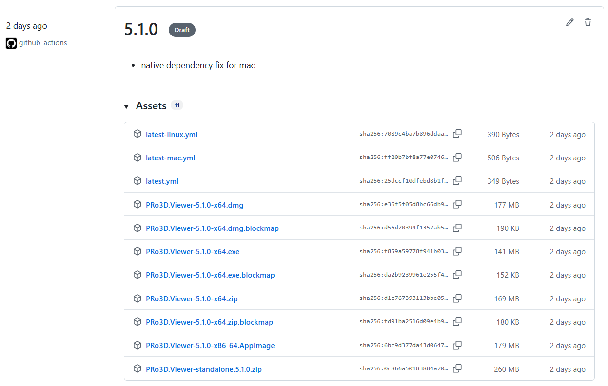
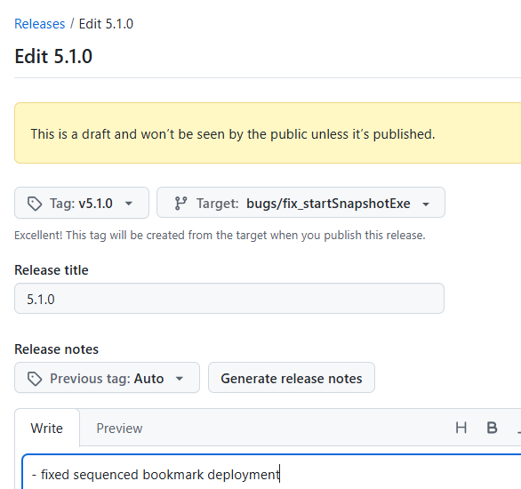

# Electron based deployment

Our current deployment mechanism is driven by `electron-builder` [see here](https://github.com/pro3d-space/PRo3D/blob/99900d5aa88242e2d340d1c4636994f09e406c79/aardium/package.json#L21).

In order to deploy all supported architectures using github actions is the preferred solution to build and distribute builds.

# 1 -- Releases for the public

## TL;DR

Deployments are triggered by github actions. 
There are two release types:
 1. public releases: add a new top entry (with the new version) to [PRODUCT_RELEASE_NOTES.md](https://github.com/pro3d-space/PRo3D/blob/develop/PRODUCT_RELEASE_NOTES.md), commit and push. The CI builds a multiplatform build with installers and the result appears as a draft on the github release page.

> **You no longer need to edit `aardium/package.json`.** `PRODUCT_RELEASE_NOTES.md` is the single source of truth for the release version: the build syncs `package.json`'s `version` from it automatically (see *How a release is crafted* below). A push that touches `PRODUCT_RELEASE_NOTES.md` is enough to trigger the deploy workflow.

The draft release looks like this:

It contains, dmg for mac, exe as *installer* etc and the artifact named PRo3D.Viewer-standalone.xxx.zip is a plain executable windows deployment, which provides sequenced bookmark functionality.

When publishing the release, make sure to set the correct tag, branch and verify the release notes.

 

 2. test releases for internal testing, modify [this](https://github.com/pro3d-space/PRo3D/blob/develop/TEST_RELEASE_NOTES.md) file and let the CI build a zip which appears on the github release page as a draft


## How a release is crafted (end to end)

A single draft release is assembled from two independent publishers; everything is keyed off **one version string** and **one tag**.

1. **Trigger & version.** `.github/workflows/deploy.yml` runs on a push that touches `PRODUCT_RELEASE_NOTES.md`, `aardium/package.json`, or `deploy.yml`. The version is the topmost entry in `PRODUCT_RELEASE_NOTES.md` (`notes.NugetVersion`). It is the only source of truth — the build patches `aardium/package.json`'s top-level `version` to it (`patchAardiumVersion` in `CopyToElectron`) and patches `viewerVersion` in `Program.fs`. The committed `package.json` version is irrelevant to the result; it is overwritten at build time.

2. **The runner matrix.** Each platform builds on its own runner and all `needs: win32_x64`:
   - `win32_x64` (windows-latest) — runs `GitHubRelease` **then** `PublishToElectron`.
   - `mac_x64` (macos-15-intel) and `mac_arm64` (macos-15, Apple Silicon) — run `PublishToElectron` (signed + notarized).
   - `linux_x64` (ubuntu-latest) — runs `PublishToElectron`.

3. **Two publishers, one draft.** Both target the same tag `v{version}`:
   - **Standalone** (`GitHubRelease`, win-x64 only): zips `bin/publish/win-x64` into `PRo3D.Viewer-standalone.{version}.zip`, creates the draft release with tag_name `v{version}`, and appends the source commit + tag to the release body. It also creates and pushes the git tag `v{version}`.
   - **Electron** (`PublishToElectron` → `yarn dist` → electron-builder, `--publish always`): builds the installer for the runner's OS/arch (`.exe`/`.dmg`/`.AppImage`) and publishes to a draft with tag `v{version}` (electron-builder's default `vPrefixedTagName`). Because the win job's `GitHubRelease` step has already created that draft, electron-builder attaches its artifacts to the **same** draft instead of creating a second one. The mac/linux jobs (`needs: win32_x64`) likewise attach to the existing draft.

4. **Tag & provenance.** git tag, standalone release tag, and electron release tag are all `v{version}`. The pushed git tag points at the built commit, so the published release anchors to that commit, and the release body records `built from commit <sha>`.

5. **Publishing.** The release stays a **draft** (`GitHub.publishDraft` is commented out; electron uses `releaseType: draft`). A human reviews artifacts/notes and publishes it. Verify the tag and target branch when publishing.

> Because both sides derive the tag from `notes.NugetVersion`, the standalone zip and the installers always land together. The one thing to confirm on a real run is that electron-builder attaches to the existing draft (it should, matching by tag) rather than forking a second one.


## Details

The `new` build system uses the Build.fsproj and Build.fs/Helpers.fs files for running builds (as opposed to fake runner and build.fsx earlier).

Thus we have those components:
 - Build.fs run by ./build.sh and build.cmd
 - the target "CopyToElectron" patches the version string and copies overW the build result into the aardium/bin folders
 - the target "PublishToElectron" performs the build and runs yarn dist in the aardium folder. The rest of deployment/signing/notarization/upload is taken care of by ./aardium/package.json.

.github/workflows/deploy.yml shows the deploy script.

## How is pro3d embedded in the electron build?

We simply deploy a pretty empty electron build and start pro3d in server mode (no window) as a process in ./aardium/main.js.
Also we create a seconary which which we pipe in stdout/stdderr using a websocket connection.
Rest is pretty much standard in main.js.
For development use `./build.sh CopyToElectron`, switch into the aardium directory and use for example `yarn install; yarn run start` for testing the application locally.

## Release notes

tags and release notes taken from PRODCT_RELEASE_NOTES.md

## Version numbers

when creating releases from within branches suffix the version number with the name of the branch to make the version unique.

### Allowed version strings

The version comes from the top heading of `PRODUCT_RELEASE_NOTES.md` and **must be valid [SemVer 2.0](https://semver.org/)** — it is consumed by FAKE's release-notes parser (`notes.SemVer`), by npm/electron-builder (`package.json` `version`), and by NuGet (`Pack`). Anything that is not valid SemVer makes the build fail early.

- Format: `MAJOR.MINOR.PATCH` with an optional `-prerelease` label, e.g. `6.0.0`, `6.0.0-prerelease1`.
- A custom prerelease label like `6.0.0-funysuperversion` **is allowed** — but the label may only contain dot-separated identifiers of ASCII letters, digits, and hyphens (`[0-9A-Za-z-]`). No spaces, underscores, slashes, or other symbols. So `6.0.0-funysuperversion` ✓, `6.0.0-rc.2-mybranch` ✓; `6.0.0-funy_version` ✗, `6.0.0-funy super` ✗, `6.0.0-releases/6` ✗ (sanitize branch names before using them as a suffix).
- The git/release tag becomes `v{version}` (e.g. `v6.0.0-funysuperversion`).
- **macOS:** prerelease labels are fine. electron-builder maps `version` → `CFBundleShortVersionString` and `buildVersion` → `CFBundleVersion`, both written verbatim into `Info.plist`. The "numeric dotted only" rule for those keys is enforced only by **App Store** submission — PRo3D ships via **Developer ID + notarization**, which does not validate the version-string format. Proof: releases already ship as `X.Y.Z-prerelease1` (e.g. `5.9.0-prerelease1`) with working signed/notarized `.dmg`s. So `6.0.0-prerelease1` deploys fine.

## Resources

all resources should be embedded using dotnet embedded resources to allow "single file deployment"

## Title bar

- title bar version is fixed up by "publish" target using string replace

# Manual build and upload to github release

- prepare the github_token env variable https://docs.github.com/en/authentication/keeping-your-account-and-data-secure/creating-a-personal-access-token, 
- change RELEASE_NOTES.md, commit, push
- in a commmand line use: ```SET GH_TOKEN=... && ./build.{cmd|sh} PublishToElectron```

# 2 -- Internal test releases

## Manual release as a zip file

`build publish` or
```SET GH_TOKEN=... && ./build.{cmd|sh} GitHubRelease```
to just create the release in the bin/publish folder.

## CI

Our electron-based workflow (above) uses click-once installers. 'Old-school' zip-releases still useful for team-internal tests and diagnostics. For this reason in early 2024 we re-introduced zip-deployments and made them CI ready via a [github workflow](https://github.com/pro3d-space/PRo3D/blob/00ace24f078b54582c9553ee39ed8d60b1c7be29/.github/workflows/testrelease.yml#L28)

The `--test` flag uses `TEST_RELEASE_NOTES.md` instead of `PRODUCT_RELEASE_NOTES.md` to quickly create test releases without interrupting the official PRODUCT_RELEASE_NOTES track. plase use a `--testing` suffix for test versions.
