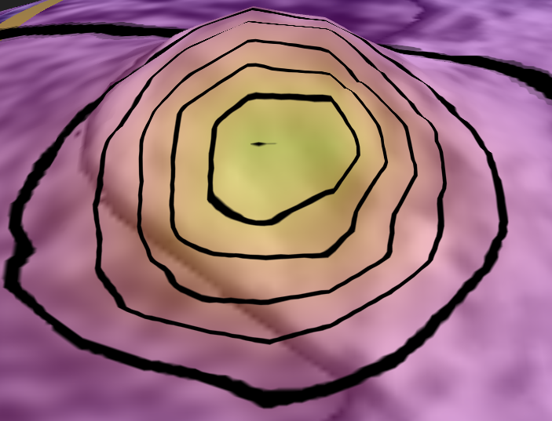
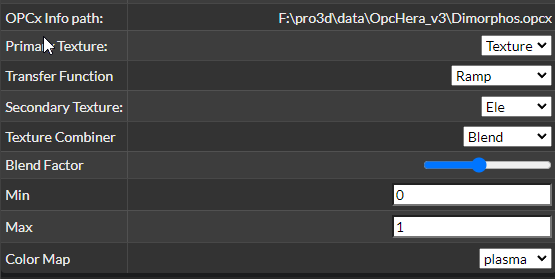
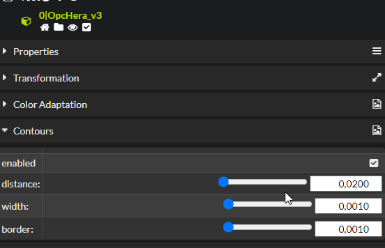
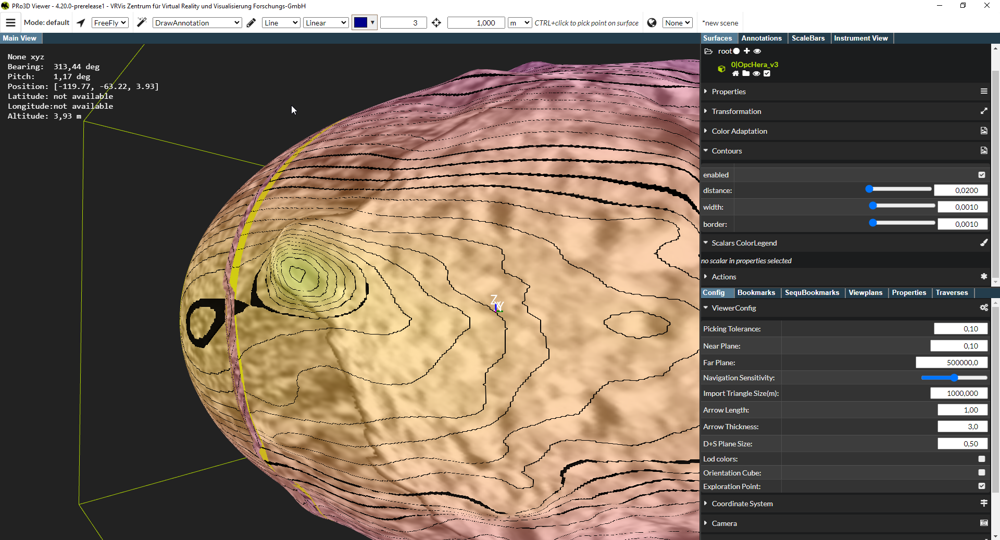

# Feature Contour Lines

Synopsis: Contour lines for texture layers
Status: Work-In-Progress
Interacts with: [Feature-Multitexturing](./Feature-Multitexture.md)

# UI

The feature only works in combination with multilayer opcs. By using surface properties, choose a particular layer as a secondary texture:

 Next, in the contour section, enable it and set distance of the lines, as well as line width and line border (both in the domain of the value chosen for texturing, here `Ele`).

The whole setup then looks like:

# Implementation

UI and logics implemented as a separate app, see: https://github.com/pro3d-space/PRo3D/blob/6416a1176dea28043548c9797436934f779a3e54/src/PRo3D.Core/VisualizationAndTFApp.fs

The line color is blended with the surface color in a separate shader: https://github.com/pro3d-space/PRo3D/blob/6416a1176dea28043548c9797436934f779a3e54/src/PRo3D.Base/Utilities.fs#L744
The shader uses hermite interpolation for smooth lines: https://github.com/pro3d-space/PRo3D/blob/6416a1176dea28043548c9797436934f779a3e54/src/PRo3D.Base/Utilities.fs#L722

Caveats:
- Currently the color cannot be chaned.
- It only works for secondary texture layers (shaders need to re-organized to be more flexible here).