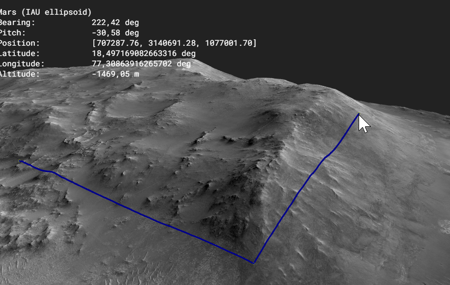
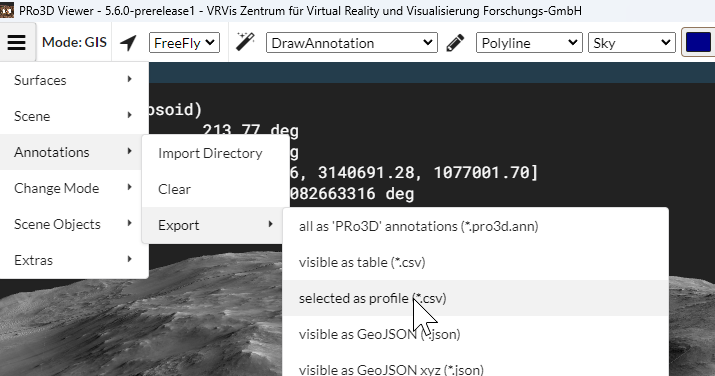
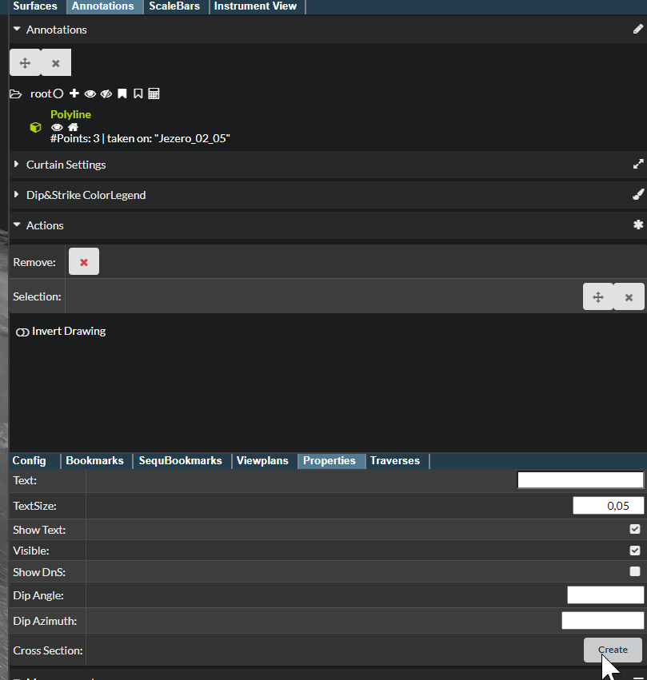
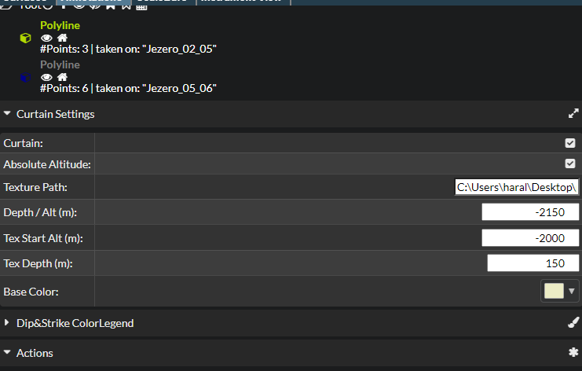
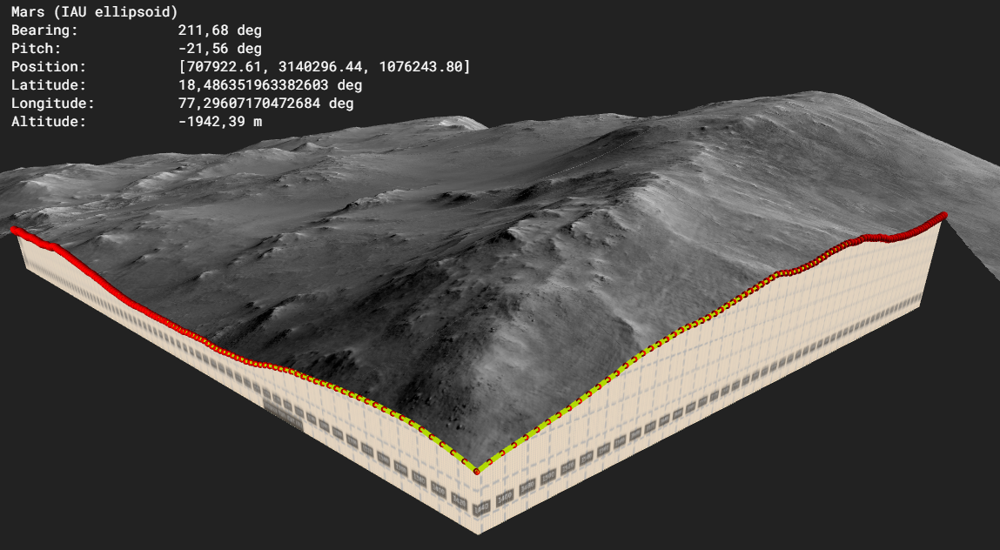

# Synopsis


The cross section feature allows you to cut  surfaces and map images onto the cutting plane.

# Approach

## 1. Create a polyline annotation. Use subsampling if needed.



## 2. 



this will look like this:
```
"distance","elevation"
"0","-2540.3019554105754"
"96.56728104292469","-2532.4515562465303"
"146.95083969889563","-2529.7198536160195"
"178.2109028662038","-2525.732550567427"
"238.47366569537462","-2515.188256619444"
"332.84560816666226","-2514.8733450224286"
```

now use the draw profile tool to create an svg/png of which shows the profile
```
python draw_profile.py --profile testProfile2.csv --curtain-height 100 --min-altitude -2200 --vertical-px 2000 --overlay --x-interval 20 --y-interval 20 --x-grid 25 --y-grid 1 --output profile.svg --grid-opacity 1.0 --grid-width 3.0
```

- choose curtain height to match the full vertical span you need
- min-alititude should be where the profile ends (lowest point of profile)
- curtain height is height in meters
- all this needs to be later matched up in (6)

Look at the profile or the info in pro3d to find good parameters.


Use approximate curtain height and min altitude to specify the 2d viewport of the cross section.

## 3. do your interpretation & tweaking of the cross section

Next convert it to a png and remember the file name.

## 5. Creating the cross section

Next go to annotation properties and move the caemera far away from the cross section.
All between the annotation and the point when creating the cross section will be clipped away.


This will leave you with the data clipped:


## 6. Setting curtain details

Next choose curtain settings and set up the curtain:



## 7. Inspection of cross section & curtain

