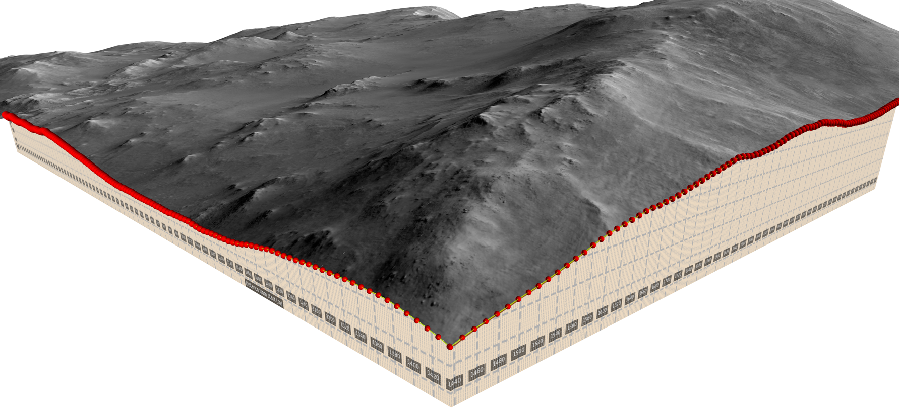
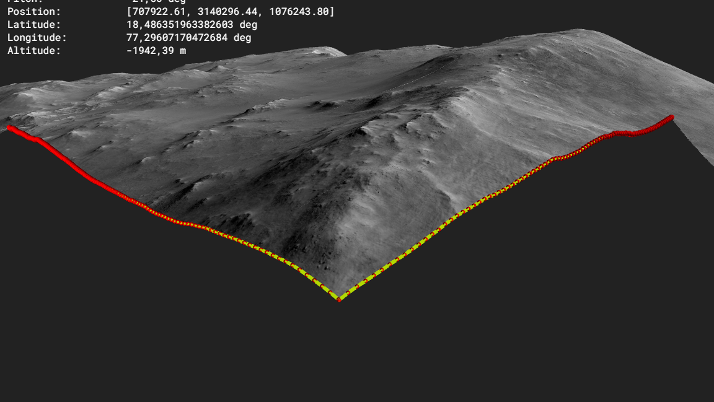

# Synopsis



The cross section feature allows you to cut  surfaces and map images onto the cutting plane.

# Approach

## 1. Create a polyline annotation. 

Use sky projection and adequate subsampling if needed. Watch out not to generate insane segment counts. E.g. for long cross-sections increase sampling distance.


## 2. Profile Export


this will look like this:
```
"distance","elevation"
"0","-2540.3019554105754"
"96.56728104292469","-2532.4515562465303"
"146.95083969889563","-2529.7198536160195"
"178.2109028662038","-2525.732550567427"
"238.47366569537462","-2515.188256619444"
"332.84560816666226","-2514.8733450224286"
```

The profile tool is described in [Profile Drawing](../profileDrawing/README.md).

now use the draw profile tool to create an svg/png of which shows the profile
```
python draw_profile.py --profile testProfile2.csv --curtain-height 100 --min-altitude -2200 --vertical-px 2000 --overlay --x-interval 20 --y-interval 20 --x-grid 25 --y-grid 1 --output profile.svg --grid-opacity 1.0 --grid-width 3.0
```

- choose curtain height to match the full vertical span you need
- min-alititude should be where the profile ends (lowest point of profile)
- curtain height is height in meters
- all this needs to be later matched up in (6)
- the vertical-px parameter is used as height of the image. the width is computed automatically given the profile length. For long profiles, you might to lower the resolution as later in pro3d the width shall not exceed 16384 pixels.

Look at the profile or the annotation nfo in pro3d to find good parameters (e.g. vertical span).

Use approximate curtain height and min altitude to specify the 2d viewport of the cross section.

## 3. do your interpretation & tweaking of the cross section

Next convert it to a png and remember the file name.

## 5. Creating the cross section

Next go to annotation properties and move the caemera far away from the cross section.
All between the annotation and the point when creating the cross section will be clipped away.


This will leave you with the data clipped:


## 6. Setting curtain details

Next choose curtain settings and set up the curtain:


## 7. Inspection of cross section & curtain


## How clipping is implemented

`Surface.Sg` writes a signed distance to the cross-section polygon (negative inside) into
a per-vertex `InsideOutsideV4` attribute, and the `crossSectionClip` fragment stage
discards fragments whose interpolated distance is negative.

Two flags gate it, and they are not redundant:

- **`CrossSectionClippingEnabled`** — the user's Clipping checkbox. Defaults to **true**,
  so it only means "clip if there is something to clip against".
- **`CrossSectionDefined`** — whether a cross-section actually exists.

Without the second, the clip shader ran on every scene from the first frame. In that
state `InsideOutsideV4` holds no meaningful data: `Surface.Sg` binds it as a constant
attribute (`SingleValueBuffer`), and on Apple Silicon that value does not arrive — whole
patches read back garbage instead of the bound zero, roughly half of it negative, so the
shader discarded a lattice of fragments across the terrain. Windows and Linux were
unaffected.

**Do not read `InsideOutsideV4` without checking `CrossSectionDefined`.**

Whether the underlying fault is Apple's GL driver or how Aardvark's GL backend handles
constant vertex attributes is not established; substituting a real zero-filled buffer for
the same attribute reads back correctly on the same machine, which narrows it to that
path but not to a cause.

## Future work

This might be interesting: https://www.youtube.com/watch?v=RKH1gKXCD6A