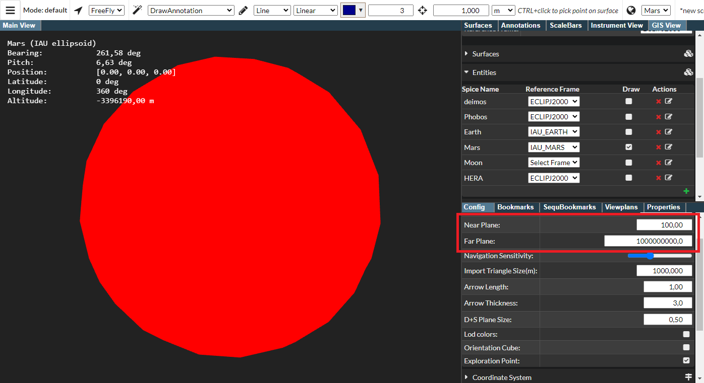

## PRo3D.GIS 

Summary: This feature allows to interpret celestial bodies and surfaces from within pro3d and serves as a basis for GIS functionality in PRo3D.
General concept: A new UI tab allows to assign coordiante frames and celestial body information to surfaces and GIS entities. By setting observeration time and by choosing an observer body, views or fly-by scenarious can be modelled.

## SPICE

### Pre-requisistes
As mentioned in [SPICE docs](./spice.md) pro3d allows to load custom spice kernels. In this documentation we use the [HERA spice kernels](https://s2e2.cosmos.esa.int/bitbucket/projects/spice_kernels/repos/hera/browse), which are also used in the [solar-system demo](https://github.com/pro3d-space/PRo3D.SPICE)

To follow the demo download or clone the [repository](https://s2e2.cosmos.esa.int/bitbucket/projects/spice_kernels/repos/hera/browse).

 
### Loading the kernel

There are two options to load SPICE kernels. 

#### The command line
 - by using the command-line argument `--defaultSpiceKernel path`, e.g. the path to the tm file: `"../hera/kernels/mk/hera_crema_2_0_LPC_ECP_PDP.tm"`, the SPICE kernel to be loaded at application startup can be specified.

#### The UI

1. Initially PRo3D with GIS view enabled looks like this:

2. Load the kernel via:

3. Then the Gis View should print the path to the kernel (scroll down, and look at the settings pane within the GIS view):

## Observing mars

Let us now observe mars from, say phobos.
1. Set the observation settings (including a time which is in available in the kernel)

2. Next, make sure the proxy visualization for mars is enabled:

and

Also make sure to have the far plane set far away for viewing mars from phobos. Ajust the near *and* far planes accordingly:

Now mars should be visible from the observation point of view.

By using the visualization properties in the entity list the element can be textured as well.

Next let us load the mola dataset.
In the Surfaces pane witin the Gis View, now specifiy reference frame and celestial body for the surface (if it does not appear change the observation settings, e.g. by setting the time):

Since we have a full surface for mars now, we can switch of the proxy geometry:

## Extended features

It is possible to add new celestial bodies, new reference frames.

## Extended concept

For story telling, PRo3D also supports to create GIS bookmarks. Similarly to stories on surfaces this can be used to create movies and interactive presentations for science.

## Caveats

Currently the GIS settings are not stored to scene files.