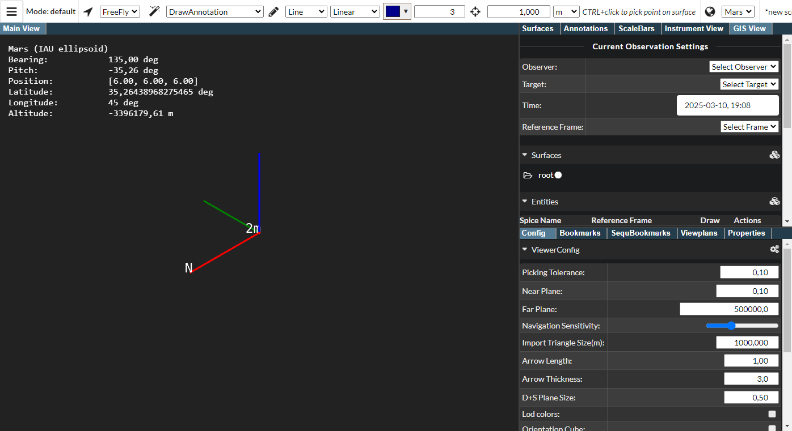
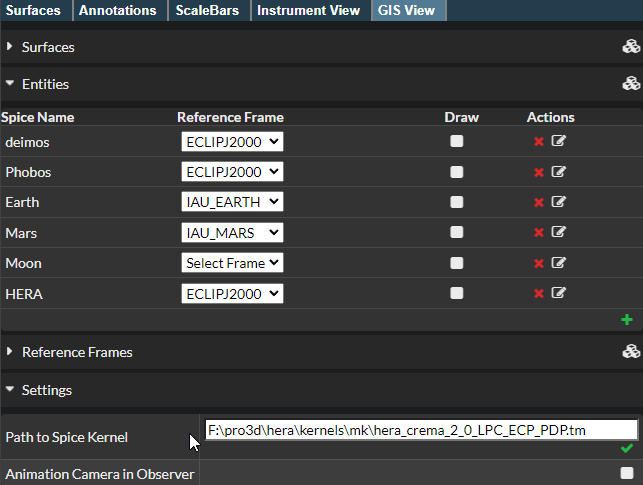

## PRo3D.GIS 

Summary: This feature allows to interpret celestial bodies and surfaces from within pro3d and serves as a basis for GIS functionality in PRo3D.
General concept: A new UI tab allows to assign coordiante frames and celestial body information to surfaces and GIS entities. By setting observeration time and by choosing an observer body, views or fly-by scenarious can be modelled.

## SPICE

### Pre-requisistes
As mentioned in [SPICE docs](./spice.md) pro3d allows to load custom spice kernels. In this documentation we use the [HERA spice kernels](https://s2e2.cosmos.esa.int/bitbucket/projects/spice_kernels/repos/hera/browse), which are also used in the [solar-system demo](https://github.com/pro3d-space/PRo3D.SPICE)

To follow the demo download or clone the [repository](https://s2e2.cosmos.esa.int/bitbucket/projects/spice_kernels/repos/hera/browse).

 
### Loading the kernel

There are two options to load SPICE kernels. 

#### The command line
 - by using the command-line argument `--defaultSpiceKernel path`, e.g. the path to the tm file: `"../hera/kernels/mk/hera_crema_2_0_LPC_ECP_PDP.tm"`, the SPICE kernel to be loaded at application startup can be specified.

#### The UI

1. Initially PRo3D with GIS view enabled looks like this:

2. Load the kernel via:

3. Then the Gis View should print the path to the kernel (scroll down, and look at the settings pane within the GIS view):

A green check mark appears below the path if loading the kernel was successful. If there is a red exclamation mark beneath the path loading was not successful. PRo3D's text output will give more detailed information why, it might be that the path to the kernel is not correct.

## PRO3D GIS View Tab

### Current Observation Settings

At the top of the GIS tab there is a section entitled "Current Observation Settings". This is used to define an observer, a target, a point in time, and a reference frame.

* Observer: The entity from which we want to observe a specific target. The camera will be placed at the location of the observer.
* Target: The entity we want to look at. The camera will look in the direction of the target.
* Time: The point of time at which we want to observe. The loaded spice kernel needs to have data for observer and target at the selected point in time!
* Reference Frame: The reference frame into which all other frames will be converted. Which frame is selected here should not change the visual result.

### Surfaces

To use a surface with PRo3D's GIS functionality, it has to be associated with a reference frame, and can be associated with an entity. This reference frame in which the surface is defined is needed to transform the surface to the global reference system used by PRo3D.
Assigning a reference frame and entity to a loaded surfaces is done in the "Surfaces" tab. 

Select the correct reference frame (and optionally entity) from the dropdown menu. If the entity or reference frame needed is not in the dropdown menu, it can be created in the "Entities"/"Reference Frames" tab.

### Entities

Entities can be celestial bodies or spacecraft. To work with PRO3D's GIS functionality the Spice Name of the entity needs to be defined in the loaded spice kernel.

The entity tab lists all entities. There are some default entities already present in PRo3D.

An entity can be edited by clicking on the right hand icon in the "Actions" column. The icon used to edit the HERA entity is circled in red in the screenshot below.

The red cross to the left of the edit icon deletes the corresponding entity.

Each entity can be assigned a reference frame in the column "Reference Frame". For each entity, a sphere can be drawn in the scene. Whether a sphere is drawn is determined by the checkbox in the "Draw" column.

A new entity can be created by clicking on the green plus icon at the bottom right hand side of the Entities tab. The spice name can only be set when creating an entity, it cannot be changed once the entity is created. To change a spice name you need to deleted the old entity and create a new one with the new spice name and the settings of the old entity. Spice names are unique, so you cannot create two entities with the same spice name.

Clicking on the edit icon of an entity (see above), opens a section for the entity:

The reference frame and whether to draw an entity can be selected in this view as well as the following settings:

- **Geometry Path** (not yet implemented) path to a geometry that is displayed at the location of this entity instead of a simple sphere
- **Texture Path** The path  to an image (for example a jpeg file) that is rendered onto the entity. 
- **Radius** The radius of the sphere that is drawn in the location of the entity in meters.

The green save icon at the bottom right hand corner closes the edit view.

Below an example of the entity Moon with a radius of 1736000 meters and a texture path.

## Reference Frames

Reference frames can be deleted (red cross icon) and created (green plus icon in the bottom right corner) in this view. They can also be assigned an entity which is associated with them.

A new reference frame can be created by clicking on the green plus icon at the bottom right hand side of the Reference Frames tab. The spice name can only be set when creating a reference frame, it cannot be changed once the reference frame is created. To change a spice name you need to deleted the old reference frame and create a new one with the new spice name and the settings of the old reference frame. Spice names are unique, so you cannot create two reference frame with the same spice name.

## Observing mars

Let us now observe mars from, say phobos.
1. Set the observation settings (including a time which is in available in the kernel)

2. Next, make sure the proxy visualization for mars is enabled:

and

Also make sure to have the far plane set far away for viewing mars from phobos. Ajust the near *and* far planes accordingly:

Now mars should be visible from the observation point of view.

By using the visualization properties in the entity list the element can be textured as well.

Next let us load the mola dataset.
In the Surfaces pane witin the Gis View, now specifiy reference frame and celestial body for the surface (if it does not appear change the observation settings, e.g. by setting the time):

Since we have a full surface for mars now, we can switch of the proxy geometry:

## Extended features

It is possible to add new celestial bodies, new reference frames.

## Extended concept

For story telling, PRo3D also supports to create GIS bookmarks. Similarly to stories on surfaces this can be used to create movies and interactive presentations for science.

## Caveats

Currently the GIS settings are not stored to scene files.