# Installing PRo3D, test data and pro3d-tool

This page is for **scientists getting started with PRo3D**. It covers three separate things, and most people need only one or two of them:

| You want to… | You need |
|---|---|
| view 3D surface reconstructions, make geological interpretations, analyse 3D structure and surface properties, do operational planning | [1. PRo3D viewer](#1-pro3d-viewer) |
| try PRo3D or the tool without your own data | [2. Test data](#2-test-data) |
| use specific command line tools that can be automated — simulated instrument images, sun angles, unprojection of image coordinates, KdTree generation | [3. pro3d-tool](#3-pro3d-tool) |

The viewer and the tool are independent: the tool does not need the viewer installed, and the viewer does not need .NET.

For developers, or for building PRo3D from source, refer to the [README](../README.md#getting-started-with-from-source).

---

## 1. PRo3D viewer

### 1.1 Download

All builds are on the **[GitHub release page](https://github.com/pro3d-space/PRo3D/releases)**. The newest stable build carries the green **Latest** badge; builds marked **Pre-release** are test builds.

Open the release and click **Assets** at the bottom of its description to show the files. Please note that in particular projects/workshops a specific version might be recommended:

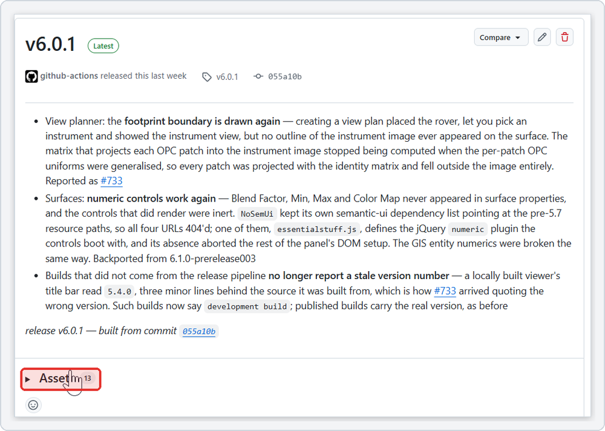

Pick the file for your system. The installer for each platform is marked:

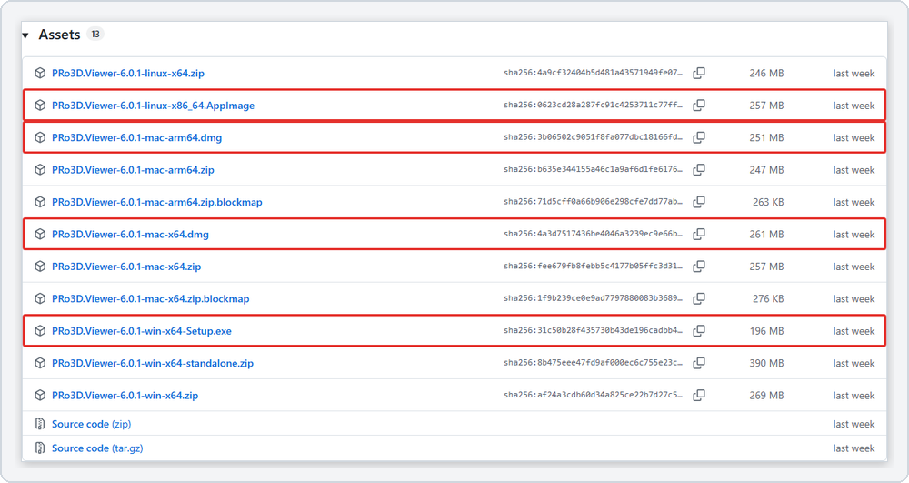

| System | Download | Notes |
|---|---|---|
| Windows 10/11, 64-bit | `…-win-x64-Setup.exe` | installer — recommended |
| Windows, no installer | `…-win-x64.zip` | same application, just unpack and run |
| Windows, several versions | `…-win-x64-standalone.zip` | just the executables, no installer — unpack each version into its own folder to run several versions side by side |
| macOS, Apple Silicon (M1…M4) | `…-mac-arm64.dmg` | *Apple menu → About This Mac* shows **Chip: Apple M…** |
| macOS, Intel | `…-mac-x64.dmg` | *About This Mac* shows **Processor: Intel** |
| Linux x64 | `…-linux-x86_64.AppImage` | single file, no installation |
| Linux x64 | `…-linux-x64.zip` | unpacked alternative to the AppImage |

Ignore the `.blockmap` files and the *Source code* archives — those are for the updater and for developers.

The files are 200–400 MB each. Click the name to download:

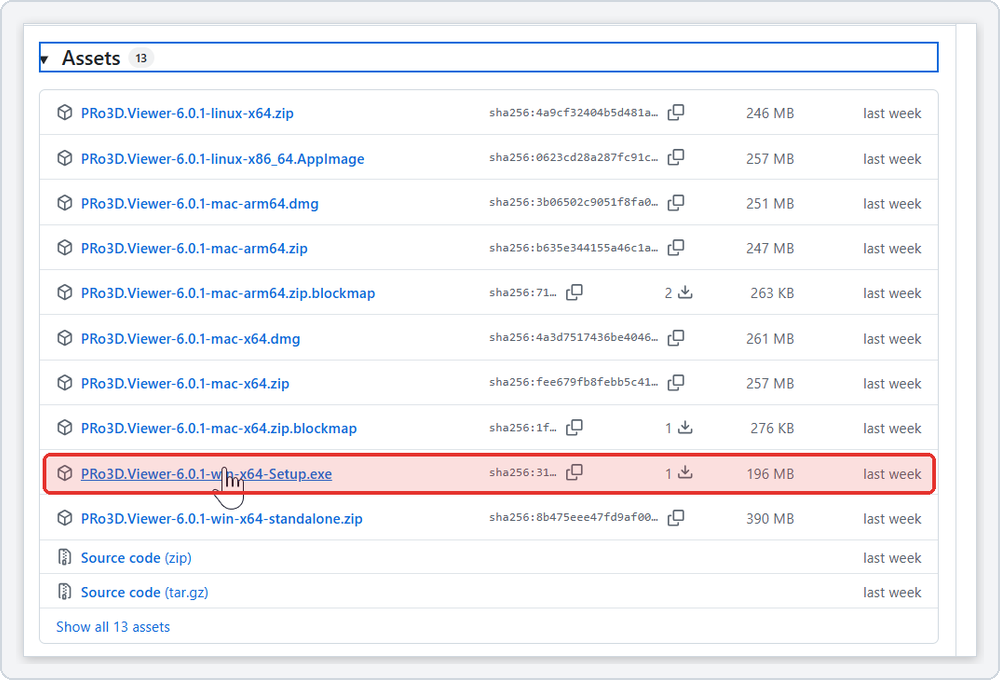

### 1.2 When the browser refuses the download

PRo3D's Windows installer is **not code-signed**, and new releases have only been downloaded a few times. Browsers treat both as a warning sign and may hold the file back with a message such as *"… isn't commonly downloaded"* or *"Suspicious download blocked"*. The file is not deleted — it waits for you to confirm. The screenshots show **Microsoft Edge**; Chrome works the same way.

**1.** The download icon in the toolbar shows a warning, and the downloads panel lists the file as *isn't commonly downloaded*:

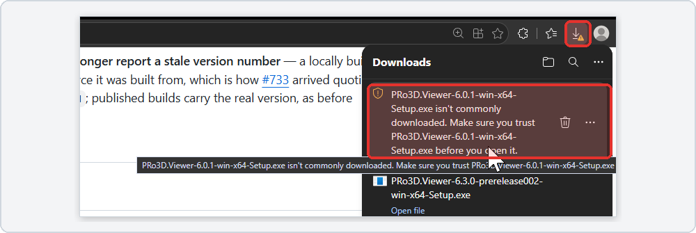

**2.** In that panel click **…** → **Open downloads page** (or press **Ctrl+J**, or type `edge://downloads` into the address bar):

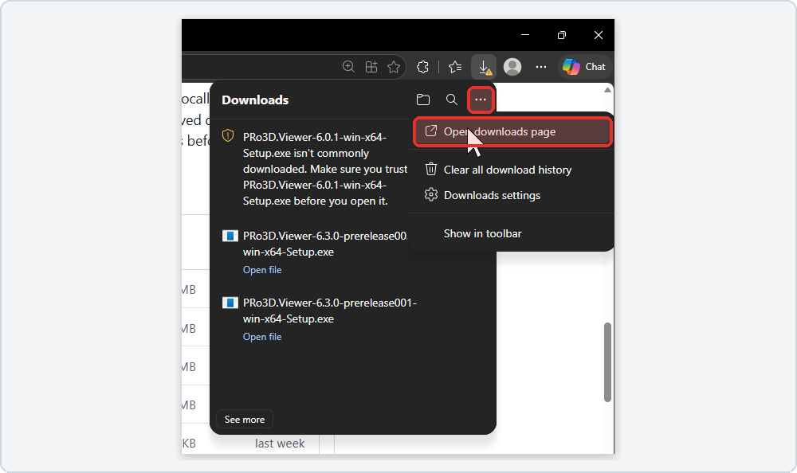

**3.** Click **Keep** under the PRo3D file. If Edge asks again, click **Show more** → **Keep anyway**:

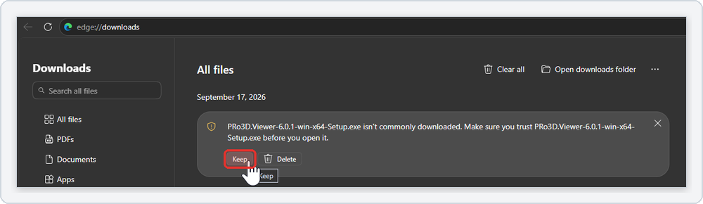

In **Chrome** the downloads page is `chrome://downloads` (**Ctrl+J**, macOS **⌘+Shift+J**).

If there is no such button, your organisation's browser policy forbids it. Download from the command line instead — this always works and does not involve the browser at all. Copy the file's link from the release page (right-click → *Copy link address*):

```powershell
# Windows (PowerShell or cmd; curl ships with Windows 10 and 11)
curl.exe -L -O https://github.com/pro3d-space/PRo3D/releases/download/v6.0.1/PRo3D.Viewer-6.0.1-win-x64-Setup.exe
```

```bash
# macOS / Linux
curl -L -O https://github.com/pro3d-space/PRo3D/releases/download/v6.0.1/PRo3D.Viewer-6.0.1-linux-x86_64.AppImage
```

**Check that the file is genuine.** The release page lists a `sha256:` checksum next to every file (click the copy icon beside it). Compare it with the checksum of what you downloaded:

```powershell
certutil -hashfile PRo3D.Viewer-6.0.1-win-x64-Setup.exe SHA256     # Windows
```

```bash
shasum -a 256 PRo3D.Viewer-6.0.1-mac-arm64.dmg                      # macOS / Linux
```

If the two values match, the file is exactly the one published on GitHub.

### 1.3 Install and first start

#### Windows

**Installer (`Setup.exe`).** Double-click it. Because the installer is not signed, Windows SmartScreen shows a blue **"Windows protected your PC"** window on first start. Click **More info**, check that the app name is the PRo3D file, then click **Run anyway**.

**ZIP files.** Before unpacking, right-click the ZIP → **Properties** → tick **Unblock** → **OK**. Otherwise the unpacked files keep the "downloaded from the internet" mark and Windows may show a security warning when you start PRo3D.

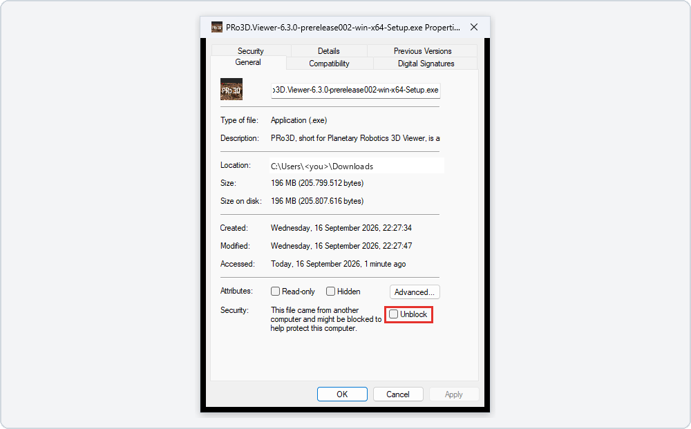

Both ZIPs have their files at the top level, so unpack each into its own folder (Explorer's *Extract All…* does this). Then start **`PRo3D Viewer.exe`** from `win-x64.zip`, or **`PRo3D.Viewer.exe`** from `win-x64-standalone.zip`.

#### macOS

Open the `.dmg` and drag **PRo3D** into **Applications**. The macOS builds are signed and notarised by Apple, so the first start only shows the usual *"downloaded from the Internet — are you sure?"* question; click **Open**.

If macOS still refuses: **System Settings → Privacy & Security**, scroll down, click **Open Anyway** next to the PRo3D message.

#### Linux

```bash
chmod +x PRo3D.Viewer-*-linux-x86_64.AppImage
./PRo3D.Viewer-*-linux-x86_64.AppImage
```

- AppImages need FUSE 2. If it fails to start with a FUSE error: `sudo apt install libfuse2` (Ubuntu 24.04: `libfuse2t64`).
- PRo3D loads images through DevIL: `sudo apt install libdevil-dev`.

### 1.4 System requirements

A **dedicated GPU** is strongly recommended (NVIDIA GeForce 700 series or newer; AMD usually works). 8 GB RAM minimum, 16 GB recommended. Large datasets want more of everything.

---

## 2. Test data

Public example datasets live in their own repository, **[pro3d-space/PRo3D.Resources.TestData](https://github.com/pro3d-space/PRo3D.Resources.TestData)**. You do **not** need git.
For specific missions other data transfer workflows might be established e.g. via JR data-exchange servers etc.
Here we describe a public repository everybody has access to and we can used it for demonstrational purposes. 

### 2.1 Download the ZIP

On the repository page click the green **Code** button, then **Download ZIP**:

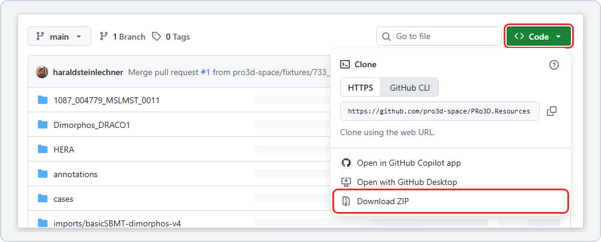

Direct link: <https://github.com/pro3d-space/PRo3D.Resources.TestData/archive/refs/heads/main.zip>

The download is large (the Dimorphos model alone is 1.1 GB). When it is done:

1. **Unpack the whole ZIP.** The examples below assume `C:\pro3d-data` (Windows) or `~/pro3d-data` (macOS/Linux); any folder works.
2. You get a folder `PRo3D.Resources.TestData-main`.

What is inside:

| Folder | Content | Good for |
|---|---|---|
| `1087_004779_MSLMST_0011/` | small part of the MSL *Stimson* outcrop on Mars | first steps in the viewer; the full dataset is at [download.vrvis.at](http://download.vrvis.at/acquisition/32987e2792e0/PRo3D/Stimson_1087.zip) |
| `HERA/Didymos_ASPECT/` | Didymos shape model | `pro3d-tool simulate-image` |
| `HERA/Dimorphos_opc/` | Dimorphos shape model and simulated HERA/AFC frames | image projection |
| `HERA/Instrument Data/` | an ASPECT instrument image with metadata | `pro3d-tool sun-angles`, `unproject` |
| `annotations/`, `cases/`, `imports/` | annotation files and example scenes | annotation features |

### 2.2 Open a surface in PRo3D

Click the **☰** menu (top left) → **Surfaces** → **Import OPCs**:

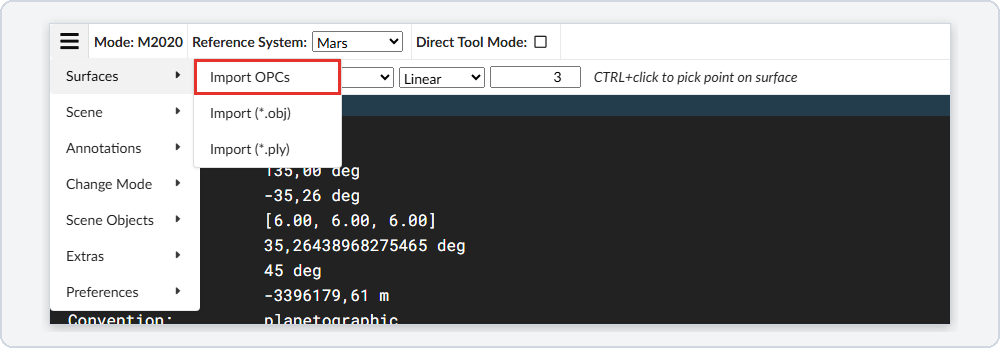

In the folder dialog select `PRo3D.Resources.TestData-main\1087_004779_MSLMST_0011` and confirm. The surface appears in the **Surfaces** list on the right and in the 3D view:

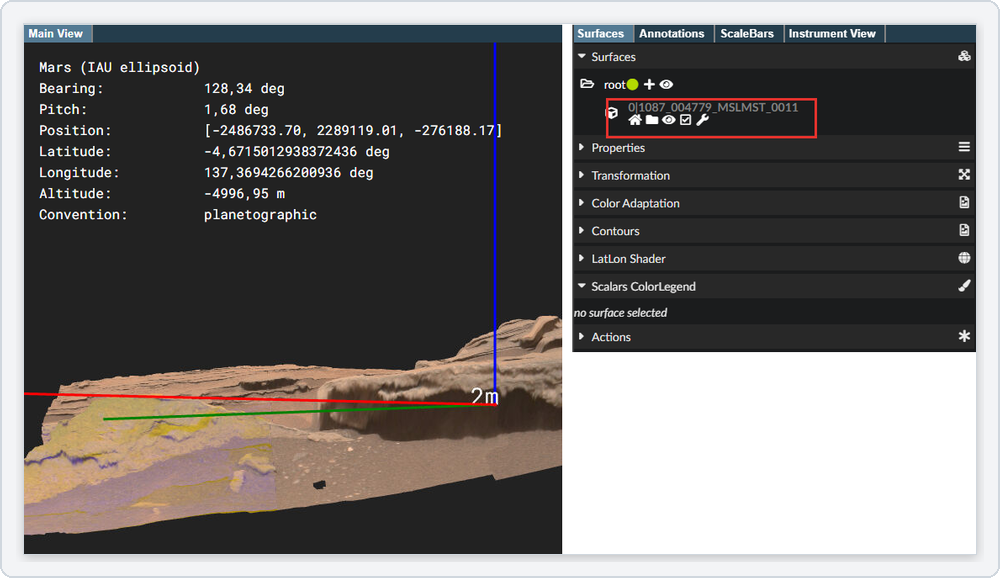

If the view does not show it, click the **house** icon next to the surface name (*Fly to surface*).

---

## 3. pro3d-tool

`pro3d-tool` is PRo3D's command line tool (verbs `kdtree`, `sun-angles`, `unproject`, `simulate-image`). It is described in detail in [Pro3DTool.md](Pro3DTool.md); this section only covers getting it running.

### 3.1 Install .NET 9

The tool is a *.NET tool* and needs the **.NET 9 SDK** — the SDK, not only the runtime, because `dotnet tool install` is part of the SDK.

| System | How |
|---|---|
| Windows | installer from <https://dotnet.microsoft.com/download/dotnet/9.0> (*SDK*, x64), or `winget install Microsoft.DotNet.SDK.9` |
| macOS | installer from the same page — **Arm64** for Apple Silicon, **x64** for Intel |
| Linux | see [Install .NET on Linux](https://learn.microsoft.com/dotnet/core/install/linux) — distribution packages, or the install script if your distribution has none |

Check with `dotnet --list-sdks`; a line starting with `9.` must be there.

### 3.2 Install the tool

```
dotnet tool install PRo3D.Tool --global
```

The package page is <https://www.nuget.org/packages/PRo3D.Tool>:

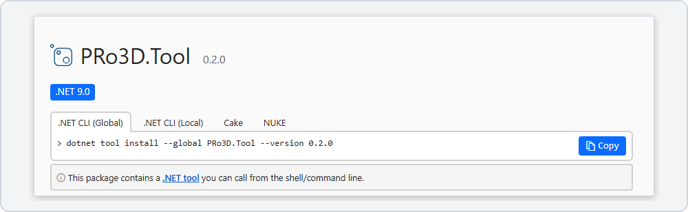

Open a **new** terminal afterwards and run `pro3d-tool`. If the command is not found, the .NET tools folder is not on your `PATH`:

```bash
export PATH="$PATH:$HOME/.dotnet/tools"      # macOS / Linux — add this line to ~/.bashrc or ~/.zshrc
```

On Windows the folder is `%USERPROFILE%\.dotnet\tools`; the SDK installer normally adds it.

**Updating:** `dotnet tool update PRo3D.Tool --global`. **Which version do I have:** `dotnet tool list --global`.

> `simulate-image` needs **pro3d-tool 0.4.0 or newer** (see [TOOL_RELEASE_NOTES.md](../TOOL_RELEASE_NOTES.md)). If NuGet does not offer that version yet, run the tool from the PRo3D sources instead: on <https://github.com/pro3d-space/PRo3D> click **Code** → **Download ZIP** (same menu as in [2.1](#21-download-the-zip)), unpack it, and use the scripts in its `scripts` folder — they run the tool with `dotnet run` and need nothing else installed.

### 3.3 SPICE kernels

Planetary geometry — spacecraft position, orientation, the direction of the Sun — comes from **SPICE kernels**, mission data files published by the space agencies.

- **Mars missions:** the kernels PRo3D needs are **included**. There is nothing to download.
- **HERA:** make sure you have the **appropriate kernels for your task** — the mission period, spacecraft and instruments you work with. They are not part of PRo3D or the test data.

Get the HERA kernels from ESA's **[SPICE for HERA](https://www.cosmos.esa.int/web/spice/spice-for-hera)** page. It explains the dataset and its meta-kernels (`plan` for planning, `ops` for data analysis), and offers the downloads under *Obtaining the kernels*. **Direct Download** is a ZIP with the latest operational kernels (about 1.1 GB, 2 GB unpacked):

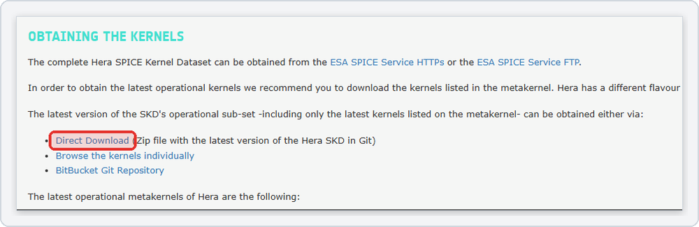

Unpack it anywhere; you get a folder `HERA` containing `kernels`. If your task needs older or other kernels than this latest operational set, pick them on the same page (*Browse the kernels individually*, or the full dataset via the ESA SPICE Service).

**Tell the tool where the kernels are** by setting `PRO3D_SPICE_KERNELS` to that `HERA` folder (its `kernels` subfolder works too):

```bat
setx PRO3D_SPICE_KERNELS C:\pro3d-data\HERA          REM Windows — then open a new terminal
```

```bash
export PRO3D_SPICE_KERNELS=~/pro3d-data/HERA         # macOS / Linux — add to ~/.bashrc or ~/.zshrc
```

Alternatively pass `--kernel-root <folder>` to a single command. There is deliberately no default: without either, the tool stops with an error instead of guessing.

### 3.4 First run

A simulated image of Didymos as seen by the ASPECT camera on Milani, using the test data from [section 2](#2-test-data):

```bat
REM Windows
pro3d-tool simulate-image --opc "C:\pro3d-data\PRo3D.Resources.TestData-main\HERA\Didymos_ASPECT" --time 2027-03-15T19:00:00Z --body DIDYMOS --frame DIDYMOS_FIXED --observer MILANI --instrument MILANI_ASPECT_NIR1 --out simulated.png
```

```bash
# macOS / Linux
pro3d-tool simulate-image --opc ~/pro3d-data/PRo3D.Resources.TestData-main/HERA/Didymos_ASPECT --time 2027-03-15T19:00:00Z --body DIDYMOS --frame DIDYMOS_FIXED --observer MILANI --instrument MILANI_ASPECT_NIR1 --out simulated.png
```

The result is `simulated.png` in the current folder. All options: `pro3d-tool simulate-image --help` and [Pro3DTool-SimulateImage.md](Pro3DTool-SimulateImage.md).

### 3.5 Platform notes

| | Windows x64 | macOS (Intel, Apple Silicon) | Linux x64 |
|---|---|---|---|
| `kdtree` | ✓ | ✓ | ✓ (may need `libdevil-dev`) |
| `unproject` | ✓ | ✓ | ✓ |
| `sun-angles`, `simulate-image` | ✓ needs GPU | ✓ needs GPU | ✓ needs GPU |

The SPICE library the tool uses exists for exactly these platforms, so there is **no Linux ARM** support for the verbs that need kernels. The tool is developed and tested mainly on Windows; please report problems on macOS and Linux as a [GitHub issue](https://github.com/pro3d-space/PRo3D/issues).

- **GPU:** `sun-angles` and `simulate-image` render with OpenGL and need a graphics driver. `kdtree` and `unproject` run on machines without a GPU.
- **Servers without a display (Linux):** the OpenGL verbs open an invisible window and therefore need a display. On a headless machine run them under a virtual one: `xvfb-run pro3d-tool simulate-image …` (`sudo apt install xvfb`).
- **Windows:** if the tool fails with a message about a missing DLL, install the [Microsoft Visual C++ Redistributable (x64)](https://aka.ms/vs/17/release/vc_redist.x64.exe).

---

## Troubleshooting

| Problem | Fix |
|---|---|
| Edge/Chrome blocks the download | downloads page → **Keep** ([1.2](#12-when-the-browser-refuses-the-download)) — or download with `curl` |
| "Windows protected your PC" | **More info → Run anyway** |
| macOS: "cannot be opened" | **System Settings → Privacy & Security → Open Anyway** |
| AppImage does not start | `chmod +x`, and install `libfuse2` |
| PRo3D shows no surface after import | select the dataset folder itself (e.g. `1087_004779_MSLMST_0011`), not a file inside it |
| `pro3d-tool: command not found` | open a new terminal; add `~/.dotnet/tools` to `PATH` |
| `no SPICE kernel tree given` | set `PRO3D_SPICE_KERNELS` or pass `--kernel-root` ([3.3](#33-spice-kernels)) |
| `Verb 'simulate-image' is not recognized.` | tool too old — `dotnet tool update PRo3D.Tool --global` (needs 0.4.0) |
