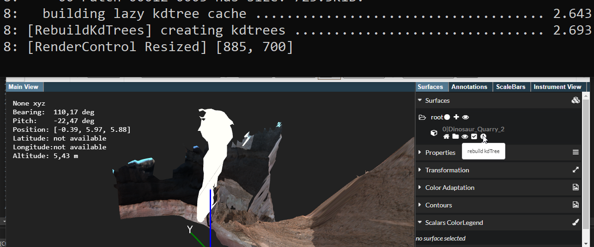
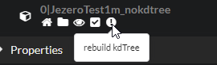

### General concept

PRo3D has two mechanisms for picking:
 1. geometry based picking on surfaces via KdTrees. This is implemented via [aardvark.geometry.intersection](https://github.com/aardvark-platform/aardvark.algodat/tree/3b225ef80e87c24177fcd1230c1e368408c52e6b/src/Aardvark.Geometry.Intersection). 
 2. rendering driven picking via pixel-readback. This one is used for picking existing annotations in a scene. Starting point is [here](https://github.com/pro3d-space/PRo3D/blob/1c8601d9fc88f81a03dae12965af1fb72fe61bcd/src/PRo3D.Core/Drawing/PackedRendering.fs#L519).

Here we describe the current state of KdTree picking (notes by harald: Parts of this seems to have no official documentation, thus i reconstruted it from my "rework" efforts for KdTrees, at least it makes sense and matches current data available and the current source code).
One could create a single kdtree for a whole OPC hierarchy (1). Another option is to create "smaller" KdTrees for leaf nodes of OPC hierarchies (2).
PRo3D generally supported both, but especially for huge scenes (1) is problematic.
The plan is to fade-out (1) in favor of (2).
 1. Master KdTree files:  
 . Usage/Loading can be seen [here](https://github.com/aardvark-platform/OpcViewer/blob/7fdf368e1e59a2c33c0cc7e5ca3e20b8c18a42a0/src/OPCViewer.Base/KdTrees.fs). Packing a complete hierarchy into a single file has several drawbacks: firstly it takes a long loading time, secondly it is not out-of-core and thirdly it might have issues with floating-point precision for huge scenes (all files i have seen have double precision though). Recently [`ignoreMasterKdTree`](https://github.com/aardvark-platform/OpcViewer/blob/7fdf368e1e59a2c33c0cc7e5ca3e20b8c18a42a0/src/OPCViewer.Base/KdTrees.fs#L212) flag was introduced to provide a transition scheme for master KdTrees.
 2. Per-Patch KdTree files. Typically they are placed just in the "top-level" patch directory. 
. (note by harald: i have seen hierarchies where those are placed in the respective patch directory. This seems to have changed over time though)


### Loading of Per-Patch KdTree files

Loading takes place [here](https://github.com/aardvark-platform/OpcViewer/blob/7fdf368e1e59a2c33c0cc7e5ca3e20b8c18a42a0/src/OPCViewer.Base/KdTrees.fs#L210). A validation step makes sure that all KdTrees are here. If not, in-place KdTree creation can be [triggered via appropriate flags](https://github.com/aardvark-platform/OpcViewer/blob/7fdf368e1e59a2c33c0cc7e5ca3e20b8c18a42a0/src/OPCViewer.Base/KdTrees.fs#L262):
```
 9: there are missing Kd0Paths. The first one has the following path: K:\gardencity\MSL_Mastcam_Sol_925_id_48420\OPC_000_000\patches\03-Patch-00001~0035\00-Patch-00016~0005-0.aakd
 9: in total there are 24/24 of Kd0Paths missing
```

### Lazy KdTree caches

To support lazy loading of particular KdTrees, the loading can be delayed via [LazyKdTrees](https://github.com/aardvark-platform/OpcViewer/blob/7fdf368e1e59a2c33c0cc7e5ca3e20b8c18a42a0/src/OPCViewer.Base/KdTrees.fs#L277).
To build a list of lazy kdtrees, unfortunately the original kdtree needs to be loaded once to extract the bounding box currently (partly reading of kdtrees could get rid of this of course).
The bounding box, kdtree tuples are stored in .cache files to prevent this step when loading a surface, [see here.](https://github.com/aardvark-platform/OpcViewer/blob/7fdf368e1e59a2c33c0cc7e5ca3e20b8c18a42a0/src/OPCViewer.Base/KdTrees.fs#L305)

Recently i tried to make this quite robust, if however the cache file cannot be loaded or is invalid, the loading code can be used to create a new cache file. If the surface is loaded from a readonly file system or another problem appears this fails and is ignored (see [here](https://github.com/aardvark-platform/OpcViewer/blob/7fdf368e1e59a2c33c0cc7e5ca3e20b8c18a42a0/src/OPCViewer.Base/KdTrees.fs#L307)).

## Create KdTrees for an OPC hierarchy.

KdTrees can be constructed:
 - directly from within PRo3D. This is now available via the UI
 
 - the [library](https://www.nuget.org/packages/OPCViewer.Base) and in [particular](https://github.com/aardvark-platform/OpcViewer/blob/7fdf368e1e59a2c33c0cc7e5ca3e20b8c18a42a0/src/OPCViewer.Base/KdTrees.fs#L307).
 - the OPC command-line tool. see [here](./OpcTool.md).

## Behavior as of June 2024 (version 4.24.0)


## Loading behavior 

| OPC | KdTree Kind | Loads as-is | Recommendation | Remark for PRo3D developers |
| --- | ----------- | ----------- | -------------- | ----- |
| OPC_JezeroTest1m_nokdtree | No kd Tree | Yes, no picking, prints `WARNING: [KdTrees] Kdtree not available, please build it manually using opc-tool or pro3d.` | Create KdTree using PRo3D or opc-tool  and reload the hierarchy. | - |
| OPC_JezeroTest1m_v2021 | OPC created using per patch kd trees | Yes, picking available fast loading, low memory | None | - |
| OPC_JezeroTest1m | OPC created without per patch kdTrees, but with master kd tree file (mostly late 2023) | Yes loads, but takes lot of memory since kdtree for whole opc is loaded. Also PRo3D reports this line in stdout `WARNING: Found master kdtree - loading incore. THIS NEEDS A LOT OF MEMORY. CONSIDER CREATING PER-PATCH KD TREES..` | Delete `*.aakd` and create new kd trees using PRo3D or opc-tool. Note that PRo3D never deletes the master kdtree file as whis would be cumbersome. Users confronted with this situation currently really need to delete unwanted huge kd tree files. | This beharior could be changed to [ignore the master kd tree](https://github.com/aardvark-platform/OpcViewer/blob/7fdf368e1e59a2c33c0cc7e5ca3e20b8c18a42a0/src/OPCViewer.Base/KdTrees.fs#L212) |


## File system behavior

Since OPCs with inconsistent `Patches` vs `patches` and `images` vs `Images` are in the wild, we introduced a mechanism to deal with those transparent to the user. This was a bad decision since it is overly complex. 
Relevant parts are:
 - [Probing paths](https://github.com/aardvark-platform/aardvark.rendering/blob/3a3044847739d07bf57eadae02923868357c3b4f/src/Aardvark.SceneGraph.Opc/OpcPaths.fs#L53)
 - And several repair paths, [here](https://github.com/aardvark-platform/OpcViewer/blob/e401124e7636133a2e2ac26b5316d1662a0a1d0c/src/OPCViewer.Base/KdTrees.fs#L51), [here](https://github.com/aardvark-platform/OpcViewer/blob/e401124e7636133a2e2ac26b5316d1662a0a1d0c/src/OPCViewer.Base/KdTrees.fs#L66), and [here](https://github.com/aardvark-platform/OpcViewer/blob/e401124e7636133a2e2ac26b5316d1662a0a1d0c/src/OPCViewer.Base/KdTrees.fs#L80)

There are some dead-ends, of this approach, which happens concerned with .cache files. While wrong paths in .cache files can be fixed using [this](https://github.com/aardvark-platform/OpcViewer/blob/e401124e7636133a2e2ac26b5316d1662a0a1d0c/src/OPCViewer.Base/KdTrees.fs#L108), this might fail (especially when also path separators change and capitalization is completely messed up on case-sensitive systems with case insensitive external disks). Then the caches get rebuilt. Currently PRo3D tries to write the caches, even if the file system is readonly (like sometimes when mounting NTFS on mac). See relevant code [here](https://github.com/aardvark-platform/OpcViewer/blob/e401124e7636133a2e2ac26b5316d1662a0a1d0c/src/OPCViewer.Base/KdTrees.fs#L337).


## Partially currupt/deleted kd trees

Generally by using the `validateKdTrees` flag all sub-kdtrees would be verified and rebuilt if needed. For WSYWYG however this validation/repair does not take place automatically. Another reason for not repairing broken OPC directories is that it disables a fast path when cache files are broken. Generally we could change this. Relevant parts are [here](https://github.com/aardvark-platform/OpcViewer/blob/fb94d0c74f9759a3ab07a71dcccac82f8186e776/src/OPCViewer.Base/KdTrees.fs#L297).