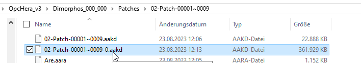

### General concept

PRo3D has two mechanisms for picking:
 1. geometry based picking on surfaces via KdTrees. This is implemented via [aardvark.geometry.intersection](https://github.com/aardvark-platform/aardvark.algodat/tree/3b225ef80e87c24177fcd1230c1e368408c52e6b/src/Aardvark.Geometry.Intersection). 
 2. rendering driven picking via pixel-readback. This one is used for picking existing annotations in a scene. Starting point is [here](https://github.com/pro3d-space/PRo3D/blob/1c8601d9fc88f81a03dae12965af1fb72fe61bcd/src/PRo3D.Core/Drawing/PackedRendering.fs#L519).

Here we describe the current state of KdTree picking (notes by harald: Parts of this seems to have no official documentation, thus i reconstruted it from my "rework" efforts for KdTrees, at least it makes sense and matches current data available and the current source code).
One could create a single kdtree for a whole OPC hierarchy (1). Another option is to create "smaller" KdTrees for leaf nodes of OPC hierarchies (2).
PRo3D generally supported both, but especially for huge scenes (1) is problematic.
The plan is to fade-out (1) in favor of (2).
 1. Master KdTree files:  
 . Usage/Loading can be seen [here](https://github.com/aardvark-platform/OpcViewer/blob/7fdf368e1e59a2c33c0cc7e5ca3e20b8c18a42a0/src/OPCViewer.Base/KdTrees.fs). Packing a complete hierarchy into a single file has several drawbacks: firstly it takes a long loading time, secondly it is not out-of-core and thirdly it might have issues with floating-point precision for huge scenes (all files i have seen have double precision though). Recently [`ignoreMasterKdTree`](https://github.com/aardvark-platform/OpcViewer/blob/7fdf368e1e59a2c33c0cc7e5ca3e20b8c18a42a0/src/OPCViewer.Base/KdTrees.fs#L212) flag was introduced to provide a transition scheme for master KdTrees.
 2. Per-Patch KdTree files. Typically they are placed just in the "top-level" patch directory. 
. (note by harald: i have seen hierarchies where those are placed in the respective patch directory. This seems to have changed over time though)


### Loading of Per-Patch KdTree files

Loading takes place [here](https://github.com/aardvark-platform/OpcViewer/blob/7fdf368e1e59a2c33c0cc7e5ca3e20b8c18a42a0/src/OPCViewer.Base/KdTrees.fs#L210). A validation step makes sure that all KdTrees are here. If not, in-place KdTree creation can be [triggered via appropriate flags](https://github.com/aardvark-platform/OpcViewer/blob/7fdf368e1e59a2c33c0cc7e5ca3e20b8c18a42a0/src/OPCViewer.Base/KdTrees.fs#L262):
```
 9: there are missing Kd0Paths. The first one has the following path: K:\gardencity\MSL_Mastcam_Sol_925_id_48420\OPC_000_000\patches\03-Patch-00001~0035\00-Patch-00016~0005-0.aakd
 9: in total there are 24/24 of Kd0Paths missing
```

### Lazy KdTree caches

To support lazy loading of particular KdTrees, the loading can be delayed via [LazyKdTrees](https://github.com/aardvark-platform/OpcViewer/blob/7fdf368e1e59a2c33c0cc7e5ca3e20b8c18a42a0/src/OPCViewer.Base/KdTrees.fs#L277).
To build a list of lazy kdtrees, unfortunately the original kdtree needs to be loaded once to extract the bounding box currently (partly reading of kdtrees could get rid of this of course).
The bounding box, kdtree tuples are stored in .cache files to prevent this step when loading a surface, [see here.](https://github.com/aardvark-platform/OpcViewer/blob/7fdf368e1e59a2c33c0cc7e5ca3e20b8c18a42a0/src/OPCViewer.Base/KdTrees.fs#L305)

Recently i tried to make this quite robust, if however the cache file cannot be loaded or is invalid, the loading code can be used to create a new cache file. If the surface is loaded from a readonly file system or another problem appears this fails and is ignored (see [here](https://github.com/aardvark-platform/OpcViewer/blob/7fdf368e1e59a2c33c0cc7e5ca3e20b8c18a42a0/src/OPCViewer.Base/KdTrees.fs#L307)).

## Create KdTrees for an OPC hierarchy.

KdTrees can be constructed
 - directly from within PRo3D. This is now available via the UI.
 - the [library](https://www.nuget.org/packages/OPCViewer.Base) and in [particular](https://github.com/aardvark-platform/OpcViewer/blob/7fdf368e1e59a2c33c0cc7e5ca3e20b8c18a42a0/src/OPCViewer.Base/KdTrees.fs#L307).
 - the OPC command-line tool. see [here](./OpcTool.md).