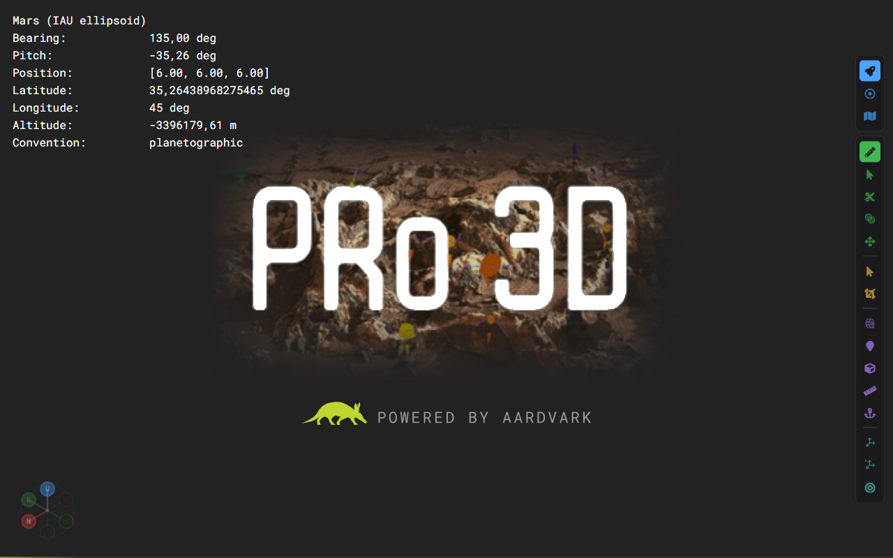

# Loading Screen

Every render control shows a boot screen while it is connecting and waiting for its
first frame: the PRo3D logo on the viewer's own background, a "powered by Aardvark"
credit, and a thin progress bar along the bottom edge.

It replaces the stock Aardvark splash — a black background with the AARDVARK block
logo and bouncing grey dots.

## How it works

The loader is **not** ours: Aardvark.UI builds it in the browser
(`resources/renderer.js`, `Renderer.createLoader`). It appends a `div.loader` inside
the render control's `div.aardvark`, fills it with the "fountain" dots and styles it
from its own `aardvark.css`. It is removed in `Renderer.fadeIn`, once the first frame
has faded in, and **created again in `fadeOut` if the connection drops** — so the
splash reappearing mid-session means the render socket went away, not that the app is
starting.

PRo3D restyles that element rather than replacing it:

| File | Role |
|------|------|
| [`src/PRo3D.Viewer/resources/pro3d-loader.css`](../src/PRo3D.Viewer/resources/pro3d-loader.css) | Overrides `div.aardvark > div.loader`: artwork, background colour, hides the dots, draws the progress bar. |
| [`src/PRo3D.Viewer/resources/pro3d-loader.svg`](../src/PRo3D.Viewer/resources/pro3d-loader.svg) | The artwork, self-contained (generated — see below). |
| `Viewer.fs`, `viewerDependencies` | Pulls the stylesheet into every page. |
| `PRo3D.Viewer.fsproj` | Embeds both files; they are served at `./resources/<name>`. |

Because the stylesheet is listed in `viewerDependencies`, it arrives through
`aardvark.addReferences`, which resolves **before** the render control boots. The
stock splash therefore never flashes first.

The background colour is deliberately `#222222`, the same as the render control's own
`background-color`, so the first frame fades in without a step in brightness.

Aardvark.UI does offer `RenderAttribute.customLoaderImage`. We do not use it: it also
injects its own "Powered by the Aardvark Platform" markup, which is malformed
(unterminated `style` attribute) and sits inside the dot container. The credit is part
of our artwork instead.

## The artwork

`pro3d-loader.svg` has everything baked in, because an SVG used as a CSS
`background-image` may not fetch anything from outside — no linked bitmaps, no web
fonts:

- the photo is a crop of `data/logo_pro3d_big.png` embedded as a JPEG data URI, calmed
  with a dark wash and a vignette, and masked so its edges melt into the background;
- the "PRo3D" lettering is cut out of the same picture as a mask and painted again in
  pure white on top, so the vignette cannot grey it out;
- "POWERED BY AARDVARK" is Roboto Mono converted to outlines;
- the aardvark silhouette comes from Aardvark.UI's own `resources/aardvark-light.svg`
  (Apache-2.0), in the brand green `#BED62F`.

To regenerate it — after a new logo, say — see
[`tools/loaderArtwork/README.md`](../tools/loaderArtwork/README.md). Do not hand-edit
the SVG.

## Scope

The stylesheet applies to every render control on a PRo3D page: the main view, the
instrument view and the map view. `PRo3D.Lite` and the GIS projected-image view switch
the loader off entirely (`showLoader false`) and are unaffected.

## Tests

UI tests must never screenshot the boot screen. It is a DOM overlay and is styled like
the viewer, so no brightness or corner-pixel test can spot it; the reliable signal is
the element itself. `loaderGone(page)` in
[`tests-ui/src/pro3d.ts`](../tests-ui/src/pro3d.ts) checks for `div.aardvark >
div.loader` and every wait loop gates on it.
