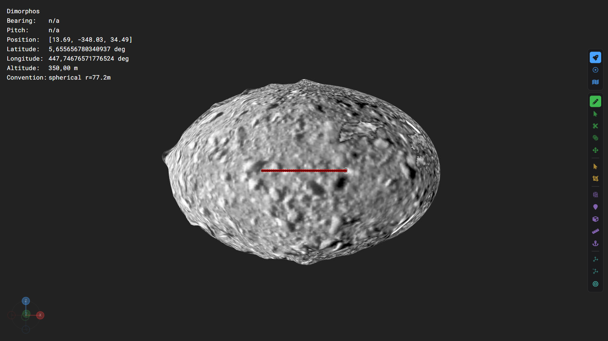
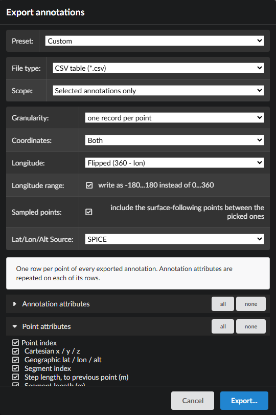
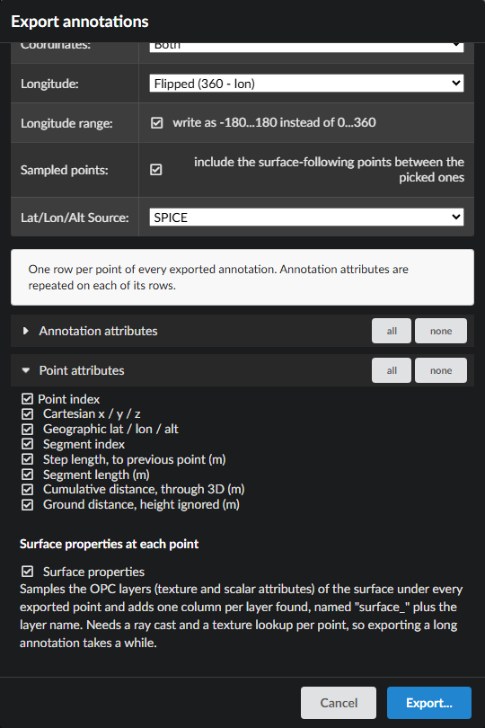

# Multi-attribute profiles

A **profile** is an annotation exported as one row per point, carrying how far along the
line each point is and how high it sits. A **multi-attribute** profile adds, for every one
of those points, the values of the OPC's own data layers underneath it — elevation,
gravity, slope, potential, whatever the dataset ships — so the whole cross-section arrives
in a single table ready to plot.

There is no *multi-attribute profile* menu command. It is a combination of three settings
in one window, and this page walks the whole thing through on the HERA Dimorphos dataset.
For the reference description of every control, see [Annotation Export](AnnotationExport.md).

The screenshots and the excerpt at the bottom are produced by
`tests-ui/tests/annotation-profile-export.spec.ts`, which performs exactly these steps
against the real viewer; regenerate them with `PRO3D_DOC_SHOTS=1`.

---

## 1. Draw the line

Pick **Draw annotation** (the pencil) in the tool strip down the right edge of the render
view, then set *Annotation* to **Line** and the projection to **Sky**.


**The projection is the setting that matters here.** With `Linear`, the two picked points
*are* the whole geometry: the annotation is a straight chord through space and a profile of
it has exactly two rows. `Sky` samples the span between them by shooting rays along the
scene's up-vector into the surface, so the line is draped over the terrain it crosses — and
those draped points are what the profile is made of. `Viewpoint` drapes it too, but samples
along rays from the camera, so the result depends on where you were standing.

Now **ctrl+click** two points on the surface. A `Line` completes itself on the second
point; there is nothing to confirm.



> Each pick ray-casts the surface's KdTrees, and the first pick on a patch loads its tree
> from disk — seconds, during which PRo3D does not react. That is loading, not a hang.
> If picking does nothing at all, the surface has no KdTrees; build them with `opc-tool`.

The annotation stays selected after drawing, which is what the *Selected* scope below picks
up.

## 2. Export it

*Annotations → Export…*, then choose the **Profile** preset. It sets everything a profile
needs in one go: CSV, **one record per point**, scope *Selected*, sampled segment points
on, and every point attribute ticked.



Then open **Point attributes** and tick **Surface properties**. This is the step that makes
the profile multi-attribute, and no preset sets it, because it is the expensive one.



Ticking it switches *Preset* back to **Custom** — expected, and shown in the screenshots
above. A preset only pre-fills the controls; nothing is locked, and changing anything
afterwards moves the label to *Custom* without undoing what the preset set.

Press **Export…** and choose a file.

> **It re-picks every exported point.** Reading the layers means casting a ray per point
> and reading each per-vertex layer there, so expect seconds rather than milliseconds, and PRo3D
> is unresponsive while it runs. Cost is dominated by how many *patches* the line crosses,
> not how many points it has.

## 3. What comes out

One header row, then one row per sampled point, in the order the annotation runs. For the
Dimorphos line above: **44 rows, 26 columns.**

```csv
key,text,surfaceName,pointIndex,segmentIndex,x,y,z,lat,lon,alt,body,latLonAltSource,stepLength,segmentLength,distance,groundDistance,surface_DRACO_1,surface_DRACO_2,surface_Elevation,surface_Gravity,surface_LonLatRad,surface_Magnitude,surface_Normal,surface_Potential,surface_Slope
04d25247…,,Dimorphos,0,0,-17.86673793028778,-83.17453539188264,8.064056598761464,5.414950318728199,102.12348507179354,85.4532191947919,Dimorphos,spice_reclat,0,43.38934354414173,0,0,177.30812350011504;177.30812350011504;177.30812350011504,180.58026045311252;180.58026045311252;180.58026045311252,62.971735173434816,8.794816374747562E-06;4.441696625325292E-05;-7.09813725991753E-06,257.87650697733926;5.414937103912552;85.45338172285355,4.5847124014892136E-05,-0.3470082115851765;-0.8844589321447756;0.2752987988112412,-0.0030084808771983686,13.786625029890011
04d25247…,,Dimorphos,1,0,-16.96306990591158,-83.63249126391263,8.112347803657121,5.430458860470855,101.46568665380471,85.72018153578983,Dimorphos,spice_reclat,1.0142344499557285,43.38934354414173,1.0142344499557285,0.9784695334888547,187.6462645601079;187.6462645601079;187.6462645601079,187.02891535006745;187.02891535006745;187.02891535006745,62.67786205413003,8.334434013093306E-06;4.448823432952289E-05;-6.990670520393172E-06,258.53429508500193;5.4304511379589595;85.72032311675297,4.5814144676308326E-05,-0.3297068615419236;-0.8955739519503706;0.2456696414044667,-0.0030240257145326766,12.60507874090586
04d25247…,,Dimorphos,2,0,-16.014709112995675,-83.91583556914534,8.143737714305148,5.445328409204594,100.80455051589888,85.81759045324625,Dimorphos,spice_reclat,0.9902815333723984,43.38934354414173,2.004515983328127,1.963948614006731,206.86055382355423;206.86055382355423;206.86055382355423,204.8591038782363;204.8591038782363;204.8591038782363,62.18989492465737,7.790576081251202E-06;4.4597331585857994E-05;-6.9919025941747054E-06,259.1954417980158;5.445327680502812;85.81772472765563,4.5827971993407365E-05,-0.23379989165803947;-0.913130481566134;0.23711076760287456,-0.0030455661542982803,12.643903232664744
```

*(`key` shortened for width. The real file carries the full GUID on every row, and it is a
fresh one per annotation, so re-running this will not reproduce that column.)*

### The columns

| Column | What it holds here |
|---|---|
| `key`, `text`, `surfaceName` | the annotation's identity, repeated on every one of its rows |
| `pointIndex`, `segmentIndex` | position along the annotation, and which picked-to-picked stretch it belongs to |
| `x, y, z` | body-fixed metres |
| `lat, lon, alt` | `Coordinates: Both` writes both sets. On Dimorphos `alt` is a **radial distance from the body centre** (~85 m), not a height above a spheroid — see below |
| `body`, `latLonAltSource` | provenance: `Dimorphos` / `spice_reclat`, recorded per row |
| | *Note:* the Profile preset leaves the longitude convention on **Flipped** (`360 − lon`), so `lon` and the raw `surface_LonLatRad` layer disagree by design — 102.12 against 257.88 in the excerpt above. Neither is broken. |
| `stepLength` | distance to the previous point (~1 m here — the sampling amount) |
| `segmentLength` | total length of the segment, repeated on each of its rows (43.39 m) |
| `distance` | running length from the first point, through 3D space — **the x-axis of the profile** |
| `groundDistance` | running length with the height removed — see [the note below](#grounddistance-on-a-small-body) |
| `surface_<layer>` | one per OPC layer sampled under the point, alphabetically |

The nine `surface_` columns are the whole point: `surface_Elevation`, `surface_Gravity`,
`surface_Slope`, `surface_Potential`, `surface_Magnitude`, `surface_LonLatRad`,
`surface_Normal`, `surface_DRACO_1` and `surface_DRACO_2` — every per-vertex layer this OPC
ships, sampled at each point of the line. Its `Earth` layer exists only as a texture, and
point samples read per-vertex layers only, so it has no column.

Multi-channel layers stay in **one** cell, semicolon-separated. In this dataset
`surface_DRACO_2`, `surface_Gravity`, `surface_LonLatRad` and
`surface_Normal` have three components, while `surface_DRACO_1`, `surface_Elevation`,
`surface_Magnitude`, `surface_Potential` and `surface_Slope` are single values. Splitting
them would make the column count depend on which layer a point landed on.

### `groundDistance` on a small body

On Dimorphos `alt` is the distance from the body centre rather than a height above a
reference surface, so the height cannot be removed by setting it to 0 — that is the body
centre. Each step is measured instead on the sphere through it, at the profile's own height.
`groundDistance` is therefore the horizontal run where the line actually lies, and never
longer than `distance`. Up to 6.3.5 it was 0 on every row of such a body
([#830](https://github.com/pro3d-space/PRo3D/issues/830)). The definition per convention is
in [Annotation Export](AnnotationExport.md#the-two-distances).

## Plotting it

`distance` against `surface_<layer>` is the usual topographic-profile shape: the
cross-section of the line, coloured by whatever the OPC measured there.

```python
import pandas as pd
df = pd.read_csv("dimorphos-profile.csv")
df.plot(x="distance", y=["surface_Elevation", "surface_Slope"])
```

The single-valued layers — `surface_Elevation`, `surface_Slope`, `surface_Potential`,
`surface_Magnitude` and `surface_DRACO_1` — read straight into a plot. The rest are
semicolon-separated vectors and need splitting first; `surface_Gravity` is one of them.

## If something is missing

| Symptom | Cause |
|---|---|
| Only two rows | The annotation is `Linear` — it has no draped points. Redraw with *Sky*. |
| No `surface_` columns at all | Nothing was sampled: *Surface properties* is off, the granularity is per-annotation, or the surface is hidden/inactive — only visible, active OPC surfaces are picked, and mesh surfaces have no layers. The schema only contains columns some row produced. |
| `surface_` columns present but empty on **some** rows | Those points missed the surface — the line runs off it, or onto a patch without that layer. |
| `lat`/`lon`/`alt` empty | No reference body: the scene is `None`, `JPL` or `ENU`. Set it under *Coordinate System*. |
| Nothing written, window stays open with a warning | The scope matched no annotation — *Selected* needs one selected. The warning says which. |

## See also

- [Annotation Export](AnnotationExport.md) — every control of the export window
- [Per-Vertex Attribute Layers](VertexAttributes.md) — what the `.aara` layers are
- [KdTrees](KdTrees.md) — the picking structures the sampling depends on
