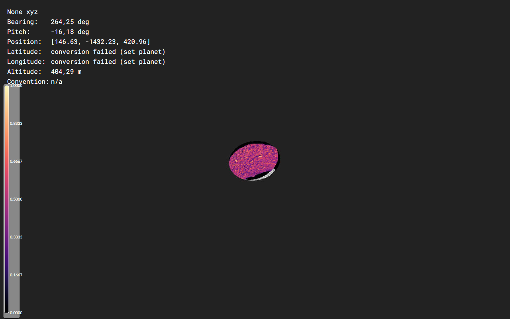
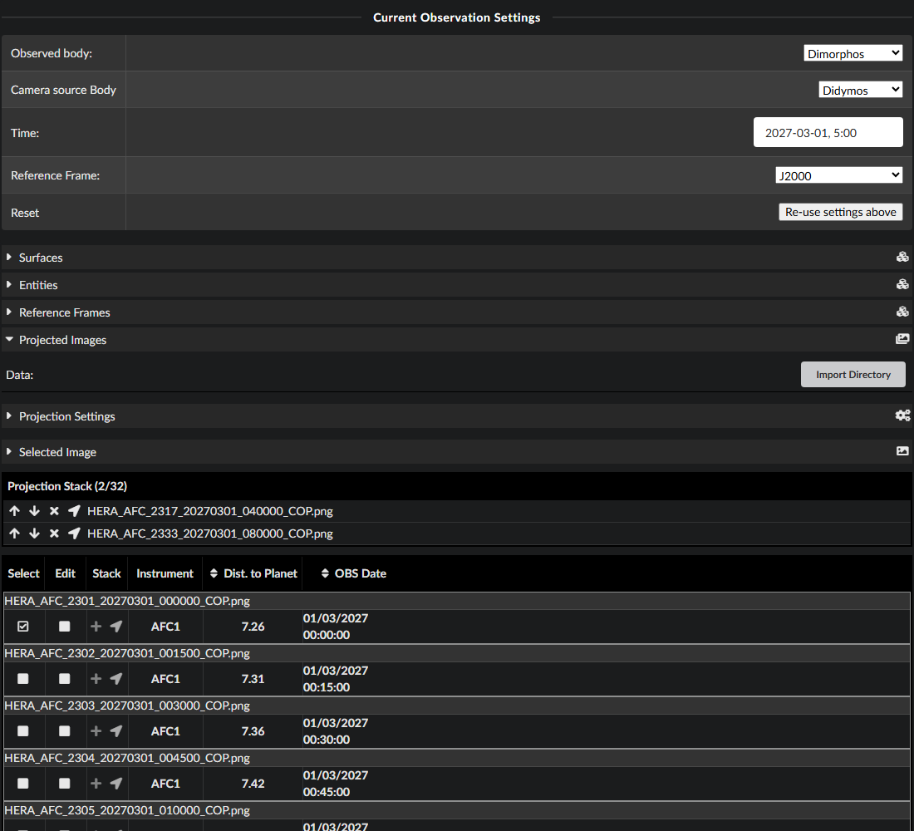
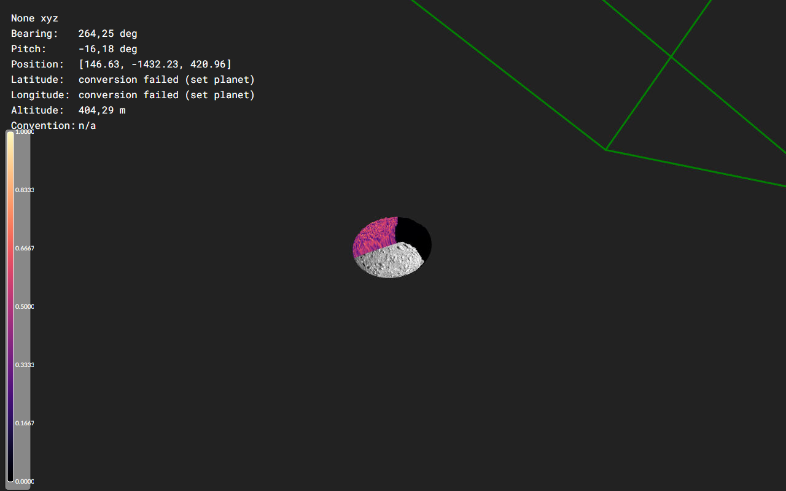
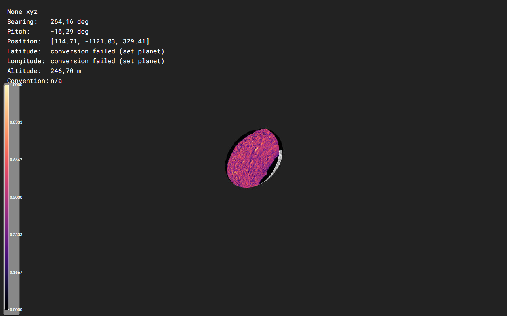
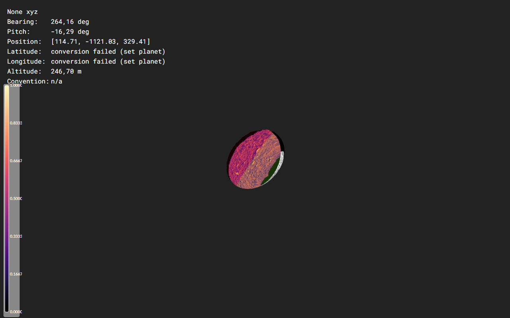

# Multi-Image Projection

Project an **ordered stack of up to 32 same-instrument images** onto a surface
at once — e.g. a flyby sequence over an asteroid. Lives in the GIS tab under
*Projected Images*. Where images overlap, the image **higher in the stack wins**
(painter's order, opaque); the opacity slider blends the stack's result with
the surface texture underneath.

# Workflow

## 1. Set up the scene

The projection surface needs a GIS **entity and reference frame** assigned
(GIS tab → *Surfaces* — e.g. entity `Dimorphos`, frame `DIMORPHOS_FIXED`), and
a SPICE kernel with coverage for the observation epochs must be loaded. Watch
out: the entity must be the body the OPC actually is — assigning `Didymos` to a
Dimorphos OPC draws it a kilometre off.

## 2. Import a folder of images

*Projected Images → Import Directory*. Every image of the folder
(`.tif/.png/.jpg/.exr`, each with its `.mbi.json` sidecar) lands in the
**library** at the bottom of the tab: sortable by observation date and
distance, with instrument, distance and observation date per image. Sorting
the library never changes what is projected.

Settings (opacity, coverage view, lighting, orientation source, boresight
registration) and the selected image's 2D preview fold away into the
*Projection Settings* / *Selected Image* sections.

## 3. Find images by hovering

**Hovering a library row previews that image live in 3D** as if it were on top
of the stack — this is the workflow for finding good images. The hovered
image's **footprint** shows as a green outline on the surface plus the
instrument frustum as a wireframe:

## 4. Build the stack

The **+** in a row adds the image to the top of the **projection stack**
(cap: 32). The stack panel lists the projected images top-first with
↑ / ↓ to reorder, ✕ to remove, and a count indicator. Hovering a stack row
highlights its footprint without changing the rendering.

## 5. Fly to an image

The paper-plane button (library and stack rows) flies the camera onto that
image's **projector axis**: forward along the instrument boresight, standing
off just far enough to frame the instrument's footprint — the rendered view
then corresponds to what the instrument saw:

## 6. Where do my images overlap?

*Projection Settings → Visibility → RelativeCount* colors the surface by how
many **stack** layers cover each fragment (blue = few … red = many):

# Data expectations

- All simultaneously projected images come from the **same instrument** (they
  share dimensions and intrinsics; the FOV comes from
  `PRo3D.Base.InstrumentProjection`, currently AFC-1/AFC-2/HSH/ASPECT).
- Sidecars are matched by the band file names they declare, with an
  `<image>.mbi.json` naming fallback. The observation time comes from
  `DATE-OBS`, falling back to the file-name timestamp (`_yyyyMMdd_HHmmss_`)
  and then `DATE`. Positions declared as km that are actually metres are
  auto-corrected (detected via the sun distance). The projection target body
  comes from the sidecar's `TARGET`. See
  [COP-sidecar-issues.md](COP-sidecar-issues.md) for the data defects these
  fallbacks absorb.
- Per-image display settings (channel, min/max, false-color preview) work
  through each row's edit panel; colormap and false-color toggle apply to the
  whole stack (one instrument, one legend).

# Under the hood

One `sampler2DArray` (layer *i* = stack entry *i*) plus fixed-size uniform
arrays of projector matrices and per-layer min/max — 2 KB of matrices, far
below GL 4.1's uniform-block minimum, so **no storage buffers** and no macOS
platform split. Each projector is computed by SPICE in the surface's
body-fixed frame at that image's own observation time (projections stick to
the terrain regardless of scene time) and memoized per
(image, method, boresight, observer, frame). The fragment loop walks the stack
top-down and stops at the first covering, projector-facing layer.

Not yet: persistence of stack and per-image settings in the scene, drag & drop
reordering, projector-side occlusion. First start after a release that changed
the surface shaders recompiles the effect once — surfaces can take a minute or
more to appear.

The implementation plan (design decisions D1–D8) is archived in
[archive-plans/multiImageProjection.md](archive-plans/multiImageProjection.md).
