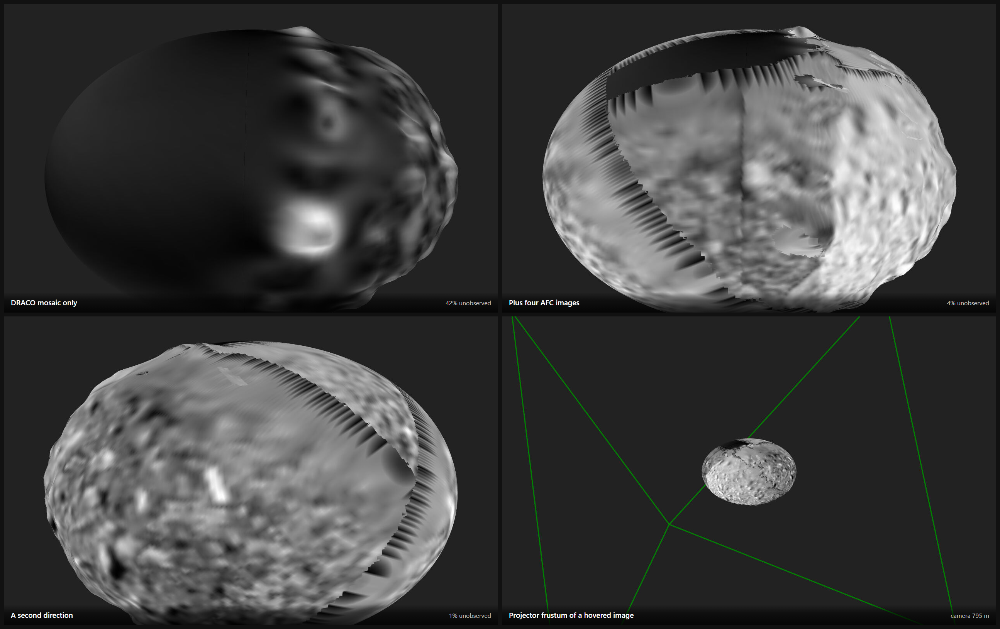
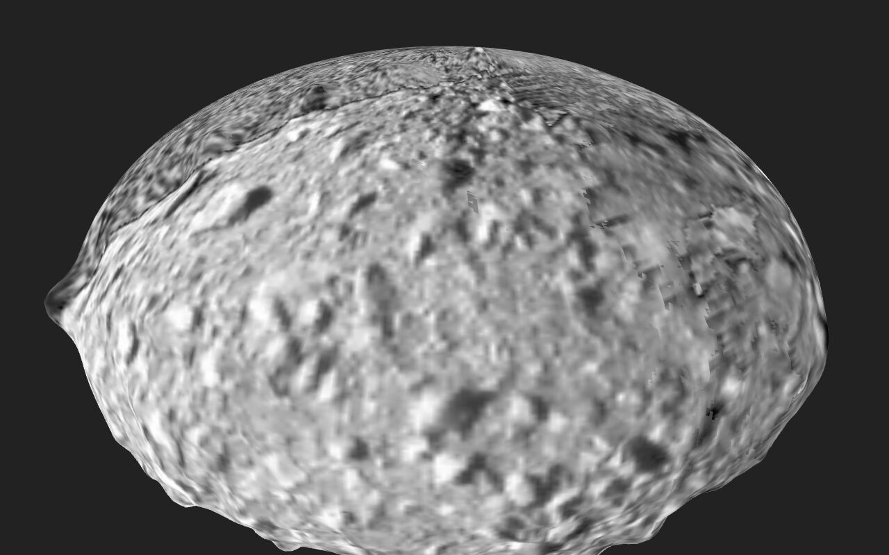

# Multi-Image Projection



Project an **ordered stack of up to 32 same-instrument images** onto a surface
at once — e.g. a flyby sequence over an asteroid. Lives in the GIS tab under
*Projected Images*.

Order and opacity are both set in the GUI:

- **Order** — where images overlap, the one **higher in the stack wins**
  (painter's order, opaque). Reorder with ↑ / ↓ in the stack panel.
- **Opacity** — *Projection Settings → Image Opacity* blends the stack's result
  with the surface texture underneath.

Panels 1 and 2 above are the same camera on the same body. Dimorphos carries its
DRACO mosaic, which does not cover it entirely: from this direction **72% of the
visible body is unobserved** and renders black. Four AFC frames bring that to
**7%**.

# Workflow

## 1. Set up the scene

Pick the body under **Reference System** in the top bar. That sets the
[scene body](SceneBody.md), and a surface with no GIS assignment of its own
belongs to it — so for a single-body scene there is nothing else to set. A SPICE
kernel covering the observation epochs must be loaded.

For surfaces of *other* bodies, assign entity and frame explicitly in
GIS tab → *Surfaces*. Two things to watch:

- The entity must be the body the OPC actually is — assigning `Didymos` to a
  Dimorphos OPC draws it a kilometre off.
- Assign **both** or **neither**. A surface with a body but no frame, or a frame
  but no body, stays unplaced.

The walkthrough below uses the Dimorphos OPC that ships with
[PRo3D.Resources.TestData](https://github.com/pro3d-space/PRo3D.Resources.TestData):

```
HERA/Dimorphos_opc/Dimorphos_DRACO1_DRACO2_Earth/Dimorphos/
```

## 2. Import a folder of images

*Projected Images → Import Directory*. Every image of the folder
(`.tif/.png/.jpg/.exr`, each with its `.mbi.json` sidecar) lands in the
**library** at the bottom of the tab, with instrument, distance and observation
date per image, sortable by date or distance. Sorting never changes what is
projected.

The four AFC-1 frames used throughout this page are in the same test-data
repository:

```
HERA/Dimorphos_opc/AFC_2027-03-21/
```


Settings and the selected image's 2D preview fold away into the
*Projection Settings* / *Selected Image* sections. *Projection Settings* holds:

| setting | what it does |
|---|---|
| **Image Opacity** | blends the projected stack over the surface texture (formerly labelled *Visualization*) |
| **Visibility** | *RelativeCount* shows the coverage view (see 6.) |
| **Transfer Function** | on (default): samples go through the per-image min/max remap and the colour map, which instrument data needs to be readable. Off: the image's own pixels, untouched — for RGB images, and for checking a projection against its source |
| **Winding Correction** | off (default). Turn it on only when an image survives **only near the limb** of the body: that is an OPC whose triangles are wound inward, so the projector-facing test rejects exactly the terrain facing the projector. On: PRo3D estimates each OPC hierarchy's winding from its coarsest patch (loaded once, the first time something is projected) and corrects the inward ones. The estimate assumes a roughly convex body seen from orbit; it is not reliable for near-vertical terrain such as rover outcrops. Saved with the scene. |
| **Orientation Source** | where the pointing comes from — `MbiBased` (default) or `Spice`; see [If an image does not land on the terrain](#if-an-image-does-not-land-on-the-terrain) |

## 3. Find images by hovering

**Hovering a library row previews that image in 3D as the top layer of the
stack.** This is the workflow for finding good images: sweep the library and
watch each one land. Nothing is added — move the pointer away and the preview is
gone. Hovering a row whose image is already *in* the stack does not duplicate its
layer; it only draws the two markers below.

Alongside the preview, two things are drawn for the hovered image alone:

- its **projector frustum**, a green wireframe from the instrument to the body,
- a **green outline** wherever the edge of its footprint crosses the terrain.


The frustum is drawn at the instrument's real standoff, so pull the camera back
to see it whole — above, the camera is 795 m out and the projector 8.4 km.

The outline appears only where a footprint *edge* falls on the terrain. The
AFC-1 frames here were taken from 6.7–8.4 km; at 5.53° that is a footprint
650–810 m across, which covers the 154 m body entirely, so none is drawn.

**Selecting** a row (its checkbox) is a different thing: it opens that image's 2D
preview and makes its min/max and colour map drive the whole stack's legend. On
its own it projects nothing.

## 4. Build the stack

The **+** in a row adds the image to the top of the **projection stack**
(cap: 32). The stack panel lists the projected images top-first with
↑ / ↓ to reorder, ✕ to remove, and a count indicator.


## 4a. Does it actually land? Slide the opacity

The AFC images in the test data were simulated from this same shape model with
`pro3d-tool simulate-image`, so a correct projection lands exactly on the texture
underneath. Drag *Image Opacity* from 0 to 1 and watch:



- **Nothing shifts or doubles** — image and texture coincide.
- **A ghost or doubled crater edge** — the projection is landing in the wrong
  place; see [If an image does not land on the terrain](#if-an-image-does-not-land-on-the-terrain).

Measured on the shipped test data by `tests-ui/src/probe-docs-shots.ts`: at opacity
0 the frame is **pixel-identical** to the bare surface, and at opacity 1 **7.9%**
of it differs. That residue is the image's own noise and shading. A projection
landing in the wrong place moves crater edges, which shows up as a much larger
difference concentrated along them.

Set two things first, or the comparison is meaningless: **Transfer Function off**
(otherwise you are comparing a false-coloured image against a greyscale texture)
and **Orientation Source → `MbiBased`** (the sidecar pointing the frame was
generated with).

## 5. Fly to an image

The location-arrow button (library and stack rows) puts the camera onto that
image's **projector axis**: forward along the instrument boresight, standing
off just far enough to frame the instrument's footprint — the rendered view
then corresponds to what the instrument saw:


The body sits small in that frame on purpose: what is framed is the **footprint**,
and for these AFC-1 images it is 650-810 m across against a 154 m body.

- **It also sets the scene's observation time** to the image's epoch, so the
  sun, the body's placement and everything else SPICE-driven match the moment
  the image was taken. That changes the scene time you save with the scene.
- **The camera jumps; it does not animate** (an animated version is planned).

Setting *Focal (mm)* on the Config page to the instrument's focal length makes
the fly-to land exactly where the instrument was. If fly-to does nothing, the
log names the missing precondition (observed body, SPICE-bound surface, or the
image itself).

## 6. Where do my images overlap?

*Projection Settings → Visibility → RelativeCount* tints the surface by the
**fraction** of the stack that covers each fragment — not by an absolute count,
so with a two-image stack a single covering layer already reads as half. The tint
is blended at 20% over the surface colour:


# Data expectations

- All simultaneously projected images come from the **same instrument** (they
  share dimensions and intrinsics; the FOV comes from
  `PRo3D.Base.InstrumentProjection`, currently AFC-1/AFC-2/HSH/ASPECT).
- Sidecars are matched by the band file names they declare, with an
  `<image>.mbi.json` naming fallback. The observation time comes from
  `DATE-OBS`, falling back to the file-name timestamp (`_yyyyMMdd_HHmmss_`)
  and then `DATE`. Positions declared as km that are actually metres are
  auto-corrected (detected via the sun distance). The projection target body
  comes from the sidecar's `TARGET`. See
  [COP-sidecar-issues.md](COP-sidecar-issues.md) for the data defects these
  fallbacks absorb.
- Per-image display settings (channel, min/max, false-color preview) work
  through each row's edit panel; colormap and false-color toggle apply to the
  whole stack (one instrument, one legend).

## If an image does not land on the terrain

First check **Orientation Source** in *Projection Settings*. It decides where
the image's pointing comes from, and the two modes fail in opposite ways:

| mode | where the pointing comes from |
|---|---|
| `Spice` | Nowhere in the image. The spacecraft position comes from SPICE at the image's epoch, but the camera is then simply aimed at the **body centre** with a fixed up-vector — `InstrumentProjection.getLookAt` computes an attitude and discards it. Every image is painted as if it had been shot dead-centre with one roll, so a frame that was off-centre or rolled lands on the body but its features do not line up. |
| `MbiBased` (default) | The image's own measured attitude (`SC_QUAT`) and range (`TRG_POS`) from its sidecar. Correct when the sidecar is — and badly wrong when it is not, because a mis-stated pointing is followed faithfully. |

So "lands on the body but does not match it" points at the first mode, and
"does not land at all" points at the second plus a sidecar problem.

The pointing comes from two sidecar fields, and they have one convention:
`SC_QUAT0..3` is the quaternion taking vectors from the **spacecraft frame to
J2000**, and `TRG_POSX/Y/Z` is **target minus spacecraft** — a vector from the
camera to the body named in `TARGET`, in km. A sidecar written the other way
round (a conjugated quaternion, a negated vector, or one measured from the
system primary instead of the target) parses perfectly, projects without
complaint, and puts the image nowhere near the body. Nothing in the file says
which reading was meant, so PRo3D cannot fall back.

A generator can self-check: transform `TRG_POS` into the spacecraft frame and
it must come out close to `(0, 0, +1)` — the target is what the camera looks
at, and the boresight is +Z.

To tell a metadata problem from a rendering one, render the body yourself and
project that back:

```
pro3d-tool simulate-image --opc <the same OPC> --time <epoch> --body <body>
    --frame <body-fixed frame> --out sim.png --write-mbi
```

`--write-mbi` writes a sidecar for the camera the render actually used, so
importing `sim.png` and projecting it must lay the image exactly over the
terrain it came from. If it does, the projection chain is fine and the problem
is in the other images' metadata — see
[COP-sidecar-issues.md](COP-sidecar-issues.md), which documents a delivery that
got all three of the above wrong at once.

Worked through with pictures, both modes side by side:
[ProjectionValidation.md](ProjectionValidation.md).

## Known limitation: surface transformations do not reach the projection

The projector is computed in the OPC's own coordinates, taken as the body-fixed
frame of the surface's SPICE reference frame. Nothing a surface is transformed
by afterwards is part of that. What this means depends on the transformation
([#741](https://github.com/pro3d-space/PRo3D/issues/741)):

- **Pre-transformation, Flip Z, SketchFab**: these change what the OPC's
  coordinates *mean*, so a projection would land in the wrong place. PRo3D
  therefore **projects nothing onto such a surface**, and *Projected Images*
  says so in red, naming the surface. Sun lighting and shadows on it are
  unaffected. Other surfaces in the scene still receive the projection.
- **Transformation** (translation, yaw/pitch/roll, scaling, pivot): moves the
  terrain and the projected image together, so an image stays on the same
  terrain points however the surface is transformed. If you transform a surface
  to **correct its registration** (for example to align an OPC with other data),
  the projection does not see the correction. Images land where they would on
  the untransformed OPC. For surfaces placed by SPICE alone, with an identity
  Transformation, this makes no difference.

(Technically: the per-patch projector matrices are `projector * Local2Global`.
The surface model trafo, which carries both the SPICE placement and the user
Transformation, is deliberately left out, because including it applied the
body's rotation twice. Separating the user part from the SPICE part is the fix.)

## Known limitation: hidden terrain is painted too

An image is painted onto every fragment inside its footprint whose face points
towards the projector. That is not a visibility test:

- **No occlusion.** Terrain the instrument could not see because other terrain
  is in front of it (behind a ridge, in the lee of a boulder) receives the image
  anyway, as if it had been visible.
- **Facing is judged against the boresight**, not against the ray to each
  fragment. Faces near the image edge that are nearly edge-on can be classified
  wrongly, by up to half the field of view (about 2.8° for AFC-1, more for wider
  instruments).

So near steep relief, check what an image actually covers before reading its
pixels as belonging to that terrain. A depth map rendered from each projector
would make both exact
([#741](https://github.com/pro3d-space/PRo3D/issues/741)).

# Under the hood

One `sampler2DArray` (layer *i* = stack entry *i*) plus fixed-size uniform
arrays of projector matrices and per-layer min/max — 2 KB of matrices, far
below GL 4.1's uniform-block minimum, so **no storage buffers** and no macOS
platform split. Each projector is computed by SPICE in the surface's
body-fixed frame at that image's own observation time (projections stick to
the terrain regardless of scene time) and memoized per
(image, method, boresight, observer, frame). The fragment loop walks the stack
top-down and stops at the first covering, projector-facing layer. *Winding
Correction* costs nothing in the shader: for an inward-wound hierarchy the
per-patch projector matrix is negated on the CPU, which leaves every projected
position where it is and flips the facing test.

Not yet: persistence of stack and per-image settings in the scene, drag & drop
reordering, projector-side occlusion. First start after a release that changed
the surface shaders recompiles the effect once — surfaces can take a minute or
more to appear.

The implementation plan (design decisions D1–D8) is archived in
[archive-plans/multiImageProjection.md](archive-plans/multiImageProjection.md).
