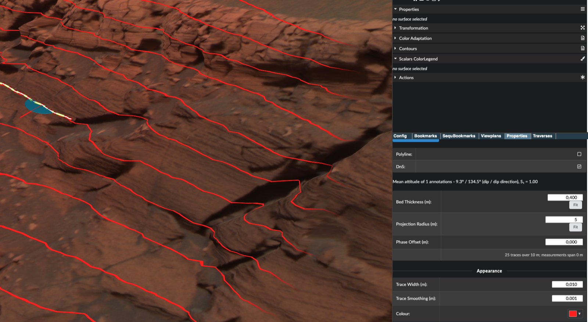

# Synopsis



Outcrop traces show **where a bedding sequence would crop out on the terrain**. You measure the
attitude once — with one dip-and-strike annotation, or an average over many — say how thick the
beds are, and PRo3D draws every place that sequence meets the surface.

In the image above the whole red pattern comes from **a single annotation** (the blue ellipse on
the left, dipping 9.3° toward 134.5°) plus a bed thickness of 0.4 m. Notice that the traces bend
upstream where they cross the gullies: that is the *rule of Vs*, and it is the visual proof that
the geometry is right rather than decorative — a plane cutting topography must do that.

# Why

Two questions this is meant to answer.

**Does this bed continue over there?** Measure bedding at one outcrop, extend the traces toward a
second, and see whether they land on the layering you can see there. If they do, the two sites
plausibly belong to the same sequence. This is stratigraphic correlation, done by eye, at
outcrop scale — and it is the reason the feature exists.

**Is the layering I think I see actually planar?** Fit the sequence to a bed you trust and the
traces either follow the rest of the outcrop or they drift off it. Drift means the bedding is
not a single planar set — it is folded, faulted, or you mis-picked.

The traces are computed per pixel from the plane equation, so they are exact at every zoom level
and every level of detail. Nothing is baked, nothing is resampled, and there is no geometry to
regenerate when you change a number.

> The feature was sketched as *coast lines*, which is a good intuition: a coastline is exactly
> the trace of a horizontal plane on topography — the dip = 0° case of this. The established
> term for the general case is *outcrop trace*, which is what a geological map draws.

# Approach

## 1. Measure the attitude

Draw a **dip-and-strike** annotation on bedding you can see clearly. One is enough. Draw more, at
different spots, if you want the sequence to reflect an average rather than a single reading.

## 2. Select the annotations

Select them in the annotation list — individually with the cube icons, or a whole group with
*Select All*. A single selected annotation works too.

## 3. Enable outcrop traces

**Annotations → Outcrop Traces → *Outcrop traces on***.

The panel immediately reports the attitude it is drawing:

```
Mean attitude of 1 annotation - 9.3° / 134.5° (dip / dip direction), S₁ = 1.00
```

That line is the contract: it names the dip and dip direction actually being used, and `S₁` says
how consistent the selection was. Compare it against the *Dip&Strike* panel — the numbers come
from the same code, so they cannot disagree.

## 4. Set the two distances

| Control | What it means |
| --- | --- |
| `Bed Thickness (m)` | perpendicular (true, stratigraphic) distance between successive beds. `0` collapses the sequence to a single plane |
| `Projection Radius (m)` | how far from the selection the traces are drawn before fading out |
| `Phase Offset (m)` | slides the whole sequence along the plane normal |

Each distance has a **Fit** button that proposes a value from the measurements: *Fit* on the
thickness gives about eight traces across the current extent; *Fit* on the radius gives the
selection's own footprint plus half again.

Underneath, the panel states what the two add up to:

```
25 traces over 10 m; from a single measurement
```

The second clause is the point. It puts the **evidence** next to the **extrapolation**, so
drawing 300 m of traces off 40 m of measurements is a judgement you can see yourself making.

## 5. Line the sequence up

*Phase Offset* slides the whole pattern along the plane normal. Use it to put a modelled bed
exactly on a marker bed you can see, so the rest of the sequence is predicting rather than
merely decorating. The pattern repeats every bed thickness, so one bed of travel reaches every
possible phase — you never need to drag further than that.

## 6. Appearance

Under the *Appearance* divider:

| Control | What it means |
| --- | --- |
| `Trace Width (m)` | full width of the drawn band, perpendicular to the plane |
| `Trace Smoothing (m)` | soft falloff either side of the band |
| `Colour` | trace colour |

All the distance controls take **millimetre** values — the teaser above uses a 10 mm trace width
with 1 mm smoothing, which is what makes lines this fine legible against the rock.

# What it refuses to draw, and why

Each measured plane contributes its **pole** (its normal). Those poles are combined with the
**orientation tensor**, the standard treatment for this kind of data, and its eigenvalues
`S₁ ≥ S₂ ≥ S₃` describe what came out:

| The panel says | Meaning |
| --- | --- |
| the attitude, with `S₁` | one dominant attitude; the traces are drawn |
| *"no dominant attitude"* | the poles are scattered; any average would be arbitrary |
| *"the poles form a girdle"* | **the selection is folded.** No single attitude represents it, so nothing is drawn — and the message names the fold axis instead |

The girdle case is the one that earns its keep. Select both limbs of a fold and a naive average
returns a plane perpendicular to both — geologically meaningless, and no single confidence number
can flag it. Only the spread of the eigenvalues can, so refusing is the honest answer, and the
fold axis is more useful than a trace would have been.

`S₁` is **not** the rose diagram's `R`. The rose measures agreement of dip *directions* only;
`S₁` measures agreement of full 3D orientations. Two beds dipping 5° in opposite directions give
`R = 0` and `S₁ = 0.99`, and both numbers are right about different questions.

# Caveats

> **A measured attitude is a local statement.** The projection radius limits the damage, it does
> not remove it. Extending far past the measurements produces a confident line with nothing
> behind it. This is the one way this feature can genuinely mislead you, which is why the panel
> prints the extrapolation and the evidence on the same line.

- **An average attitude is not a plane fitted through all the points.** It answers *"what
  orientation do these share"*, not *"do these lie on one plane"*. Two parallel beds 50 m apart
  look identical to it.
- **The projection radius is a sphere around the centre of the selection**, not a distance across
  the ground. On steep terrain the visible reach is shorter than the number suggests.
- **The attitude does not follow surface transformations.** It is built from world-space picked
  points, so transforming a surface afterwards moves the terrain and leaves the planes behind.
  Same as cross sections; re-pick to fix.
- **Very thin traces are held at about a pixel and a half.** Below roughly one pixel of terrain
  the antialiasing floor takes over, so 1 mm and 5 mm look identical from far away and diverge
  only as you zoom in. Without that floor a sub-pixel trace flickers between frames instead of
  fading.
- **Traces are not exportable** as geometry or annotations.
- **Headless batch rendering (`PRo3D.Snapshots`) does not show them.** Not a rendering problem —
  the scene graph is shared, so interactive screenshots *do* include traces. The settings are
  simply not saved with the scene yet.

# How it is implemented

**One plane uniform, however many traces are on screen.** The sequence is not N planes uploaded
to the GPU: the fragment shader folds the signed distance into one bed-thickness interval
(`d mod bedThickness`) — the same trick [Contour Lines](./Contour-Lines.md) uses against a
texture value. So there is no uniform array, no per-fragment loop, and no cost to asking for a
thousand traces.

**Everything happens in view space.** The plane is composed on the CPU in `double` and uploaded
camera-relative. The same test in world space would be a `float32` dot product against ~3.4e6 m
on Mars — about 0.25 m of resolution, which is noise next to a 10 mm trace. See
[ai/CONVENTIONS.md](../ai/CONVENTIONS.md).

**Antialiasing is load-bearing, not cosmetic.** Trace width and bed thickness are both in metres,
so a bed thinner than a couple of pixels of terrain shimmers and crawls as the camera moves. The
shader takes screen-space derivatives of the signed distance, clamps the band to at least ~1.5 px
and fades the sequence out below ~3 px per bed, so an over-dense stack dissolves into a flat tint
instead of aliasing. (Use `ddx`/`ddy`, never `ddxFine`/`ddyFine` — the Fine variants need GLSL
4.50 and macOS caps OpenGL at 4.1, where they take the whole surface shader down with them.)

**The trace shader runs last** in both the OPC and OBJ effect stacks, so trace colour survives
lighting and shadowing. `contourLines` sits earlier and *is* shaded — right for a property of the
terrain, wrong for an interpretive overlay.

**Poles are axial data**, which is why the orientation tensor and not a mean of normals:
`n nᵀ = (-n)(-n)ᵀ`, so the stored sign of a fitted plane — which PRo3D never corrects — does not
matter. Summing normals instead makes repeated measurements of one near-vertical bed cancel out.

Code: `src/PRo3D.Core/OutcropTrace-Model.fs`, `OutcropTraceApp.fs`,
`ViewerUtils.OutcropTraceShader`. Tests: `src/Tests/OutcropTraceAttitudeTest.fs` (the combination
maths), `OutcropTraceShaderTest.fs` (GLSL code generation, no GL context needed),
`Features/Section21_OutcropTraces.fs`.

# Future work

- Save the settings with the scene, so batch rendering and reopened scenes keep them.
- Export a trace as a polyline annotation — needs CPU mesh slicing rather than the shader test.
- Offer the fold axis as something drawable in the girdle case, rather than only naming it.
