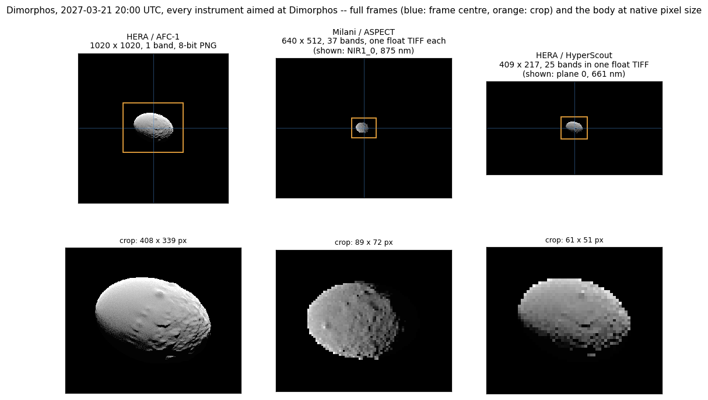
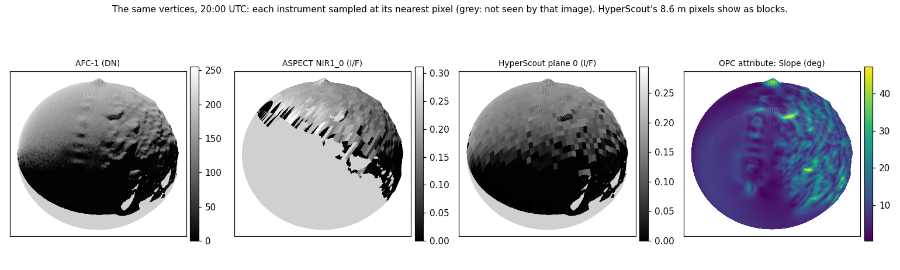
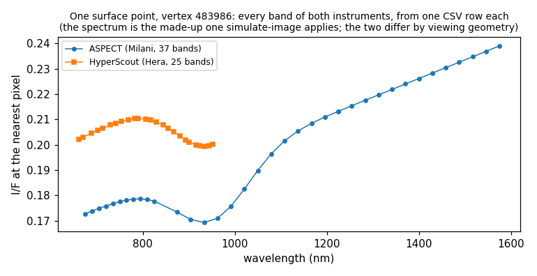
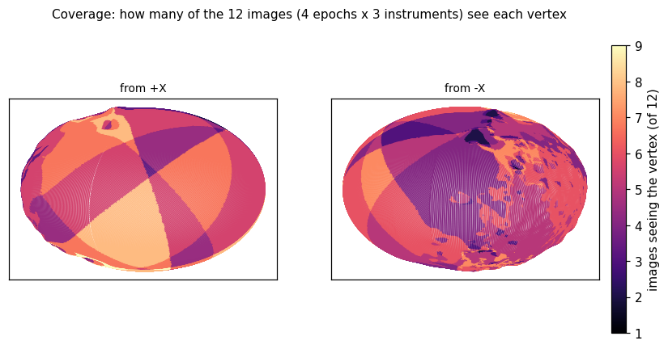

# `pro3d-tool sample-layers`

Assemble observations from several instruments onto the surface of a body, as one dataset
keyed by surface point. Tested on simulated images of HERA's AFC-1/-2 and HyperScout and Milani's ASPECT.

Part of [`pro3d-tool`](./Pro3DTool.md) — see there for installation, test data and
**[SPICE kernel setup](./Pro3DTool.md#spice-kernels)**, which this verb requires.

```
pro3d-tool sample-layers --opc <body-opc> --images <folder> [<folder> ...] --out <dir> [options]
```

Instruments differ in pixel grid, field of view, resolution and viewpoint, so their pixels
cannot be compared directly. This tool compares them on the shape model instead: for every
vertex of the OPC and every image, it works out

- whether the image **sees** the point (in the frame, facing the camera, not hidden by terrain),
- **where** in the image it lands (continuous pixel coordinates),
- the **illumination geometry** there (incidence, emission, phase),
- the value of **every band** at the nearest pixel.

All results are keyed by vertex id, so instruments and epochs line up by construction; OPC
properties such as slope or gravity are written against the same ids.





Figures and excerpts on this page come from a real run over the [test data](#test-data).

## Example

```
pro3d-tool sample-layers ^
  --opc    PRo3D.Resources.TestData\HERA\Dimorphos_opc\Dimorphos_DRACO1_DRACO2_Earth\Dimorphos ^
  --images PRo3D.Resources.TestData\HERA\Dimorphos_opc\SampleLayers_2027-03-21\AFC ^
           PRo3D.Resources.TestData\HERA\Dimorphos_opc\SampleLayers_2027-03-21\ASPECT ^
           PRo3D.Resources.TestData\HERA\Dimorphos_opc\SampleLayers_2027-03-21\HSH ^
  --out    sample-layers
```

```
[images] 12 observation(s) in 3 folder(s)
[body] DIMORPHOS in DIMORPHOS_FIXED
[layers] 2328412 vertices (0.9 s)
[layers] 6 kd-tree(s) loaded
[out] vertices.csv
[out] attributes/Slope.csv
[AFC1_SIM_20270321_140000] 2328412 vertices in the frame, 1165125 facing the camera, 1103763 of those unoccluded
[AFC1_SIM_20270321_140000] HERA_AFC-1 at 2027-03-21T14:00:00.0000000Z: 1103763 vertices seen, 1 band(s) (4.6 s)
...
[ASP_SIM_20270321_200000] MILANI_ASPECT_NIR1 at 2027-03-21T20:00:00.0000000Z: 1136050 vertices seen, 37 band(s) (9.0 s)
...
[HSH_SIM_20270321_230000] HERA_HSH at 2027-03-21T23:00:00.0000000Z: 1122653 vertices seen, 25 band(s) (6.3 s)
```

2.3 million vertices × 12 observations × 252 band columns take about 75 s, without a GPU. The
OPC needs kd-trees: build them once with [`pro3d-tool kdtree`](./Pro3DTool-KdTree.md).

## Options

| Option | Effect |
|---|---|
| `--opc <dir>` | OPC directory of the body (required) |
| `--images <dir> [<dir> ...]` | one or more folders of observations (required); every `.mbi.json` in them is one observation |
| `--out <dir>` | output directory (default `./sample-layers`) |
| `--attributes <a,b,...>` | per-vertex OPC layers to write, comma separated (default `Slope`; `none` for none). Case-insensitive; an unknown name fails the run and lists what the OPC has |
| `--body <name>` | SPICE body of the OPC (default: the images' `TARGET`, e.g. `DIMORPHOS`) |
| `--frame <name>` | body-fixed frame the OPC is in (default `<body>_FIXED`) |
| `--observer <name>` | spacecraft; default follows the instrument per image (ASPECT → `MILANI`, else `HERA`) |
| `--kernel <file>` | explicit metakernel; default is the one the first sidecar names |
| `--kernel-root <dir>` | SPICE kernel tree; overrides `$PRO3D_SPICE_KERNELS` |
| `--method <spice\|mbi>` | projection method, as in [`unproject`](./Pro3DTool-Unproject.md) (default `mbi`) |
| `--occlusion-tolerance <m>` | how far in front of a vertex something must be to hide it (default `0.05`) |

The body defaults to the images' own target, not a fixed name: Dimorphos frames sampled in
`DIDYMOS_FIXED` would give plausible-looking nonsense.

## Input: observations

An observation is one `.mbi.json` sidecar with the band files it lists, or, if it lists none,
the image of the same name (`X.mbi.json` → `X.png`/`X.tif`). Products are read as delivered:

| Instrument | Layout | Columns in the output |
|---|---|---|
| AFC-1/-2 | one 8-bit PNG (or TIFF) | one, named after the file (raw DN, not normalised) |
| ASPECT 2B | one single-band float TIFF per band | one per band, named by its label (`Vis_0` … `NIR2_12`) |
| HyperScout 1B | one float TIFF holding 25 planes (`_Stacked.tif`) | one per plane (`Stacked_0` … `Stacked_24`) |

Pointing is read as in the PRo3D viewer and
[`unproject`](./Pro3DTool-Unproject.md#what-the-image-folder-needs), so the same folders work in
all three. All bands of an observation must share one pixel grid, or it is skipped with a
message.

## Output

```
sample-layers/
  vertices.csv                   id, x, y, z             -- every surface point, once
  attributes/Slope.csv           id, Slope               -- one file per --attributes layer
  images/<observation>.csv       id, image coords, angles, bands -- one file per observation
  manifest.json                  what is where: images, instruments, epochs, band wavelengths
```

Complete excerpts are in [`docs/examples/sample-layers/`](./examples/sample-layers/).

### `vertices.csv`

Every vertex of the finest level of detail, body-fixed, metres; the row is the id.

```
id,x,y,z
0,0.00000,0.00000,57.10000
1,-0.16609,0.00000,57.09905
2,-0.16609,-0.00097,57.09905
```

Each point appears **once**. OPCs repeat points at patch edges, the poles and the 0/360° seam,
so points within 1 mm are merged (Dimorphos: 2 342 530 grid vertices → 2 328 412 points).

### `attributes/<layer>.csv`

One per-vertex OPC layer per file, one column per component (`Gravity_0,Gravity_1,Gravity_2`);
empty where a patch lacks the layer.

```
id,Slope
0,0.360530615
1,0.382033587
```

### `images/<observation>.csv`

One row per vertex the observation **sees**; unseen vertices have no row.

```
id,imageCoordX,imageCoordY,incidence_deg,emission_deg,phase_deg,AFC1_SIM_20270321_200000
483986,552.227,447.086,23.3778,49.8239,33.3411,223
659123,543.883,511.835,38.4388,6.0704,32.9894,151
864290,551.220,595.752,94.4795,62.6612,32.5344,3
```

```
id,imageCoordX,imageCoordY,incidence_deg,emission_deg,phase_deg,Vis_0,Vis_1,...,NIR2_12
483986,306.171,257.406,23.3778,30.0049,47.2654,0.172721446,0.173787326,...
```

```
id,imageCoordX,imageCoordY,incidence_deg,emission_deg,phase_deg,Stacked_0,Stacked_1,...,Stacked_24
483986,210.167,98.952,23.3778,49.8239,33.3411,0.20219703,0.202964053,...
```

| Column | Meaning |
|---|---|
| `id` | the vertex, as in `vertices.csv` |
| `imageCoordX`, `imageCoordY` | where the vertex projects, **0-based, origin top-left, integers at pixel centres** — the `image` convention of [`unproject`](./Pro3DTool-Unproject.md#pixel-convention). Continuous: feeding the row back to `unproject` returns the vertex |
| `incidence_deg` | angle between the vertex normal and the sun direction at the image's epoch |
| `emission_deg` | angle between the vertex normal and the direction to the camera |
| `phase_deg` | angle between sun and camera, seen from the vertex |
| one column per band | the value at the **nearest pixel** (the one whose centre is closest), as stored: float TIFFs in their own units, 8/16-bit images as raw DN |

Vertex 483986 is in all three. Incidence depends only on epoch and sun, so it is the same in
every row; emission and phase match for AFC and HyperScout (both on Hera) and differ for ASPECT
(on Milani). Joining the rows by `id` gives the point's spectrum across instruments:



### Viewpoint and roll differ per image

ASPECT views from Milani, 55° around the body from Hera, and every image has its own roll: at
20:00, north is 16.8° from image up in AFC-1 and HyperScout and 2.6° in ASPECT, and Hera's roll
drifts by 46° over 9 hours. Nothing needs correcting, because every value is looked up through
its own image's camera. Details: [simulate-image: Pointing, aiming and roll](./Pro3DTool-SimulateImage.md#pointing-aiming-and-roll).

### `manifest.json`

The run's OPC, body, frame and metakernel; per image its sidecar, instrument, SPICE frame,
observer, epoch, size, range and vertices seen; per band column its file, plane and wavelength.
Read wavelengths from here, not from column names.

## What "seen" means

A vertex is seen by an image when it is

1. **in the frame**, in front of the camera (the camera the PRo3D viewer projects the image with);
2. **facing the camera**, by its outward per-vertex normal;
3. **not occluded**: nothing on the line of sight lies more than `--occlusion-tolerance` in front
   of it. The tolerance keeps a vertex from hiding behind its own triangles. Only the `--opc`
   body occludes: see [Limitations](#limitations).

The log counts each step. On Dimorphos at 7–8 km, occlusion removes 3–6% of the facing vertices:
crater walls and boulders.

Each image (one epoch of one instrument) is decided separately. The figure counts how many of
the test set's 12 images (4 epochs × 3 instruments) see each vertex. Dimorphos turns in 11.9 h,
so each epoch sees a partly different face; the maximum, 9, is 3 epochs × 3 instruments.



## Accuracy

On the test set, whose sidecars hold the exact render cameras:

| What | Result |
|---|---|
| every band lands in the right column | each ASPECT/HyperScout band, divided by the spectrum it was simulated with, agrees across all bands to 5·10⁻⁸ |
| pixel values match the illumination geometry | correlation 0.88–0.97 with the Lommel-Seeliger term `cos i / (cos i + cos e)` from the output angles; the rest is simulated surface roughness and cast shadows |
| instruments agree with each other | AFC and HyperScout at the same epoch, per point: correlation 0.92–0.99 |
| points land on the body, not beside it | no well-lit point (incidence < 60°, emission < 70°) samples an empty (sky) pixel; zeros occur only near the limb |
| image coordinates lead back to the point | 299 of 300 sampled rows fed to [`unproject`](./Pro3DTool-Unproject.md) return their vertex (median 0.6 mm, p99 4.5 cm); the 300th is seen exactly edge-on at the limb |
| results are reproducible | two runs give byte-identical output |

## Test data

`PRo3D.Resources.TestData/HERA/Dimorphos_opc/SampleLayers_2027-03-21/`: Dimorphos by all three
instruments at 14:00, 17:00, 20:00 and 23:00 UTC, rendered from
`HERA/Dimorphos_opc/Dimorphos_DRACO1_DRACO2_Earth`:

```
AFC/     AFC1_SIM_<epoch>.png (+ .png.json, .mbi.json)            HERA/AFC-1, 1020x1020
ASPECT/  ASP_SIM_<epoch>_<band>.tif (+ .tif.json), .mbi.json       Milani/ASPECT, 37 x 640x512
HSH/     HSH_SIM_<epoch>_Stacked.tif (+ .tif.json), .mbi.json      HERA/HyperScout, 25 x 409x217
```

ASPECT and HyperScout values are rendered I/F times a made-up spectrum: fit for checking where
bands land, not for spectroscopy ([details](./Pro3DTool-SimulateImage.md#spectral-cubes-hyperscout-and-aspect)).
`scripts/make-sample-layers-test-data.py` regenerates the set, `scripts/make-sample-layers-figures.py`
this page's figures and excerpts.

> **⚠ Not planned observations.** Every instrument is [aimed](./Pro3DTool-SimulateImage.md#aiming-a-deliberate-departure-from-the-plan)
> at Dimorphos (`--aim DIMORPHOS`), because Milani's planned pointing leaves it at or beyond
> the edge of ASPECT's field. Epochs, positions, sun and roll are planned; the pointing is not,
> and each sidecar says so (`PRO3DAIM`). Do not use this set to study what the mission will see.

The images also open in the PRo3D viewer (GIS tab → Projected Images → Import Directory, one
folder at a time) and project exactly onto the OPC. Dimorphos is 40–50 pixels across in ASPECT
and HyperScout: real geometry at these ranges, not a flaw.

## Limitations

- **Vertices only.** Points are the OPC's vertices (Dimorphos: 1.96 m grid, denser at the poles).
- **Nearest pixel.** No interpolation: all points under one 8.6 m HyperScout pixel share its value
  (the blocks in the figure).
- **One body.** Only the `--opc` body occludes or shadows. Didymos in front of Dimorphos, or its
  shadow on it, goes undetected: those points count as seen and lit.
- **No cast shadows.** `incidence_deg` is local; a point shadowed by a boulder has an ordinary
  incidence but a dark value.
- **Vertex normals.** Facing and angles use per-vertex normals, [`sun-angles`](./Pro3DTool-SunAngles.md)
  face normals, so they differ slightly on rough terrain. Without normals: no facing test, empty
  incidence/emission.
- **One kernel set per run**: the first sidecar's metakernel, or `--kernel`.
- **Size.** Full-precision CSV: one ASPECT image (1.1 million points × 37 bands) is about 550 MB.

## Future work

- **Occlusion and shadowing by other bodies**: Didymos hiding Dimorphos, and mutual shadowing.
- **Interpolated instrument values**: bilinear, or integrated over each point's image footprint;
  matters most for coarse pixels such as HyperScout's.
- **Chosen points**: a regular lat/lon grid or your own list, besides the vertices.
- **Cast-shadow flag** per point and image.
- **Compact output** (e.g. Parquet) for large runs.
