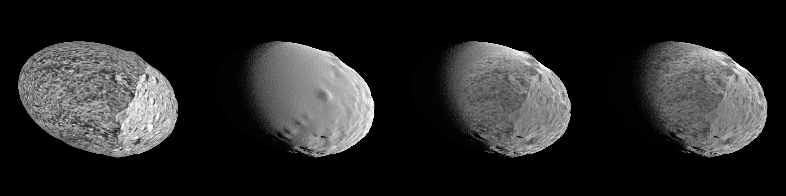
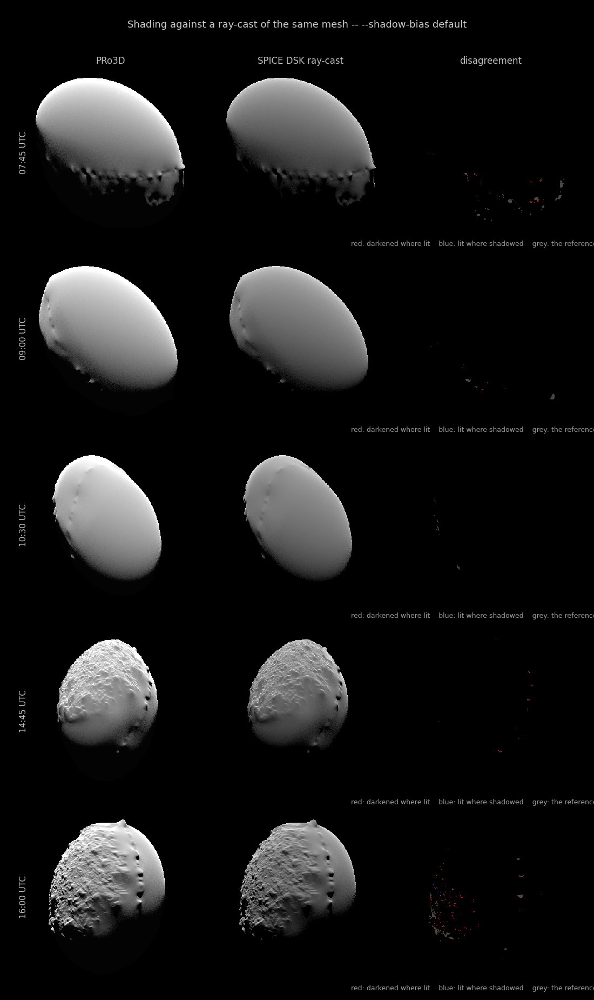
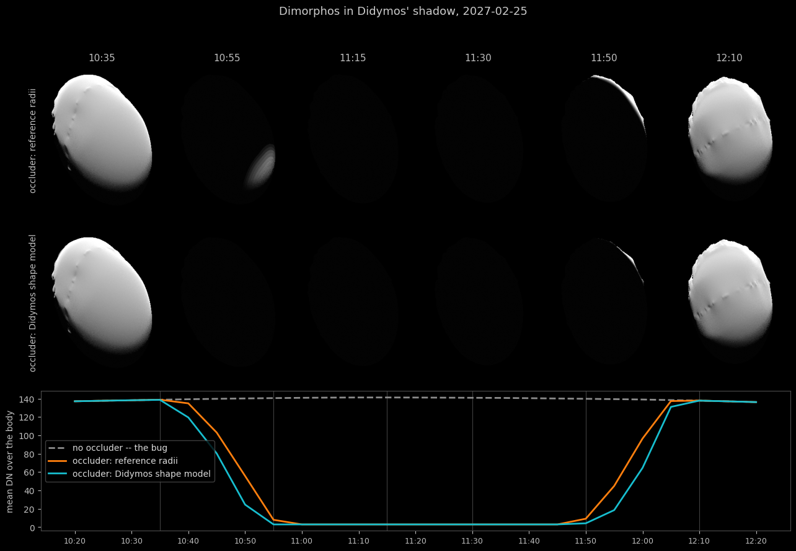
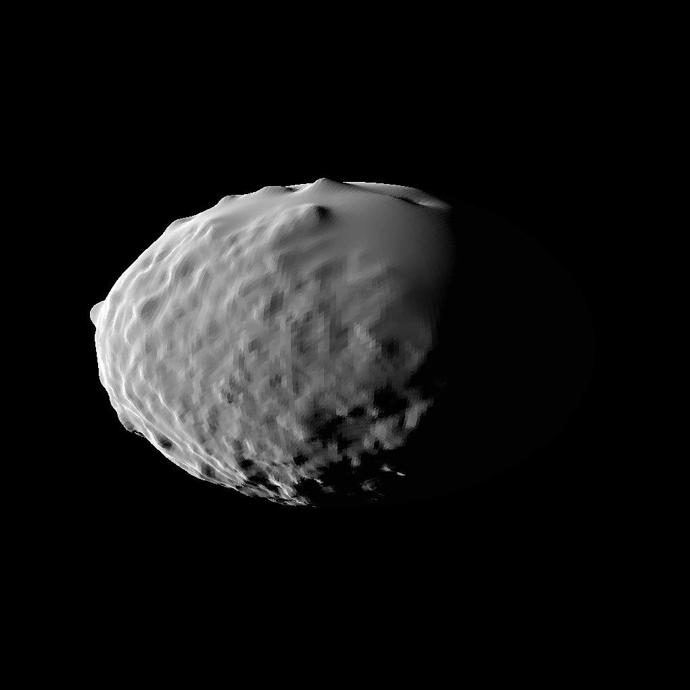
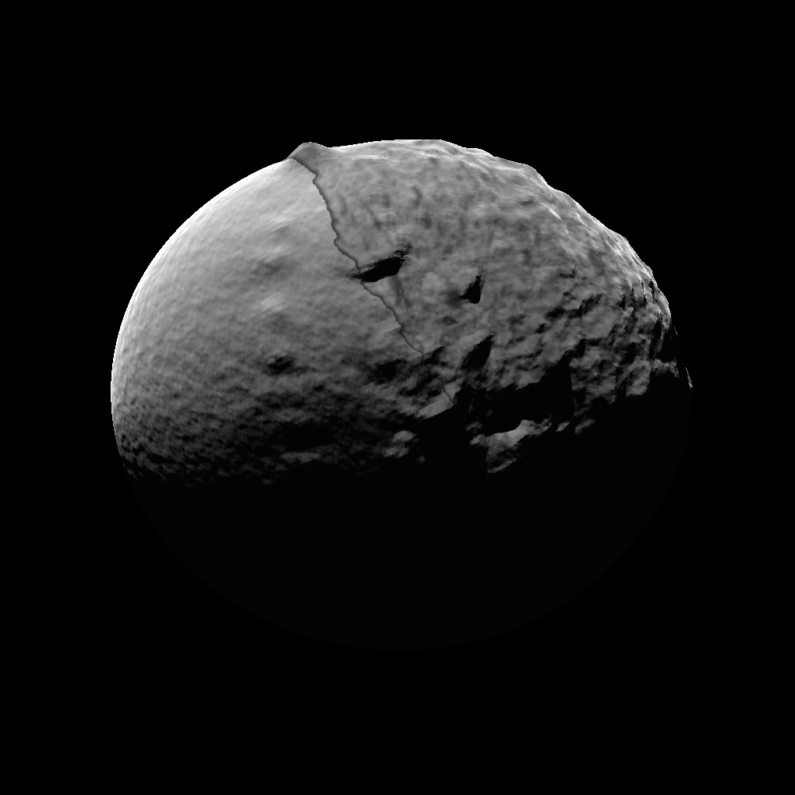

# `pro3d-tool simulate-image`

Simulated asteroid images: give it a time, SPICE kernels, an OPC and an instrument name,
and it renders the body as that instrument would plausibly see it — for preparing and
sanity-checking illumination-based reconstruction workflows (stereophotoclinometry /
shape-from-shading) of the kind used for Dimorphos ([Daly, Ernst, Barnouin et al. 2024,
PSJ](https://doi.org/10.3847/PSJ/ad0b07)) before real images exist.

Part of [`pro3d-tool`](./Pro3DTool.md) — see there for installation, test data and
**[SPICE kernel setup](./Pro3DTool.md#spice-kernels)**, which this verb requires.

```
pro3d-tool simulate-image --opc <body-opc> --time <iso8601-utc> [options]
pro3d-tool simulate-image --opc <body-opc> --mbi <image-or-sidecar> [options]
pro3d-tool simulate-image --obj <shape.obj> --time <iso8601-utc> [options]
```

The second form renders through the camera an existing image's `.mbi.json`
sidecar describes, instead of a look-at camera at `--time`. Together with
`--write-mbi` (below) that turns the verb into a way to *check* the projection
chain rather than only to picture it.

## What goes into the image

- **Geometry from SPICE.** The spacecraft position comes from the SPK at `--time` and the
  sun direction from the same kernels, with the instrument's frustum (AFC: 5.5°,
  1020×1020). The **orientation comes from the CK**, read on the *instrument* frame so the
  real boresight offset (0.145° for AFC-1) is included rather than idealised away. Only
  when no attitude is available at that epoch does the camera fall back to a look-at at
  the body centre, and it says so in the log.

  This has a consequence worth stating plainly: **if the spacecraft was not pointed at the
  body, the render is empty** and the verb reports `the body does not appear in the frame`.
  That is a correct answer, not a failure — see
  [Pointing and observation windows](#pointing-and-observation-windows).
- **Lommel-Seeliger photometry.** `I/F = albedo · 2μ₀/(μ₀+μ)` with a 5 % Lambert
  admixture — the photometric behaviour measured for Dimorphos ([Li et al. 2024,
  PSJ](https://doi.org/10.3847/PSJ/ad2b60): near-lunar scattering, minimal multiple
  scattering, p ≈ 0.16). Plain Lambert shading over-darkens the limb for regolith;
  SPC's own forward model is the closely related lunar-Lambert function.
- **De-shaded texture albedo (opt-in, `--deshade`).** The fit and the divisor must be the
  same layer — `--deshade-layer DRACO_2` now sets both. Pointing them at different layers
  divides one image by a fit made on another; on this OPC the default texture layer is
  `DRACO_1`, which is black over 93 % of the surface, so de-shading silently affected only
  a quarter of the disk:

  

  *DRACO_2 texture | constant albedo | de-shade with mismatched layers (26.6 % of the disk)
  | de-shade with matching layers (62.6 %)*
 OPC textures projected from real
  images (the DRACO mosaic) have illumination baked in — for `Dimorphos_DRACO1` this is
  measurable: per-vertex brightness follows the surface normal at r ≈ 0.6 with a hard
  terminator. With `--deshade`, the verb fits the baked light direction from the OPC's
  own per-vertex normals and brightness, divides it back out in the shader, and rescales
  so the mean matches `--albedo`. Where the source mosaic is shadowed, unobserved (DRACO
  saw only one hemisphere) or near its own terminator, the constant albedo is used
  instead. Off by default because the correction is approximate (see Caveats); the
  default surface is the constant `--albedo` plus micro-structure.
- **Procedural micro-structure.** The OPC is smooth at ~0.2 m/vertex; sub-mesh roughness
  is added by perturbing the shading normal with multi-octave value noise evaluated in
  body-fixed coordinates (`--micro-scale`, `--micro-amplitude`).
- **Cast shadows.** A 4096² depth map rendered from an orthographic sun camera over the
  body, sampled with PCF. `--ambient` keeps the night side barely distinguishable from
  space.
- **Auto-exposure.** I/F is rendered to float and tone-mapped so the 99.5th percentile of
  the body lands at DN 245; the applied gain is logged. Pass `--gain` to fix the exposure
  across a series.

Output is one 8-bit greyscale PNG at the instrument's native size.

## Options

| Option | Effect |
|---|---|
| `--opc <dir>` | OPC directory of the body. Exactly one of `--opc` and `--obj` |
| `--obj <file>` | Wavefront shape model instead of an OPC; `.obj.gz` is read directly. See [Rendering from a mesh](#rendering-from-a-mesh) |
| `--obj-scale <v>` | metres per `--obj` file unit (default `1000`: the SPICE DSK shape models are in kilometres). The resulting extent in metres is logged |
| `--obj-texture <file>` | image to drape on `--obj`, using the mesh's own texture coordinates. Required by `--deshade` / `--texture-albedo` / `--texture-only`, which are refused without it |
| `--time <iso8601>` | observation time, UTC, e.g. `2027-03-15T19:00:00Z` (required unless `--mbi` is given) |
| `--mbi <file>` | render the camera an existing image's `.mbi.json` declares; takes the image or the sidecar. Epoch, instrument and pointing all come from it |
| `--write-mbi` | also write `<out>.mbi.json` and `<out>.json`, so the render can be imported into the viewer and projected back |
| `--out <file>` | output PNG (default `./simulated.png`) |
| `--instrument <frame>` | SPICE instrument frame (default `HERA_AFC-1`) |
| `--observer <name>` | spacecraft carrying the instrument (default `HERA`) |
| `--body <name>` | SPICE body of the OPC (default `DIMORPHOS`) |
| `--frame <name>` | body-fixed reference frame (default `DIMORPHOS_FIXED`) |
| `--kernel <file>` | explicit metakernel (default `<kernel-root>/mk/hera_plan.tm`) |
| `--kernel-root <dir>` | SPICE kernel tree; overrides `$PRO3D_SPICE_KERNELS` |
| `--distance <m>` | camera range override, along the SPICE direction; `0` (default) uses the spacecraft's real distance |
| `--width`, `--height` | output size; `0` (default) uses the instrument's native size |
| `--albedo <v>` | normal reflectance (default `0.16`, measured for Dimorphos) |
| `--deshade` | fit + divide the baked illumination out of the OPC texture and use it as albedo; default off (constant albedo) |
| `--deshade-layer <name>` | per-vertex layer with the texture brightness. Also selects the texture layer that gets divided, so one option sets both. Falls back to `--texture-layer`, then to `DRACO`; if the layer is absent the log names the ones the patch has. Scalar (`float`) and `V3f` layers both work |
| `--micro-scale <m>` | micro-structure feature size in metres (default `0.5`) |
| `--micro-amplitude <v>` | normal perturbation strength; `0` disables (default `0.3`) |
| `--ambient <v>` | night-side floor (default `0.02`) |
| `--gain <v>` | fixed I/F→DN gain; `0` (default) auto-exposes |
| `--pointing <ck\|lookat>` | where the orientation comes from. `ck` (default) uses the attitude in the kernels and **fails** if there is none at this epoch — it never substitutes a synthetic camera. `lookat` aims the boresight at the body centre with an up-vector roll convention: useful for a picture, but not what the instrument saw |
| `--no-shadows` | skip the sun shadow map. Does **not** disable the eclipse: that is the other body blocking the sun, not this body shadowing itself |
| `--occluder-body <name>` | cast the other body of a binary as a shadow — see [Eclipse by the other body](#eclipse-by-the-other-body) |
| `--occluder-frame <name>` | its body-fixed frame (default `<body>_FIXED`) |
| `--occluder-obj <file>` | its shape model; without one the occluder is a tessellation of its reference radii |
| `--occluder-obj-scale <v>` | metres per `--occluder-obj` file unit (default `1000`) |
| `--shadow-bias <v>` | shadow depth bias (default `0.002`) |
| `--no-lighting` | flat white disk instead of a shaded body — the silhouette, for comparing pointing and shape without shading in the way |
| `--texture-only` | the OPC's own texture as this camera sees it: no lighting, no de-shading fit |
| `--texture-layer <name\|index>` | which texture layer `--texture-only` draws **and which texture `--deshade` divides**, by name (`DRACO_2`) or index. **Default is the patch's own default layer, which is not necessarily the one a PRo3D scene displays** — a scene stores its own `selectedTexture`. An unmatched name lists what the OPC declares. |
| `--project <image>` | project this image onto the body through PRo3D's projection shader instead of shading it. With no `--mbi` the camera is that image's own, so the output must reproduce the input |
| `--project-shader <single|stack>` | which shader `--project` goes through: `single` (default, what sun-angles and the testbeds compose) or `stack` (a one-layer stack — what the viewer renders) |

## Generating a projection test set

[`scripts/make-projection-test-data.py`](../scripts/make-projection-test-data.py)
drives this verb to produce a set of AFC-1 frames with sidecars plus a PRo3D scene
set up to project them, and checks every sidecar it writes against the boresight
invariant. See [ProjectionValidation.md](./ProjectionValidation.md) for what that
data is used to prove.

## Generating a time series

[`scripts/make-image-time-series.py`](../scripts/make-image-time-series.py) drives this
verb on a fixed cadence instead — by default one Dimorphos rotation at 15 min, two lit
variants per epoch (micro-structure on and off) at a fixed `--gain`, with a subset ready
to import as a projection stack. See [ImageTimeSeries.md](./ImageTimeSeries.md).

## Checking the shading against SPICE

Rendering from the kernels' own mesh makes a question askable that was not askable before:
`check-renderers.py` compares *outlines*, because two renderers on different shape models
disagree pixel by pixel whatever the lighting does — but the OBJ and the DSK are the same
body, so a per-pixel comparison now measures the **shading** and nothing else.

```
python scripts/check-lighting.py --figure lighting.png
```



Left our render, middle a `spiceypy` ray-cast of the same mesh, right where they disagree:
**red** is ground we darkened that the ray-cast says is lit, **blue** ground we left lit
that it says is shadowed, grey the reference's shadow for context. Measured over five
epochs of 2027-02-25 at phase 35.8–62.8°:

| | |
|---|---|
| cast shadows | IoU **0.891 – 0.984** against `illumf`'s own lit flag, over sun-facing facets only |
| wrongly darkened | **0.002 – 0.40 %** of the sun-facing body, and the picture shows an outline rather than a stipple |
| shadow leak | **0 – 2.9 %** of the reference's shadow — no peter-panning |
| brightness | Pearson **r = 0.9934 – 0.9937**, RMS **3.3 – 4.8 %** of the mean |

The brightness residual is expected and is ours: the ray-cast is pure Lommel-Seeliger while
we add 5 % Lambert (Li et al. 2024). Facets turned *away* from the sun are excluded
throughout — that is the terminator, which every renderer gets right, and including it
grades a shadow map on something else.

### `--shadow-bias` was measured, not guessed

The default is **0.006**, swept against the ray-cast:

| `--shadow-bias` | wrongly darkened | of it isolated | shadow leak |
|---|---|---|---|
| 0.0005 | 18 – 20 % | 4.1 – 6.7 % | 1.3 – 11.5 % |
| 0.002 (the old default) | 2.6 – 6.1 % | 1.0 – 3.2 % | 0 – 2.4 % |
| **0.006** | **0.002 – 0.40 %** | **0.002 – 0.38 %** | **0 – 2.9 %** |
| 0.02 | 0.002 – 0.07 % | ditto | 19 – 24 % |

At 0.0005 the disagreement panel is solid red — acne, a stipple at the scale of a
shadow-map texel across every sun-grazing slope. At 0.02 the shadows detach from their
contact points and a fifth of the real shadow renders lit. The old 0.002 sat in between and
was visibly stippled.

Slope-scaling the bias — which the viewer's own `terrainSunShadow` does — was tried and
**measured no better**: it moves the optimum (base 0.0005 rather than 0.006) without
improving either end. The reason it buys nothing here is that this map is *finer* than the
geometry it renders: 4096² over ~270 m is 6.6 cm a texel against 0.24 m facets, so the depth
error is not the sampling footprint slope-scaling models. It is not in the shader.

<a name="eclipse-by-the-other-body"></a>
## Eclipse by the other body

The scene holds one body. In a binary that is wrong for a measurable fraction of the time:
**Dimorphos lies inside Didymos' shadow for about 12 % of the close-orbit phase — some 235
hours**, and with nothing in the scene to cast that shadow those epochs rendered in full
daylight.

`--occluder-body DIDYMOS` fixes it. The occluder gets a **sun-side depth map of its own**,
fitted to itself, and the shading shader takes a second lookup into it.

Why a second map rather than putting the primary into the target's: the target's map is a
4096² ortho over ~180 m — 5 cm a texel — and stretching it to cover a pair 1.2 km apart
drops it to 0.5 m. That would throw away the target's own self-shadowing to buy a shadow
whose penumbra is a few metres wide. A map fitted to Didymos alone resolves it at 0.3 m,
and the two passes cost each other nothing.

The occluder's **geometry is a shape model like any other**:

| | |
|---|---|
| `--occluder-body <name>` | the other body; empty (the default) disables the whole thing |
| `--occluder-frame <name>` | its body-fixed frame (default `<body>_FIXED`) |
| `--occluder-obj <file>` | its shape model, `.obj`/`.obj.gz`. The kernels ship one: `dsk/g_01165mm_spc_obj_didy_0000n00000_v003.obj` |
| `--occluder-obj-scale <v>` | metres per file unit (default `1000`) |

Without `--occluder-obj` the occluder is a **tessellation of the body's reference radii**
(Didymos: 409.5 × 400.5 × 303.5 m, hard-coded — `CooTransformation` exposes no `bodvrd`,
see [#801](https://github.com/pro3d-space/PRo3D/issues/801)). That is a coarse shape model,
not a special case: it goes through the same depth pass and the same lookup, so there is no
second implementation of "is the sun blocked" to drift.

### What it does, measured

One full event on 2027-02-25, rendered three ways at a fixed gain — the same camera, the
same exposure, differing only in what is casting the shadow:



| | |
|---|---|
| first contact | just after 10:35 |
| totality | 10:55 – 11:45, at the `--ambient` floor (DN 3 of 140) |
| last contact | just after 12:05 |

The dashed line is the bug: without an occluder the body sits at DN ~140 straight through
its own eclipse.

**The real shape and the radii disagree where it matters.** Through ingress and egress the
mesh is ahead of the ellipsoid by up to 30 percentage points of the disk — at 10:40 it is
at 86 % of unshadowed brightness against the ellipsoid's 97 %, and at 11:55 13 % against
32 %. During totality they agree exactly, because a body fully inside the umbra does not
care about the shape of the limb that put it there. So the radii are enough to say *when*,
and only the shape model says *how much*, which is the half the light curve is made of.

Per-epoch numbers in [`eclipse.json`](images/simulateImage/eclipse.json); regenerate both
with `python scripts/make-eclipse-figure.py`.

### Which eclipse to render — and what you cannot have

There are **188 umbra events** between 2027-02-01 and 2027-05-01, about two a day, of which
**137 have AFC-1 actually pointed at Dimorphos**. So there is plenty of choice, and the
choice is worth making deliberately, because one thing is not available at any of them:

> **No eclipse shows the DRACO mosaic lit.** Over all 188 events the sub-solar point sits
> **94–97°** from the centre of the DRACO footprint — a three-degree spread across three
> months. The mosaic is behind the terminator during every single one.

That is the orbit, not the epoch list. An eclipse happens when Dimorphos is anti-sunward of
Didymos, which pins the sub-solar longitude in the body-fixed frame; the DRACO footprint is
a fixed patch of that frame, centred at **lon 264.6°, lat −1.9°** and covering **46 % of the
body** (measured from the OPC's own `LonLatRad` and `DRACO_1` layers — `DRACO_1` is the real
mosaic, black outside its footprint, while `DRACO_2` is the same mosaic with the remaining
54 % filled in synthetically).

So an eclipse series lights the **filled** hemisphere, and `delit` frames of it show
procedural texture rather than DRACO imagery. Nothing is wrong with the render; it is what
that side of the body is made of in this OPC. If the mosaic itself is what you want to show,
that is a different series — the DRACO side is both facing HERA and lit at **138 epochs** of
the phase, best around **2027-02-28T22:00** (footprint centre 10° from the disk centre, 11°
from the sub-solar point, range 6.70 km, phase 20.5°). Rendering from `--obj` sidesteps the
question entirely, at the cost of having no texture at all.

### Caveats

- **The penumbra is approximated by a blur.** The Sun's angular radius at 1.6 AU, across a
  1.2 km separation, smears the umbra edge over a few metres; the shader spreads its
  lookup by that width in texels. It is not a real integration over the solar disk, and
  the gradient's shape is a 3×3 kernel's rather than a limb-darkened Sun's.
- **The occluder is a shadow caster and nothing else.** It is not in the image: if the
  primary is inside the instrument's field of view it will not appear. Rendering both
  bodies is a different job.
- **No light-time correction** between the two bodies — 4 µs across 1.2 km.

<a name="rendering-from-a-mesh"></a>
## Rendering from a mesh

`--obj` renders the body from a Wavefront shape model instead of an OPC. Everything else is
identical — same camera, same photometry, same shadow pass, same shader stack, same sidecar
and the same pointing pre-flight. What changes is the geometry and what it can carry.

**Why it matters.** AFC is 1020 x 1020 at 93.7 urad/px, so at 5 km a detector pixel covers
**0.48 m** while the posts of the Dimorphos OPC are **1.96 m** apart. One post spans about
4 x 4 pixels: frames rendered from that OPC are limited by the shape model, not by the
sensor, and do not resolve what AFC would see. The shape model the SPICE kernels ship is
**0.243 m** per facet — twice as fine as a pixel.

How far that goes is measurable. Against a `spiceypy` ray-cast of the kernels' own DSK, on
four epochs of 2027-02-25:

| | silhouette IoU | lit-region IoU |
|---|---|---|
| OPC render vs ray-cast | 0.972 | 0.862 |
| **OBJ render vs ray-cast** | **1.000** | 0.897 |

The silhouette is exact — 79 836 covered pixels against 79 837, uncentred and unscaled —
because the DSK was built from this very OBJ, so the two renderers are drawing the same
body and nothing but the renderers differ. The lit-region number stays near 0.90 for a
reason that has nothing to do with the shape: our lit mask is thresholded at DN 25 while
the ray-cast writes every pixel with mu0 > 0, which costs about 5 % of the lit area. That
caps any lit comparison of ours against anyone else's at roughly 0.90 whatever the shape —
see [ShapeModelCrosscheck.md](./ShapeModelCrosscheck.md).

**Units.** `--obj-scale` is metres per file unit and defaults to **1000**, because the DSK
shape models are in kilometres (`INPUT_DATA_UNITS = DISTANCES = KM` in their own MKDSK
setup). The extent in metres is logged on load, and an implausible body is warned about:

```
[obj] 1579014 vertices, 3145728 triangles in 1.0 s
[obj] extent 0.1795 x 0.1694 x 0.1152 (file units) x 1000 = 179.5 x 169.4 x 115.2 m
```

**No texture.** The kernel set's shape models carry `v` and `f` lines only — no `vt`, no
`vn`, no `mtllib` — and the `.png` shipped beside each `.bds` is a **preview render, not a
map** (its own `aareadme.txt`: "an image example in png format for convenience"). So
`--deshade`, `--texture-albedo` and `--texture-only` are **refused** on an untextured mesh
rather than quietly falling back to the constant albedo: a `--deshade` frame that came out
as flat albedo is indistinguishable from one that never asked for it.

With `--obj-texture` they all work again. The de-shading fit then samples the texture at
each vertex's own UV and pairs it with the vertex normal, which is the mesh equivalent of
the per-vertex `.aara` layer the OPC path fits against; both go through the same
least-squares.

**What is cheaper, and what is not.** A mesh has no LOD tree, so a pass is complete in its
first frame instead of the eight an OPC needs to refine — which is the difference between a
minute of rendering and eight on 3.1 M triangles. Parsing 175 MB of ASCII takes about a
second, once per process, and `simulate-series` pays it once for the whole series. Reading
`.obj.gz` directly costs nothing measurable and turns 175 MB into 39 MB.

**What a mesh cannot do.** There is no `.opcx`, so `--texture-layer` means nothing and
`--project` has no layer to project onto in the viewer: these frames are for comparing
renderers, not for projecting back. The PRo3D scene the time-series generator writes is
skipped for an OBJ run, and it says so.

## Cross-checking a render against SPICE

The same observation rendered twice — once by this verb from the OPC, once by a ~40-line
`spiceypy` ray-tracer against SPICE's own DSK shape model — agrees to **1.24 %** in
apparent size and **0.014** in axis ratio. See
[ShapeModelCrosscheck.md](./ShapeModelCrosscheck.md), which also shows how much surface
detail the 1.96 m OPC loses against the 0.243 m DSK.

<a name="pointing-and-observation-windows"></a>
## Pointing and observation windows

Because the camera follows the CK, an epoch is renderable only if the instrument was
pointed at the body then — and across a mission phase that is the exception, not the rule.
Measured over HERA's **COP** phase (2027-02-05 → 2027-04-30) against
`hera_plan_v182_20260820_001`, the AFC-1 boresight is within its 2.77° half-FOV of
Dimorphos for just **37 % of the phase**, in 24 continuous windows of 6 h or more (the
longest ≈ 36.7 h).

The reason is not missing data — attitude coverage over COP is **100 %**, with the
pointing locked on its target to a mean residual of 0.0007°. It is that the target is
usually the *other* body: sampled every 10 min across COP, `HERA_SPACECRAFT +Z` is on
**Didymos 66.6 %** of the time, on **Dimorphos 33.2 %**, and slewing between them 0.2 %.
Dimorphos is renderable slightly more often (37 %) than it is targeted (33 %), because the
two bodies are only ~4° apart as seen from HERA and Dimorphos sometimes falls inside
AFC-1's half-FOV while the spacecraft is aimed at the primary.

So a series does not merely need an epoch inside the kernels' coverage; it needs one
inside an *observation window*. A slew shows up as a hard edge: at 2027-03-22T01:24 the
boresight sits 0.15° off Dimorphos, and six minutes later 3.95° off it — and 0.15° off
**Didymos**, which is where it now points. Every Dimorphos render past that point is
empty, while `--body DIDYMOS` would render perfectly well.

That residual 0.15° is not error: it is AFC-1's mounting offset from the spacecraft
axis (0.146° measured, 0.145° declared), which is why it appears identically in every
sidecar this verb writes.

Find the windows before committing a long run:

```python
import numpy as np, spiceypy as sp
sp.furnsh("hera_plan.tm")
et = sp.str2et("2027-03-21T13:00:00")
pos, _ = sp.spkpos("DIMORPHOS", et, "J2000", "LT+S", "HERA")
d = pos / np.linalg.norm(pos)
b = sp.pxform("HERA_AFC-1", "J2000", et) @ np.array([0.0, 0.0, 1.0])
print(np.degrees(np.arccos(np.clip(np.dot(b, d), -1, 1))))   # < 2.77 = in frame
```

## Example

Against the Hera workshop Dimorphos OPC (note the doubled folder — the OPC surface folder
is the inner one):

```
pro3d-tool simulate-image ^
  --opc  C:\data\Dimorphos_DRACO1\Dimorphos_DRACO1 ^
  --time 2027-03-15T16:00:00Z ^
  --distance 2500 ^
  --micro-scale 3 ^
  --deshade ^
  --out  dimorphos.png
```

or, against the public test data, via the script:

```
scripts\run-simulate-image.cmd <testdata>
scripts/run-simulate-image.sh  <testdata>
```

## What it produces — layer by layer

All renders: Dimorphos through AFC-1 from 2.5 km (2027-03-15T16:00Z, phase 63°,
`--distance 2500 --micro-scale 3`, HERA SKD as of 2026-08-20). This is also the
recommended validation procedure for a new dataset or a suspicious-looking image: switch
the layers off, then re-enable them one at a time.

**1. Bare shape, Lommel-Seeliger shading only**
(`--micro-amplitude 0 --no-shadows`). The ~2 m waffle pattern is the SPC model's native
resolution showing through — the mesh is oversampled from a ~2 m GSD DTM — not a
rendering artefact:



**2. + procedural micro-structure** (`--no-shadows`). Regolith-scale grain masks the DTM
waffle:


**3. + cast shadows** (no flags — **the default**): constant albedo, micro-structure and
shadows. Concavities near the terminator darken:


**4. + de-shaded DRACO texture** (`--deshade`). Adds the real surface's albedo-like
mid-tone variation. The difference to (3) is deliberately subtle: measured albedo
variation on Dimorphos is small, and the de-shaded values are compressed and clamped, so
the texture modulates rather than dominates. The dark seam crossing the disk is the
**edge of the DRACO mosaic's footprint** — DART imaged only one hemisphere, and at this
geometry that boundary is in view (see Caveats):



Pick the epoch deliberately: the DRACO mosaic covers only the hemisphere DART saw, so at
epochs where the other side is sunlit the texture contributes little and the surface is
carried by the constant albedo plus micro-structure. Since micro-structure below the pixel
scale (≈ 0.85 m/px at 9 km for AFC) averages out, raise `--micro-scale` when rendering
from far away — or move closer with `--distance`.

## Writing an mbi sidecar

`--write-mbi` writes two files next to the PNG:

- `<out>.mbi.json` — the observation, in the convention PRo3D reads
  (see [COP-sidecar-issues.md](./COP-sidecar-issues.md#pointing--issues-5-6-and-7)):
  `SC_QUAT0..3` is the **spacecraft → J2000** quaternion, `TRG_POSX/Y/Z` is
  **target minus spacecraft** in km, J2000 axes, centred on `TARGET`.
- `<out>.json` — the statistics sidecar, whose only load-bearing content is the
  pixel size that `unproject` needs to turn a pixel into a ray.

Drop the pair into a folder, import it in the viewer's GIS tab and project it
onto the same OPC: the image lands exactly on the terrain it was rendered from.
Anything else is a real disagreement — a wrong texture layer, a shifted OPC, or
a projection bug — and no longer a question of whether the metadata was right.

The geometry is not asserted, it is measured. The sidecar is derived by
inverting the viewer's own projector chain, then read straight back through
`Visualization.projectDirect` — the same call the viewer makes — and the
disagreement is reported:

```
[mbi] round trip: boresight 0.000001 deg, worst corner 0.000 px, max matrix element 1.648e-011
```

Anything past a tenth of a pixel is a warning: the viewer would reconstruct a
different camera than the one the image was rendered with, and the projection
would not overlay. (`src/Tests/MbiSidecarTest.fs` asserts the same round trip,
and pins the convention against the three real HERA sidecars in the fixtures.)

Because the sidecar states the convention in a file that demonstrably works, it
also serves as the reference to hand to a data generator whose own sidecars do
not project.

## Caveats

- **Pointing follows the CK, so it can miss.** The boresight is the spacecraft's planned
  or measured attitude, not an aim at the body centre, so an epoch where the instrument
  was pointed elsewhere renders nothing. Where no attitude exists the verb falls back to a
  look-at with an up-vector roll convention and logs a warning — that frame's roll is then
  arbitrary and will not match a real image. `--mbi` bypasses both cases where a real
  observation exists: it takes the measured attitude from the sidecar.
- **De-shading is approximate.** The baked illumination is divided out with a Lambert
  term of a *fitted* light direction, while the true baked radiance is Lommel-Seeliger
  under an unknown acquisition geometry (and the mosaic blends several frames). Residual
  shading survives; de-shaded albedo is clamped to 0.5–2× of `--albedo` (Li et al. 2024
  found the real albedo variation to be small).
- **The DRACO texture is hemispheric.** The unobserved side falls back to constant
  albedo, so the two hemispheres differ in texture character, and when the mosaic's
  footprint edge is in view it shows as a seam — its texels ramp through dark values
  that neither the de-shade division nor the fallback blend can fully hide.
- **Results follow the kernel set.** The same command with a newer HERA SKD produces a
  different image — planning kernels are regenerated regularly and move the spacecraft
  and the body orientation. For reproducibility, record the kernel-set version (its git
  commit or the `MK_IDENTIFIER` in the metakernel) together with the logged gain.
- **Micro-structure is shading only.** Noise perturbs the normal; it casts no shadows,
  does not alter the silhouette, and is not real topography — a shape-from-shading
  inversion will happily reconstruct it as relief. That is acceptable for look-and-feel
  images and deliberate forward-model-mismatch tests, but the noise is not ground truth.
- **No detector model.** No PSF, no shot/read noise, no 12-bit quantisation — the image
  is cleaner than a real AFC frame.
- **No phase function.** `f(α)` is constant across one image and is absorbed by the
  exposure; absolute radiometry across a series needs `--gain` *and* an external `f(α)`.
- **Designed for small bodies.** The micro-structure noise and the shadow lookup evaluate
  body-frame coordinates in `float32` in the shader — comfortable for a body a few
  hundred metres across, but a deliberate deviation from PRo3D's planetary-scale
  precision rules. Do not point this verb at a Mars-sized OPC and expect clean output.
  `--obj` is the same bargain and a little more so: the mesh is uploaded in `float32`
  body coordinates with no per-patch local frame, which resolves ~10 microns at 180 m and
  ~1 m at 10 000 km.
- **A mesh is one draw call.** The whole shape is resident, so `--obj` trades the OPC's
  level of detail for memory: 3.1 M triangles is about 60 MB of vertex and index buffers,
  and a shape model an order of magnitude larger would need the LOD path back.

## Future work

- **Hapke photometry** behind a flag (w = 0.126, g = −0.36, θ̄ = 18° for Dimorphos), for
  low-phase realism (opposition surge) beyond Lommel-Seeliger.
- **Tessellation-based displacement** so micro-structure gains silhouettes and cast
  shadows, instead of normal perturbation.
- **A `--pointing lookat` override**, to force the body into frame at epochs where the CK
  points the instrument elsewhere. Today the only ways to render such an epoch are a
  sidecar (`--mbi`) or a kernel set whose attitude covers it.
- **Detector chain**: PSF convolution, Poisson/read noise, 12-bit quantisation.
- **Float I/F output + provenance sidecar** for quantitative consumers, mirroring
  `sun-angles`.

