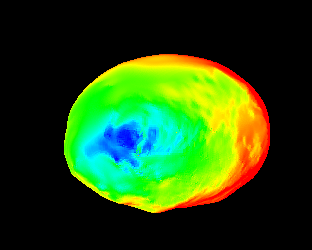
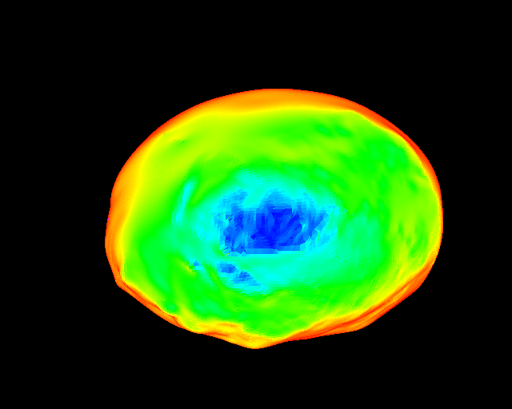

# `pro3d-tool sun-angles`

Per-pixel illumination geometry for instrument images.

Part of [`pro3d-tool`](./Pro3DTool.md) — see there for installation, test data and
**[SPICE kernel setup](./Pro3DTool.md#spice-kernels)**, which this verb requires.

```
pro3d-tool sun-angles --opc <body-opc> --images <image-folder> [options]
```

For each instrument image, the body is rendered as that instrument saw it and the local
illumination geometry is written as float32 rasters, pixel-aligned to the source image.

## Output per image

| File | Contents |
|---|---|
| `<image>_incidence.tif` | surface normal ↔ direction to the Sun |
| `<image>_emission.tif` | surface normal ↔ direction to the observer |
| `<image>_phase.tif` | Sun–surface–observer angle |
| `<image>_angles.json` | epoch, body, frame, observer, kernel, units, caveats |
| `<image>_<angle>_color.png` | false-colour rendering, with `--false-color` |

Single-band float32, **radians**, **NaN as nodata**. Plain TIFF with no georeferencing tags
— an instrument image frame has no map projection to encode. Read as unreferenced float
rasters by GDAL, QGIS, `tifffile` and PIL.

## Options

| Option | Effect |
|---|---|
| `--opc <dir>` | OPC directory of the body (required) |
| `--images <dir>` | folder of instrument images with `.mbi.json` sidecars (required) |
| `--image <file>` | process only this image; default is every image in the folder |
| `--out <dir>` | output directory (default `./sun-angles`) |
| `--body <name>` | SPICE body of the OPC (default `DIDYMOS`) |
| `--frame <name>` | body-fixed reference frame (default `DIDYMOS_FIXED`) |
| `--observer <name>` | observing spacecraft (default `MILANI`) |
| `--kernel <file>` | explicit metakernel, overriding the sidecar's declaration |
| `--kernel-root <dir>` | SPICE kernel tree; overrides `$PRO3D_SPICE_KERNELS` |
| `--method spice\|mbi` | projection method (default `mbi`) |
| `--width`, `--height` | output size; `0` (default) uses the source image's native size |
| `--false-color` | also write one false-colour PNG per angle |

Batch is the normal mode: every image in `--images` with a sidecar is processed, reusing one
SPICE kernel and one render context. A failing image is reported and the run continues; the
exit code is non-zero if any failed.

`--width`/`--height` at `0` is what guarantees pixel alignment. The instrument frustum's
aspect ratio is fixed, so a differently-shaped viewport stretches the result; the tool warns
when the requested size differs from the source.

## Example

```
pro3d-tool sun-angles ^
  --opc     <testdata>\HERA\Didymos_ASPECT ^
  --images  "<testdata>\HERA\Instrument Data" ^
  --out     .\sun-angles ^
  --false-color
```

or via the script, which passes exactly that:

```
scripts\run-sun-angles.cmd <testdata>
scripts/run-sun-angles.sh  <testdata>
```

## What it produces

Source ASPECT frame:


Incidence — blue is near-perpendicular illumination, red is grazing:



Emission — blue faces the instrument, red at the limb:



Only the body named by `--opc` is rendered. Dimorphos appears in the source frame but not in
the rasters, which is also why coverage is a third of the frame.

## `--false-color`

One PNG per angle on a **blue → cyan → green → yellow → red** ramp: blue is 0, red is full
scale (90° for incidence and emission, 180° for phase). Same ramp as
PRo3D.ProjectionTestbed — the function lives in `PRo3D.GIS` and is shared — so outputs of
the two are directly comparable.

- Nodata is black, outside the ramp.
- On emission, pixels above 90° are magenta rather than colour-mapped. A thin magenta rim at
  the limb is expected; magenta elsewhere indicates an inconsistent shape model.

## Caveats

**Terrain self-shadowing is not evaluated.** These are local illumination angles from the
surface normal and the sun/observer directions. A point in the shadow of nearby relief still
reports its geometric incidence angle. Combine with a shadow test for actual illumination.

**Emission above 90° is preserved, not clamped.** It means a facet facing away from the
observer was rasterised — expected at the limb, otherwise a sign of an inconsistent shape
model.

Both are repeated in each output's JSON sidecar.

**A substituted metakernel is logged as a warning.** Sidecars routinely name a kernel version
that is not on disk; the tool then falls back to `hera_plan.tm`, and the geometry may differ
from the image.
