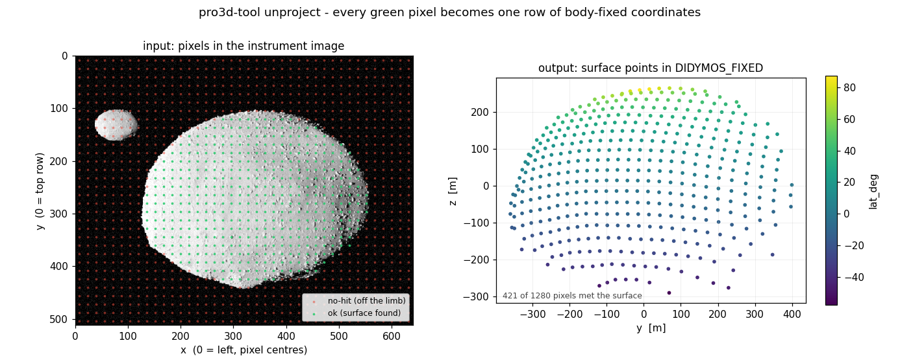
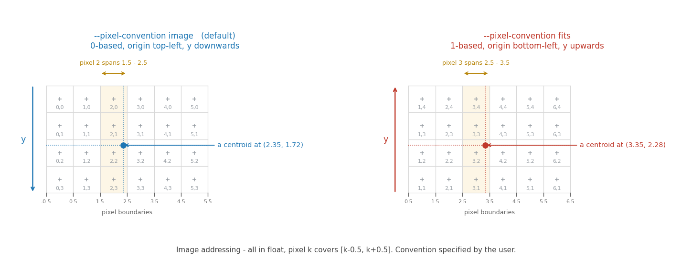

# `pro3d-tool unproject`

Image pixel coordinates to body-fixed surface coordinates on a shape model.

Part of [`pro3d-tool`](./Pro3DTool.md) — see there for installation, test data and
**[SPICE kernel setup](./Pro3DTool.md#spice-kernels)**, which this verb requires.

```
pro3d-tool unproject --opc <body-opc> --images <image-folder> --input <table> [options]
```

Each row of the input names an image and a pixel in it. The pixel is unprojected through that
image's instrument camera and intersected with the shape model, and the surface point is written
out next to the row it came from. 

The OPC must already have kd-trees; build them once with
[`pro3d-tool kdtree`](./Pro3DTool-KdTree.md). The [test data](./Pro3DTool.md#test-data) ships with them,
so the example below runs as-is.



A grid of pixels swept across the ASPECT test image: green where the ray met Didymos, red where
it passed the limb, and on the right the 421 surface points that came back, coloured by latitude
(here latitude, but it can be any layer attribute available in the 3D model — slope, gravity,
potential, elevation).

Both figures on this page are generated by `scripts/make-unproject-figures.py`; the one above is
a real run of the tool, not a mock-up.

## What the image folder needs

`--images` must contain, for every image named in the input:

| File | Carries | Found by |
|---|---|---|
| `<image>.tif` | nothing that is read currently (might use in the future) — but it must be present | the name in your input |
| `*.mbi.json` | pointing quaternion, epoch, target position, SPICE metakernel | content: each sidecar lists the band images it covers |
| `<image>.tif.json` | image width and height | naming convention |

**A folder of bare TIFFs will not work.** Without the `.mbi.json` there is no pointing and no
epoch, so there is no camera to unproject through, and every row comes back `no-image`. These are
the sidecars the instrument products ship with — keep them next to the images.

One `.mbi.json` normally covers many images: an ASPECT export shares a single sidecar across all
its band images, and the association is by the band names recorded inside it rather than by file
naming. So there is nothing to point at in the input; put the folder in `--images` as delivered.

Image names are matched to the folder case-insensitively.

The HERA folder in the [test data](./Pro3DTool.md#test-data) looks exactly like this — three
files for one image:

```
HERA/Instrument Data/
  ASP_000000_270323T060000_2B.mbi.json          pointing, epoch, target, SPICE_MK
  ASP_000000_270323T060000_2B_NIR1_0.tif        the image itself
  ASP_000000_270323T060000_2B_NIR1_0.tif.json   width, height, statistics
```

## Input

Any text table with at least three columns, in this order: **image filename, x, y**.

```
image,x,y,label
ASP_000000_270323T060000_2B_NIR1_0.tif,320,256,crater_rim
ASP_000000_270323T060000_2B_NIR1_0.tif,280.5,240.25,boulder_7
ASP_000000_270323T060000_2B_NIR1_0.tif,412.9,88.04,ridge_shadow
```

- **Separator** — comma, semicolon, tab or whitespace, whichever the file uses. Semicolon covers
  what Excel writes on a European locale.
- **Header** — optional. A first row whose x/y are not numbers is treated as one; there is no
  flag to set.
- **Extra columns** — anything past the third is copied to the output untouched, so your own
  identifiers and metadata survive the round trip.
- **Coordinates** — floats. A centroid is normally not on a whole pixel.
- **Several images** — put them all in one file; each row names its own image, and each image's
  camera is resolved once.

A runnable example against the [test data](./Pro3DTool.md#test-data) ships as
`scripts/example-centroids.csv`.

## Output

One row per input row, in input order, so the result can be joined back on row number.

| Column | Meaning |
|---|---|
| *(input columns)* | reproduced verbatim |
| `status` | `ok`, `no-hit`, `no-image`, `no-pointing` or `bad-input` |
| `x_m` `y_m` `z_m` | surface point in the body-fixed frame, metres |
| `lat_deg` `lon_deg` `alt_m` | see **Coordinates** below |
| `range_m` | distance from the instrument to the surface point |
| *(attribute columns)* | one per per-vertex layer the OPC carries |

Geometry columns are empty for any status but `ok`. The column names carry units so they cannot
collide with an input file that has its own `x` and `y`.

Actual output, from the input above (trimmed to the leading columns):

```
image,x,y,label,status,x_m,y_m,z_m,lat_deg,lon_deg,alt_m,range_m
ASP_..._NIR1_0.tif,320,256,crater_rim,ok,388.6271,-81.4280,83.9454,11.9374,11.8338,-3.6572,9701.699
ASP_..._NIR1_0.tif,280.5,240.25,boulder_7,ok,349.3113,-145.4151,108.2875,15.9708,22.6015,-15.9392,9721.533
ASP_..._NIR1_0.tif,5,5,off_the_limb,no-hit,,,,,,,
```

and with an OPC that carries per-vertex layers, the same rows gain them:

```
...,range_m,LonLatRad_x,LonLatRad_y,LonLatRad_z,Normal_x,Normal_y,Normal_z,Gravity_x,Gravity_y,Gravity_z,Magnitude,Potential,Elevation,Slope
...,10078.87,297.3476,149.7420,68.4884,-0.1568,-0.3525,0.9207,1.907e-06,2.505e-05,-4.223e-05,4.915e-05,-0.003729,44.0821,12.1190
```

`no-hit` means the ray missed the body — a real answer about a pixel off the limb, not an error,
and it does not fail the run. `no-image`, `no-pointing` and `bad-input` do.

### Attributes

Where the OPC ships per-vertex `*.aara` layers (see [VertexAttributes.md](./VertexAttributes.md))
they are interpolated at the hit point and added as columns: `Slope`, `Potential`, `Elevation`,
`Magnitude`, and the vector layers `Normal`, `Gravity` and `LonLatRad` split into `_x` `_y` `_z`.
Not every export has them — the HERA `AARA_Textures` products do, others do not — and the run
says so once when none are found.

Only the per-vertex layers are read, never the texture fallback: that decodes an image per layer
per sample, which is fine for a cursor readout and not for a list of points.

Attribute columns are the layer's **raw stored values**, not converted. That matters for
`LonLatRad`, which on the HERA exports is in **gradians**: `LonLatRad_x` is longitude x 10/9
(0..400) and `LonLatRad_y` is (latitude + 90) x 10/9 (0..200, counted from the south pole); only
`LonLatRad_z`, the radius, is in metres. For degrees use the `lat_deg`/`lon_deg`/`alt_m` columns.

### Coordinates

`x_m`/`y_m`/`z_m` are in the frame given by `--frame`, by default `DIDYMOS_FIXED`. Longitude is
east-positive, as `CooTransformation` returns it.

`lat_deg`, `lon_deg` and `alt_m` are derived via SPICE from the intersection point, not read
from the shape model. A body with no known coordinate convention leaves these three columns
empty.

For the shape model's own values, use its attribute columns instead: `Elevation`, and the radius
in `LonLatRad_z`.

## Options

| Option | Effect |
|---|---|
| `--opc <dir>` | OPC directory of the body (required) |
| `--images <dir>` | folder of instrument images with `.mbi.json` sidecars (required) |
| `--input <file>` | the coordinate table (required) |
| `--out <file>` | output table; default `./unproject.csv`. `.csv` gets commas, anything else tabs |
| `--body <name>` | SPICE body of the OPC (default `DIDYMOS`) |
| `--frame <name>` | body-fixed frame for the output (default `DIDYMOS_FIXED`) |
| `--observer <name>` | observing spacecraft; by default derived per image from its instrument |
| `--kernel <file>` | explicit metakernel, overriding the sidecar's declaration |
| `--kernel-root <dir>` | SPICE kernel tree; overrides `$PRO3D_SPICE_KERNELS` |
| `--method spice\|mbi` | projection method (default `mbi`) |
| `--pixel-convention image\|fits` | how the input addresses pixels — see below |
| `--config <file>` | JSON supplying any of the above; explicit flags win |

`--observer` rarely needs setting: AFC is on Hera and ASPECT on Milani, and the spacecraft
follows the instrument, so one input file may mix them.

A `--config` file uses the same names:

```json
{
  "opc": "D:/hera/Didymos_ASPECT",
  "images": "D:/hera/Instrument Data",
  "input": "centroids.csv",
  "out": "centroids_xyz.csv"
}
```

## Pixel convention

Coordinates are read in whichever convention you declare. All values are floats; pixel *k* covers
`[k-0.5, k+0.5]`.

| `--pixel-convention` | centre of first pixel | origin | y axis | typical source |
|---|---|---|---|---|
| `image` (default) | `0` | top-left | downwards | OpenCV, `scipy.ndimage`, GIS, most image tools |
| `fits` | `1` | bottom-left | upwards | astropy, SExtractor, FITS pipelines |



The HERA instrument products — ASPECT and AFC — are addressed as `image`, so the default is
already right for them and nothing needs passing. Use `--pixel-convention fits` when the
coordinates came out of a FITS pipeline.

The choice is echoed in the run log and recorded in the output. PRo3D authors are happy to validate the results of your science case to rule out coordinate system flip problems for sure.

## Example

```
pro3d-tool unproject ^
  --opc    <testdata>\HERA\Didymos_ASPECT ^
  --images "<testdata>\HERA\Instrument Data" ^
  --input  centroids.csv ^
  --out    centroids_xyz.csv
```

or via the script, which passes exactly that:

```
scripts\run-unproject.cmd <testdata>
scripts/run-unproject.sh  <testdata>
```

where `<testdata>` is a clone of
[PRo3D.Resources.TestData](https://github.com/pro3d-space/PRo3D.Resources.TestData):

```
git clone https://github.com/pro3d-space/PRo3D.Resources.TestData.git
```

An end-to-end check of the whole chain — CLI, SPICE, kd-tree intersection, output writer — runs
the verb and verifies what came back:

```
PRO3D_TEST_DATA=<testdata> PRO3D_SPICE_KERNELS=<hera> scripts/test-unproject.sh
scripts	est-unproject.cmd <testdata> <hera>
```

It is not part of the CI suite, which has neither the test data nor the kernels.

## Caveats

- **The camera model is a pinhole with no distortion**, and the principal point is assumed to be
  the image centre. Field of view comes from a table keyed by instrument frame
  (`HERA_AFC-1`, `HERA_AFC-2`, `HERA_HSH`, `MILANI_ASPECT_NIR1`); nothing is read from the IK
  kernels. An instrument that is not in that table cannot be used.
- **Accuracy is set by the pointing**, which comes from the sidecar quaternion. `range_m` is
  reported so a pointing error in angle converts to a ground distance.
- **The nearest surface along the ray is returned**, so occlusion is handled — an occluded pixel
  reports the front surface, which is what the image shows.
- **One metakernel per run.** SPICE keeps a single active metakernel; a list of images spanning a
  mission phase boundary has to be split into one run per kernel.
