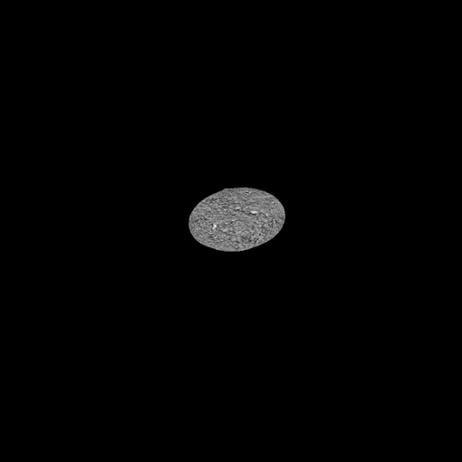
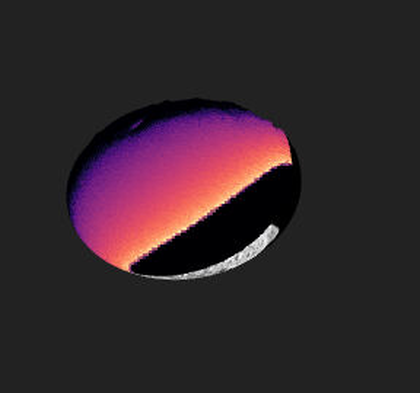
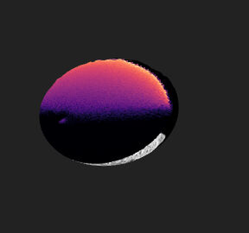

# Validating the image projection

Why do projected instrument images not sit exactly on the body, and how do we
tell a *metadata* problem from a *rendering* problem?

This page answers both with pictures. Everything here is reproducible from
[`pro3d-tool`](./Pro3DTool-SimulateImage.md) and the Playwright harness in
`tests-ui/`; the numbers are the ones those runs printed.

**Short answer.** Two independent things, neither of them a bug in the
projection maths:

1. The **Orientation Source** defaults to *SPICE*, which does not read the
   image's pointing at all — it aims the camera at the body centre with a fixed
   roll. Images therefore land on the body but their features do not line up.
2. Switching to *MBI* uses the image's measured attitude, and then the **HERA
   COP delivery's sidecars** turn out to state that attitude three different
   ways wrong, so those images miss the body entirely. Real HERA sidecars
   (AFC2, HSH, ASPECT) are fine.

---

## 1. The geometry is right: simulated vs delivered

`pro3d-tool simulate-image` renders the body from SPICE at a given epoch. Here
it is at `2027-03-01T04:00:00Z` next to the COP delivery's own frame for that
epoch (`HERA_AFC_2317_20270301_040000_COP`):

| `simulate-image` (SPICE camera) | the delivery's own frame |
|---|---|
|  |  |

Same size, same place in the frame, same orientation. The illumination differs
(the COP render is near-flat, ours is Lommel-Seeliger at a 41° phase angle) and
ours carries the DRACO mosaic's texture rather than synthetic regolith — but the
**silhouette agrees**, which is the part that depends on ephemeris, body
orientation and instrument frustum. SPICE, the shape model and the delivery's
images are consistent with each other.

## 2. The MBI path is right: real ASPECT data

The stronger test uses a *real* observation. `simulate-image --mbi` takes the
camera from an existing image's own `.mbi.json` — through the viewer's
projection code, not a look-at — and renders with it. If the sidecar convention
were misread, the render would not line up with the image it came from:

```
pro3d-tool simulate-image --opc <Didymos_ASPECT> \
    --mbi "ASP_000000_270323T060000_2B_NIR1_0.tif" \
    --body DIDYMOS --frame DIDYMOS_FIXED --observer DIDYMOS --write-mbi
```

| the real ASPECT frame | rendered through *its own* sidecar |
|---|---|
|  |  |

Didymos sits at the same place, at the same size, in the same orientation.
(Dimorphos is missing on the right simply because the OPC contains only
Didymos.) The image and sidecar are from `PRo3D.Resources.TestData`
(`HERA/Instrument Data`, `HERA/Didymos_ASPECT`) — no hand-made metadata is
involved; the delivery's own sidecar is used as it ships.

## 3. The closed loop: render it, project it back

`--write-mbi` writes a sidecar describing the camera the render actually used,
so the image can be imported into the viewer and projected onto the very
terrain it came from. It must land exactly on itself.

The tool checks this before you even open the viewer: it reads the file it just
wrote back through `Visualization.projectDirect` — the same call the viewer
makes — and reports the disagreement.

```
[mbi] round trip: boresight 0.000001 deg, worst corner 0.000 px, max matrix element 1.648e-011
```

`tests-ui/tests/projection-overlap.spec.ts` then does the viewer half: import
the render, fly onto its projector axis, and measure how much of the body the
projection repaints.

```
body pixels 66175, covered 90.7%, spilled into space 0.18%
```

The missing tenth is the limb, where the projector grazes the surface and falls
off. 0.18% "spill" means the projection essentially never paints where there is
no surface.

## 4. What is actually wrong, in the viewer

All four pictures below are the same scene, same camera, same OPC
(`Dimorphos_0_Meridian`), one image in the stack. Only the **Orientation
Source** and the image differ. Coverage is the fraction of visible body the
projection repainted.

Terrain with nothing projected:


| | **SPICE** (default) | **MBI** |
|---|---|---|
| **COP frame, as delivered** | <br>87.9% — lands, but offset | <br>**0.0% — misses entirely** |
| **`simulate-image --write-mbi`** | <br>83.9% | <br>**89.7% — lands** |

Read the table by column:

- **SPICE column** — both images land about equally well, because this mode
  ignores what the image says and points at the body centre either way. Look at
  the COP cell: the projected footprint is visibly shifted off the limb, dark
  along the upper-left edge and leaving an uncovered crescent at the
  lower-right. Nothing about the picture can be right here except by accident,
  because the image's roll and its off-centre pointing were discarded.
- **MBI column** — this mode follows what the image says, and the two images
  diverge completely. Our own sidecar puts the image back where it came from.
  The COP sidecar puts it nowhere near the body.

`pro3d-tool unproject` says the same thing without a GPU — the centre pixel of
that COP frame finds no surface with `--method mbi` and hits at 8557 m with
`--method spice`.

## 5. Why the COP sidecars miss

Three independent defects, each documented with its evidence and its fix in
[COP-sidecar-issues.md](./COP-sidecar-issues.md#pointing--issues-5-6-and-7):

| | field | delivered | should be |
|---|---|---|---|
| 5 | `SC_QUAT0..3` | J2000 → spacecraft | spacecraft → J2000 (the conjugate) |
| 6 | `TRG_POSX/Y/Z` | the camera's location | target **minus** spacecraft |
| 7 | `TRG_POSX/Y/Z` | measured from Didymos | measured from `TARGET` (Dimorphos) |

Correcting all three by hand makes the same centre pixel land on Dimorphos at
8561.9 m range, 0.15° from the delivery's own ground-truth boresight in
`COP/PRo3D.json`. Correcting only 5 and 6 still misses: Dimorphos is 1.05 km
from Didymos at an 8.2 km standoff, which is 7.0° — more than the AFC's whole
5.53° field of view.

The one-line self-check for a generator: transform `TRG_POS` into the
spacecraft frame and it must land on `(0, 0, +1)`. The three real HERA
sidecars in `src/Tests/data` do, to 1e-4; `src/Tests/MbiSidecarTest.fs` asserts
it.

## Reproducing this page

```
# 1 + 3: render Dimorphos at a COP epoch, with a sidecar
pro3d-tool simulate-image --opc <Dimorphos OPC> --time 2027-03-01T04:00:00Z \
    --body DIMORPHOS --frame DIMORPHOS_FIXED --observer HERA \
    --instrument HERA_AFC-1 --out sim/SIM_AFC1.png --write-mbi

# 2: render a real ASPECT observation through its own sidecar
pro3d-tool simulate-image --opc <Didymos_ASPECT> --mbi <the .tif> \
    --body DIDYMOS --frame DIDYMOS_FIXED --observer DIDYMOS --write-mbi

# 3: the viewer half (asserts; needs the scene's own OPC)
cd tests-ui && PRO3D_SIM_IMAGE_DIR=<sim> npx playwright test projection-overlap

# 4: look at one case, including the ones that fail (asserts nothing)
PRO3D_PROBE_IMAGE_DIR=<folder> PRO3D_PROBE_METHOD=MbiBased \
PRO3D_PROBE_LABEL=cop-mbi npx tsx src/probe-projection-landing.ts
```

The Playwright harness is machine-local by design (real GPU, local OPC and
image data); `tests-ui/src/pro3d.ts` lists the `PRO3D_*` variables.
