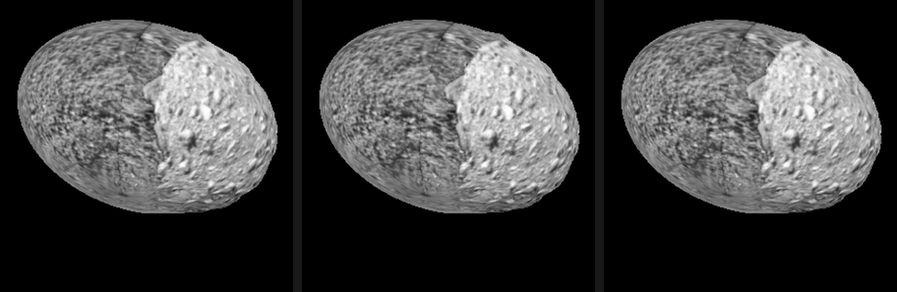
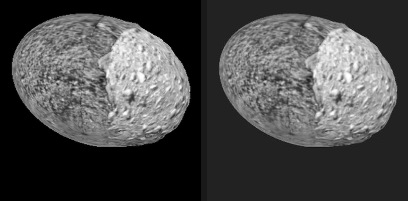
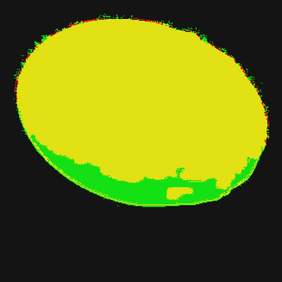
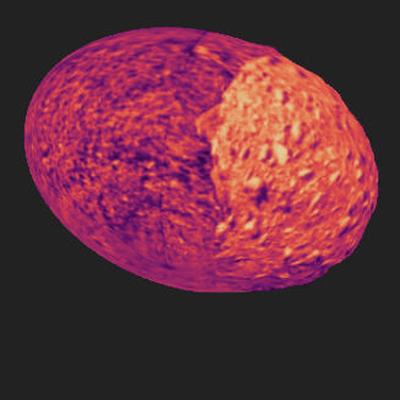

# Validating the image projection

Does a projected instrument image land exactly on the terrain, and if not, is
the fault in the projection or in the image's metadata?

This page answers that with a dataset we generate ourselves, so that "correct"
is something we can construct rather than assume. Everything here is
reproducible from [`pro3d-tool`](./Pro3DTool-SimulateImage.md) and the
Playwright harness in `tests-ui/`; the numbers are what those runs printed.

**Where things stand.** All three rungs pass, the production viewer included.
Projecting an AFC frame back onto the shape model it was rendered against, from
that frame's own camera, reproduces the frame **at zero pointing offset** in all
three — see [the proof](#the-proof) below.

Things that still make images look wrong independently of the projection itself:

1. **Orientation Source** set to *SPICE* reads no pointing from the image at all
   — it aims the camera at the body centre with a fixed roll, so real frames land
   on the body with their features out of place. It used to be the default, which
   made a correct projection look broken out of the box; **MBI** is the default
   now.
2. A sidecar can state the pointing wrongly, and the projector will follow it
   faithfully. The HERA COP delivery does exactly this.
3. **The scene has to be set up before any of it can work.** From an empty
   PRo3D, projection needs an observed body, a surface bound to a SPICE body,
   and a time inside the loaded kernels' coverage. PRo3D's default epoch is
   2025-03-10, where HERA has no ephemeris for Dimorphos — nothing resolves, and
   because SPICE calls serialise on a global lock the failing calls repeat every
   frame and the interface crawls. The fly-to now names whichever precondition
   is missing.
4. **The texture layer is not cosmetic.** `Earth` is a placeholder world map,
   and the two DRACO layers cover different hemispheres, so the wrong choice can
   leave a nearly black frame that any correlation will happily score well.
   See [the proof](#the-proof).

---

## The ladder

The projection is validated in steps, each with a number rather than an
impression, and each only meaningful once the one below it holds:

| step | what it isolates | status |
|---|---|---|
| **1** | the projection shader itself (`stableImageProjection`, offscreen — what `sun-angles` and `ProjectionTestbed` compose) | **passed**, below |
| 2 | the stack shader (`stableImageProjectionStack`), offscreen, same image and camera — must equal step 1 | **passed**, below |
| 3 | the production viewer, same image and camera — must equal step 2 | **passed**, below |

All three pass, and all three are now compared the same way: against the source
image itself.

Step 3 used to be excused from that ("the viewer has its own field of view and
standoff") and compared against the terrain underneath instead. It no longer
needs the excuse. Flying to the image puts the camera on the projector's own
axis, and setting *Focal (mm)* to the instrument's makes the viewer's field of
view the instrument's, so the render is the same gnomonic projection of the same
scene as the source frame — just on a different pixel grid. Resample by the
width ratio and the two must agree **at zero shift**. That is a stronger claim
than fitting each body's bounding box: a fit quietly absorbs a real pointing
error and then reports a meaningless few-pixel residual, which is exactly what
an earlier version of this page did.

Prerequisites for step 3, all now in: the *Transfer Function* toggle (off = the
image's own RGB, so the render is comparable to the source rather than to a
colour-mapped version of it), the viewer's missing `NormalFlip` binding, a
fly-to that lands pointing at the body, and the projector matrix fix below.

<a name="the-proof"></a>
### The proof

One AFC-1 frame projected back onto the shape model it was rendered against,
from that frame's own camera. Every number below comes from a single run over a
single state, so the page cannot drift out of internal consistency:

- OPC `Dimorphos_opc` (the current export)
- texture layer **DRACO_2**, epoch **2027-03-21T20:00**, range 6 706.8 m
- viewer window 1100×1100, *Focal (mm)* 122.563 = AFC-1's 5.5307°
- *Orientation Source* MBI, *Transfer Function* off

| rung | correlation at zero shift | best shift found | mean ΔDN |
|---|---|---|---|
| **1** tool, single-image shader | **0.9999** | (0, 0) px | 0.0995 |
| **2** tool, stack shader | **0.9999** | (0, 0) px | 0.0077 |
| **3** viewer, production render | **0.9705** | (0, 0) px | — |

and for the viewer, the checks that a correlation alone cannot make:

| check | result |
|---|---|
| orientation — all eight square symmetries scored | **identity**, margin **0.8776** over the next best |
| coverage — from the shader's own coverage view | **99.2%** of 49 789 body pixels |
| silhouette overlap — lit frame | IoU **0.87**, centroid offset **6.0 m** |

Rungs 1 and 2, offscreen — source, single-image shader, stack shader:



Rung 3, the production viewer — source left, render right, same angular scale,
no fitting of any kind:



Silhouettes (yellow both, red source only, green render only) and the coverage
view (tint = how many stack layers cover a fragment):

| silhouette overlap | coverage |
|---|---|
|  |  |

**Reading these honestly.** The registration and orientation numbers are
unambiguous: the shift search ranged ±24 px (±0.12°) and peaked at zero, and the
identity beat every flip and rotation by 0.88. The silhouette IoU is the weakest
of the four and should not be read as a 13% error: the source frame's unlit limb
is DN 0, indistinguishable from space, while the viewer's mask is "not the clear
colour" and so includes it. Across the four epochs in the dataset the disk fills
0.90–0.93 of its own bounding ellipse, which is the size of that bias. It is a
gate — *do the outlines coincide at all* — not a precision measurement.

Three choices in that setup are load-bearing, and each was got wrong at least
once during this work:

- **DRACO_2, not DRACO_1 or Earth.** `Earth` is a placeholder world map. The two
  DRACO layers are different DART passes over different hemispheres, and at these
  epochs HERA looks at the DRACO_2 side. Measured at 20:00: DRACO_2 mean DN 5.80
  over 42 241 lit pixels, DRACO_1 mean 2.96 over 18 831, Earth mean 0.66. An
  earlier version of this table was computed on DRACO_1 and reported 1.0000 /
  1.0000 / 0.9628 — correlating two near-empty images. True, and worthless.
- **A frame with texture, and a frame with light, for different checks.** The
  texture-only frame carries the surface detail the registration and orientation
  checks need; the lit frame fills the disk so its outline is the body's outline.
  Neither does both.
- **The viewer's field of view set to the instrument's**, and a squarish window.
  That is what makes the two frames the same gnomonic projection of the same
  scene, so they can be compared at zero shift instead of by fitting.

## 1. The projection shader reproduces the image it was given

`pro3d-tool simulate-image --write-mbi` renders the body from SPICE and writes
an `.mbi.json` describing **the camera it actually used**.
`simulate-image --project` then feeds that image back through PRo3D's own
single-image projection shader, rendering from the same camera:

```
pro3d-tool simulate-image --opc <TestData>/HERA/Dimorphos \
    --project HERA_AFC_0005_20270304_140000_SIM.png \
    --body DIMORPHOS --frame DIMORPHOS_FIXED --observer DIMORPHOS \
    --out reprojected.png
```

The output must *be* the input. The transfer function is switched off for this
(`UseFalseColor` off, `DataType` float, range 0..1 makes `ColorMapping.remap`
the identity) and the exposure is pinned to 1, so the comparison is DN for DN
rather than through a colour map.

| source image | projected back onto the body | \|difference\|, stretched 0–8 DN |
|---|---|---|
|  |  |  |

(AFC-1 frames are **1020 × 1020** — square, per `hera_afc_v06.ti`. These three
are the same square crop around the body, at the same scale.)

| | |
|---|---|
| body pixels rendered / source non-zero | 54,662 / 54,707 |
| mean \|ΔDN\| | **0.077** |
| median \|ΔDN\| | **0** |
| bit-identical pixels | **94.24%** |
| within ±1 DN | **99.49%** |
| worst | 51 DN |

The residual is the silhouette, not the geometry: of the 75 pixels past 4 DN
(0.137% of the body), **90.7% lie within 3 px of the limb**, where the source's
local gradient is **141 DN/px** against 4.5 DN/px over the body as a whole —
bilinear resampling across a hard edge, which no projection can avoid.

So the projection shader, the sidecar convention and the camera model are
correct together. Anything that misregisters downstream is introduced after
this point.

**What this step cannot show.** Source and reprojection share one camera, so a
wrong *absolute* roll would rotate both together and cancel. Roll is pinned
elsewhere: against the real ASPECT frame it comes out at **−2.03°** (IoU 93.9%),
and for AFC the same code lands within **11.9°** of the COP delivered frame at
the same epoch — different by an amount the delivery's own 34° body-orientation
error covers, and nowhere near the 90° a wrong `specialTrafos` entry would give.
An independent absolute-roll check for AFC would need a real AFC frame with
trustworthy metadata, which we do not have.

## 2. The stack shader agrees with it

The viewer does not render through `stableImageProjection`; it renders the
projection **stack**. `--project-shader stack` sends the same image, the same
projector and the same camera through `stableImageProjectionStack` as a
one-layer stack — the per-patch matrices coming from `projectionUniformMap`
exactly as in the viewer:

```
pro3d-tool simulate-image --opc <TestData>/HERA/Dimorphos     --project HERA_AFC_0005_20270304_140000_SIM.png --project-shader stack ...
```

| | |
|---|---|
| body pixels drawn, single / stack | 54,662 / **54,662** |
| drawn by one shader only | **0** |
| mean \|ΔDN\| between the two | 0.072 |
| identical pixels | 94.75% |

**Coverage is bit-for-bit the same** — not one pixel differs in which fragments
the two shaders accept — so the geometry, the projector composition and the
facing test agree exactly. The two paths are the same projection.

Where they differ in *value*, it is filtering, and the stack is the better of
the two. Against the source image:

| shader | mean \|ΔDN\| | identical | within ±1 DN |
|---|---|---|---|
| single-image | 0.0771 | 94.24% | 99.49% |
| **stack** | **0.0054** | **99.46%** | **100.00%** |

The 75 differing pixels (0.137%) sit exactly where step 1's residual sat: 90.7%
within 3 px of the limb, median source gradient 141 DN/px against 4.5 over the
body. The single-image path samples a mip-mapped `sampler2d`, the stack an
un-mipmapped `sampler2dArray`, so the single path blurs slightly where the
projected texel density falls below 1:1. Nothing here is geometric.

## 3. The viewer reproduces the image it projects

Project an image onto the body and look from the projector's own viewpoint. The
render must **be** the image again. The terrain's own texture does not enter
into it, which is what makes this the test to run: it needs no assumption about
what the surface is textured with.

Setup: one simulated AFC-1 frame of Dimorphos, projected onto
`Dimorphos_opc`. *Fly to image* puts the camera on that frame's projector
axis; *Focal (mm)* = 122.563 makes the viewer's field of view AFC-1's 5.5307°;
*Orientation Source* = MBI; *Transfer Function* off, so the layer is painted as
its own RGB. Window 1100×1100, square, because a 16:9 window would frame the
body by its shorter vertical fov instead of the instrument's.

Four checks, in this order. The order matters: every content-level number is
meaningless if the silhouettes do not coincide, and a shift search cannot see a
flip.

| # | check | result |
|---|---|---|
| **0** | geometric overlap — do the silhouettes coincide? | IoU **0.87**, centroid offset **6.0 m** (see the caveat above) |
| **1** | orientation — all eight square symmetries scored | **identity wins**, margin **0.8776** over the next best |
| **2** | registration against the source, shared angular grid | **0.9705** at **zero** shift (±24 px searched) |
| **3** | coverage, from the shader's own coverage view | **99.2%** |

The figures are [in the proof](#the-proof), which is the same run: source
against viewer render, the silhouette overlap, and the coverage view.

Two of those four checks deserve a note on how to read them.

**The silhouette check is a gate, not a measurement.** Its green band along the
bottom limb is not a projection error — it is where the source frame's unlit
limb reads as DN 0, indistinguishable from space, while the viewer's mask is
"not the clear colour" and includes it. Across the dataset's four epochs the
disk fills 0.90–0.93 of its own bounding ellipse, which is the scale of that
bias. It answers *do the outlines coincide at all*, which has to be true before
any content-level number means anything, and nothing finer.

**The orientation check exists because a shift search cannot see a flip.** A
mirrored image correlates poorly at every shift, and the search reports the
least-bad one — which reads as "slightly misregistered" rather than "mirrored".
So all eight square symmetries are scored and the identity has to win. Here it
wins by 0.88, which is not a close call.

That both matter was shown the hard way: an intermediate build passed the
silhouette check at IoU 0.95 while its content was uncorrelated at 0.046, because
the body had rotated under a camera aimed at where it used to be and a triaxial
ellipsoid looks much the same whichever way it is turned.

Two frames because they test different things. The lit render fills the disk, so
its outline **is** the body's outline and check 0 means something. The
texture-only render carries the surface detail that checks 1 and 2 need — the
lit frame is nearly featureless at this phase angle (8.2° on a smooth shape
model), so its correlation would be carried partly by the disk shape rather than
by the surface. Trusting a number whose region does not contain the evidence is
the mistake the rest of this page is a record of.

### Why not compare against the terrain instead

An earlier version of this section did exactly that — rendered the mosaic as the
instrument sees it, viewed the surface with the same mosaic as its texture, and
compared the two. The idea is sound and it would be the sharper test, because it
checks the image is glued to the *right* terrain rather than merely reproduced
from the viewpoint it was taken from.

It was withdrawn because the version that ran had two independent faults, either
of which alone invalidates it:

- **The metric scored the wrong thing.** It correlated the viewer *with* the
  projection against the viewer *without* it — "did these two frames stay the
  same" — over a region restricted to the lit side. The score is dominated by
  pixels the projection never touched, so the more broken the projection, the
  fewer it repaints and the *closer to 1.0000* it scores. It reported 1.0000 at
  (0,0), ΔDN 0.000, 99.99% bit-identical, and concluded "exact" for a projection
  that was rotated. A test whose score improves as the subject gets worse is not
  a test.
- **The two sides showed different data.** `--texture-only` draws the patch's
  default texture layer (`Earth`, index 0) and has no option to pick another,
  while the scene selects `DRACO_1` (index 8). Measured from the same camera:
  the tool's render correlates **0.0345** with the viewer's `DRACO_1` terrain
  and **0.8616** with its `Earth` terrain. No projection could have made the
  original comparison agree.

Restoring it needs a way to tell the tool which texture layer to render — see
*Still open*. Until then the projector-viewpoint test above is what stands, and
it does not depend on the terrain's texture at all.

## Supporting evidence: a self-made AFC dataset

`pro3d-tool simulate-image --write-mbi` renders the body from SPICE and writes
an `.mbi.json` describing **the camera it actually used**. Project that image
back onto the same shape model and it must land on itself — there is no
metadata to doubt, because the render and the sidecar are the same camera.

Eight AFC-1 frames of Dimorphos are committed to the test data repository as
`HERA/SimulatedAFC` (see the README there), rendered against the OPC sitting
next to them so the set is self-contained:


Three independent checks, all on the committed files:

| check | result |
|---|---|
| sidecar read back through `Visualization.projectDirect` vs the render camera | boresight **0.000000°**, worst frustum corner **0.000 px** (all 8) |
| `unproject --method mbi`, 5 pixels per frame | **40 of 40** hit the shape model |
| `TRG_POS` transformed into the spacecraft frame | `(0.00225, 0.00118, 0.999997)` — +Z, as the convention requires |

The residual `(0.00225, 0.00118)` is not error: it is AFC-1's real 0.145°
offset from the direction the spacecraft tracks.

### In the viewer

Validated by the projector-viewpoint test in [step 3](#3-the-viewer-reproduces-the-image-it-projects):
silhouettes coincide, orientation is the identity, registration 0.9705 at zero
shift, coverage 99.2%.

The close-up figures that used to sit here were renders from before the
double-rotation fix. They showed the projection reaching only part of the body,
with a ragged edge stair-stepped along triangle boundaries — the per-triangle
facing test working from a misrotated normal. They are not kept: a page of
validation evidence should not carry pictures of a defect next to text
describing the fix, which is how they were being read.

The coverage numbers that went with them (17.1% before the `NormalFlip` binding,
86.2% and 92.1% after) were *changed-pixel* counts, which understate coverage
because they cannot tell "not covered" from "covered by a value that matches".
The number to trust comes from the shader's own coverage view: **99.2%**.

## Supporting evidence: real data, ASPECT at Didymos

The self-made set proves the chain is self-consistent. A *real* observation
proves the convention is the one real deliveries use.

`simulate-image --mbi` takes the camera from an existing image's own sidecar —
through the viewer's projection code, not a look-at — and renders with it. If
the convention were misread, the render would not line up with the image it
came from:

```
pro3d-tool simulate-image --opc <Didymos_ASPECT> \
    --mbi "ASP_000000_270323T060000_2B_NIR1_0.tif" \
    --body DIDYMOS --frame DIDYMOS_FIXED --observer DIDYMOS --write-mbi
```

| the real ASPECT frame | rendered through *its own* sidecar |
|---|---|
|  |  |

Same place, same size, same orientation. (Dimorphos is missing on the right
only because that OPC contains Didymos alone.) Both files are in the test data
repository under `HERA/Instrument Data`; the sidecar is used exactly as it
ships.

## The setting that decides whether any of this is used

*Projection Settings → Orientation Source*:

| mode | where the pointing comes from |
|---|---|
| **SPICE** | Nowhere in the image. The spacecraft position is SPICE's, but the camera is then aimed at the **body centre** with a fixed up-vector — `InstrumentProjection.getLookAt` computes an attitude and discards it. Every image is painted as if shot dead-centre with one roll. |
| **MBI** (default) | The image's measured attitude (`SC_QUAT`) and range (`TRG_POS`). Correct when the sidecar is, and faithfully wrong when it is not. |

So the symptom tells you where to look: *"lands on the body but the features do
not line up"* is the first mode; *"does not land at all"* is the second plus a
sidecar problem.

Measured in the viewer, one image in the stack, same scene and camera
throughout:

| | **SPICE** | **MBI** |
|---|---|---|
| COP frame, as delivered | <br>87.9% of the body repainted — but offset | <br>**0.0% — misses entirely** |

`pro3d-tool unproject` says the same without a GPU: that frame's centre pixel
finds no surface with `--method mbi`, and hits at 8557 m with `--method spice`.

## The HERA COP delivery

Its sidecars state the pointing three ways wrong at once — each documented with
its evidence and its fix in
[COP-sidecar-issues.md](./COP-sidecar-issues.md#pointing--issues-5-6-and-7):

| | field | delivered | should be |
|---|---|---|---|
| 5 | `SC_QUAT0..3` | J2000 → spacecraft | spacecraft → J2000 (the conjugate) |
| 6 | `TRG_POSX/Y/Z` | the camera's location | target **minus** spacecraft |
| 7 | `TRG_POSX/Y/Z` | measured from Didymos | measured from `TARGET` (Dimorphos) |

Correcting all three by hand makes the centre pixel land on Dimorphos at
8561.9 m, 0.15° from the delivery's own ground-truth boresight. Correcting only
5 and 6 still misses.

### The images themselves do not match our shape model either

Rendering the same epoch with `simulate-image --no-lighting` (a flat disk, so
the image *is* the silhouette) and overlaying the outlines — red = delivered,
green = ours:


| | |
|---|---|
| centroid offset | **1.80 px** of 1020 — the boresight and ephemeris agree to ~0.01° |
| silhouette area | ours **1.149×** larger |
| principal-axis roll | **+11.9°** |
| best fit allowing rotation **and** scale | IoU 90.4% at −12°, scale 0.94 |

A pure roll does not explain it: rotating our silhouette to best fit only
raises IoU from 84.5% to 85.5%. The outlines are genuinely different shapes, so
the body is presented differently — and indeed, checked against the delivery's
own `PRo3D.json`, its per-image body **orientation** disagrees with SPICE's
body-fixed frames:

| epoch | Didymos vs `DIDYMOS_FIXED` | Dimorphos vs `DIMORPHOS_FIXED` |
|---|---|---|
| 2027-02-05T01:00 | 6.2° | 34.6° |
| 2027-03-01T04:00 | 15.6° | 34.3° |
| 2027-04-30T01:00 | 2.2° | 13.9° |

Body *positions* agree with SPICE to about a metre, so this is orientation
only, and it is not a constant frame offset or a single clock error. Our two
Dimorphos OPCs agree with each other, which puts the disagreement between the
delivery and SPICE rather than between our shape models.

These frames were produced through PRo3D's own sequenced-bookmark rendering
([PR #716](https://github.com/pro3d-space/PRo3D/pull/716)), which is the first
place to look for how the body orientation was set per snapshot. Not chased
further here.

## What was fixed along the way

- **The transfer function was not a property.** `UseFalseColor` was bound in
  `ColorMapping.fs` as `p.colorMapping |> AVal.map Option.isSome`, and
  `getProjectionVisualizationProperties` always supplies a colour map for the
  selected image — so it was effectively always on. Now a real
  `useTransferFunction` flag on `ProjectedImageListModel`, with a checkbox in
  *Projection Settings*; off paints the layer's own RGB, skipping both the
  min/max remap and the colour map. Instrument data still defaults to the
  transfer function; an RGB image does not need it, and a projection cannot be
  *checked* against its source through a colour map.
- **The body's own rotation was applied twice — the one defect that actually
  broke the viewer.** The per-patch projector matrices composed
  `vp.Forward * modelTrafo.Forward * Local2Global.Forward`. But these are applied
  to the raw *patch-local* position, and `Local2Global` already carries that to
  the surface's body-fixed frame — which is the frame `computeProjector` builds
  `vp` in ("the surface's reference frame — body-fixed, so the projection sticks
  to the terrain regardless of the scene's current time"). The model trafo then
  applied pxform, body-fixed → observer frame, a *second* time.

  Measured on one AFC frame projected back from its own camera: correlation with
  the source **0.028 → 0.976**. Setting the scene's observation frame to
  `DIMORPHOS_FIXED`, which makes the model trafo identity, gives the same
  improvement by hand — which is what confirmed the diagnosis.

  The removed line carried the note *"the surface model trafo is required; it
  only worked without while every body sat at identity"*. What it compensated
  for is that `computeProjector` falls back to `"J2000"` when a surface has no
  GIS reference system — and such a surface has no entity either, so
  `getSurfaceTrafo` returns `None` and the model trafo is identity anyway.

  **This is why the offscreen tools were always right and only the viewer was
  wrong**: the tools place the OPC without a GIS transform, so their model trafo
  is identity and the extra rotation was the identity matrix. `sun-angles`,
  `unproject`, `simulate-image` and both testbeds were never affected.

- **The viewer never bound `NormalFlip`.** The offscreen tools estimate each
  dataset's winding and bind it; the viewer did not, and worked around it for
  *lighting* by orienting the face normal toward the viewer. That cannot work
  for the projection, whose facing test is relative to the **projector**. The
  heuristic now lives in `PRo3D.Core.NormalWinding.estimate` (one implementation
  for the tools and the viewer), `Surface.Sg` binds it per hierarchy, and the
  surface effect composes `applyNormalFlip`. Measured on `Dimorphos_0_Meridian`,
  the export in use at the time — the current `Dimorphos_opc` is wound outward
  (26 outward / 0 inward, `NormalFlip 0`) and needs no correction, so the numbers
  in this bullet and the next are history rather than current behaviour:
  `Dimorphos_0_Meridian`
  votes 0 outward / 26 inward (flip 1).

  This governs *coverage*, not alignment — it explains a crescent, not a shift.

- **A wrong turn worth recording: the projector-facing test is fine.** Before
  the double rotation was found, the `normal.Z < 0` test looked like the
  culprit: forcing `NormalFlip 1` covered 40.9% of the body and forcing 0
  covered 58.0% — union 98.8%, overlap 0.2%, which reads as "this OPC is not
  consistently wound, so one flip per hierarchy cannot work", and the test was
  removed.

  That reading was wrong. The facing test evaluates
  `ProjectedStackTrafos[i].TransformDir(localNormal).Z`, using the *same* matrix
  that carried the double rotation. The normals in the test were being
  misrotated, splitting the body along a plane set by the erroneous rotation and
  unrelated to the triangle winding. With the rotation fixed the test covers
  **99.8%** (against 99.7% with it removed) — it now costs 0.1%, which is the
  terrain the projector genuinely cannot see. The test was restored.

  The lesson generalises: a test that consumes a broken matrix fails in a
  pattern that looks like a bug in the test.

- **The fly-to landed the camera in the right place pointing the wrong way.**
  *Fly to this image* put the camera at exactly the instrument's position —
  position residual 0 m against the sidecar — and aimed it 180° away. The frame
  came back empty, which is indistinguishable from a broken projection. Every
  check on the *position* passed, because at the instrument's own focal length
  the standoff equals the range and the sign error cancels out of
  `pos = projPos + fwd * (distance - standoff)`, surviving only in the
  orientation.

  The camera handed to the animation was correct (`dot(boresight,
  direction-to-body) = 1.0000`); `CameraAnimations.animateForwardAndLocation`
  — the deprecated animation path — rotates forward and up out of the state it
  is given while setting the location absolutely, and mishandles a target up
  that is nearly opposite the current one, which the instrument's is. The fly-to
  now **sets** the camera. `tests-ui/tests/looking-at-dimorphos.spec.ts` asserts
  the body is in frame and the right apparent size (22.6% of frame width against
  22.8% predicted from the sidecar's range), so it cannot regress silently.

- **The transfer function was not a property.** `UseFalseColor` was bound in
  `ColorMapping.fs` as `p.colorMapping |> AVal.map Option.isSome`, and
  `getProjectionVisualizationProperties` always supplies a colour map for the
  selected image — so it was effectively always on. Now a real
  `useTransferFunction` flag on `ProjectedImageListModel`, with a checkbox in
  *Projection Settings*; off paints the layer's own RGB. A projection cannot be
  *checked* against its source through a colour map.

## Still open

Nothing in the ladder. The projection is correct in the shader (step 1), in the
stack path (step 2) and in the production viewer (step 3): a projected image
reproduces itself from the projector's viewpoint at zero pointing offset, with
the silhouettes coinciding and the identity orientation winning over every flip.

Future work:

- **A texture-layer option for `simulate-image`.** The tool draws the patch's
  default layer and cannot be told to draw another, so it cannot currently
  render the same layer a PRo3D scene displays. That blocks the
  terrain-comparison test described in step 3, which would check the image is
  glued to the *right* terrain rather than only reproduced from the viewpoint it
  was taken from. Wiring it means passing `SecondaryTexture.textures` to
  `PatchNode` the way `Surface.Sg` already does, instead of `None`.
- **Should `projectionMethod` default to `MbiBased` rather than `Spice`?** The
  default discards the image's own measured attitude — see *The setting that
  decides whether any of this is used*.

## Reproducing this page

### The data set

[`scripts/make-projection-test-data.py`](../scripts/make-projection-test-data.py)
generates it — eight AFC-1 frames with sidecars and a `ProjectionTest.pro3d` set
up so that projection works the moment it opens:

```
python scripts/make-projection-test-data.py \
    --opc <pro3ddata>/HERA/workshop3/Dimorphos_opc/Dimorphos \
    --out <pro3ddata>/HERA/workshop3/"Projection Test Data"/AFC_Dimorphos_v2_2027-03-21 \
    --texture-layer DRACO_2 --scene-template <an existing .pro3d>

python scripts/make-projection-test-data.py --opc <...> --out <...> --list-layers
```

It checks every sidecar it writes against the boresight invariant before
returning, and resolves the texture layer's index from the OPC's `.opcx` rather
than assuming one — the ordering has differed between exports, and the viewer
needs the index while the tool takes the name.

The frames it produces are what this page measures: the numbers above were
re-derived from a freshly generated set, and reproduce to the digit
(registration 0.9705, identity, zero shift).

Shape model: `<pro3ddata>/HERA/workshop3/Dimorphos_opc/Dimorphos`. The frames are
only meaningful on the shape model they were rendered against, so keep them
together; the README written beside them covers the viewer settings that matter.

```
# the frames (--texture-layer matters: without it the tool draws the patch's
# DEFAULT layer, which is not necessarily the one a scene displays)
pro3d-tool simulate-image --opc <...>/Dimorphos_opc/Dimorphos \
    --time 2027-03-21T20:00:00Z --body DIMORPHOS --frame DIMORPHOS_FIXED \
    --observer HERA --instrument HERA_AFC-1 \
    --texture-only --texture-layer DRACO_2 --write-mbi \
    --out AFC1_DRACO2_20270321_200000.png

# rung 1 -- the single-image shader, what sun-angles and the testbeds compose
pro3d-tool simulate-image --opc <...> --project <that frame> \
    --texture-layer DRACO_2 --body DIMORPHOS --frame DIMORPHOS_FIXED \
    --observer HERA --instrument HERA_AFC-1 --out rung1.png

# rung 2 -- the same image and camera through the viewer's stack shader
pro3d-tool simulate-image --opc <...> --project <that frame> \
    --project-shader stack --texture-layer DRACO_2 ... --out rung2.png

# rung 3 -- the production viewer
cd tests-ui
PRO3D_SCENE=<...>/ProjectionTest.pro3d \
PRO3D_PROBE_IMAGE_DIR=<...> PRO3D_PROBE_IMAGE=AFC1_DRACO2_20270321_200000.png \
PRO3D_PROBE_METHOD=MbiBased PRO3D_PROBE_TRANSFER=off \
PRO3D_PROBE_FLYTO=1 PRO3D_PROBE_FOCAL=122.563 \
PRO3D_PROBE_VIEWPORT=1100x1100 PRO3D_PROBE_LABEL=rung3 \
  npx tsx src/probe-projection-landing.ts

# coverage rather than content: the same run with
PRO3D_PROBE_VISIBILITY=RelativeCount

# does the viewer see the body from the instrument's own viewpoint at all?
PRO3D_AFC_DIR=<...> npx playwright test looking-at-dimorphos
```

The other probes in `tests-ui/src/`, and why they exist:

| probe | question it answers |
|---|---|
| `probe-projection-landing.ts` | look at one case end to end, including the ones that fail; screenshots and logs lit-fraction after **every** step, because an empty frame three steps later cannot be attributed |
| `probe-accordion.ts` | **clicks** a UI control like a user and asserts the result is visible; the other probes reach into the DOM and so cannot see a broken widget |

The Playwright harness is machine-local by design (real GPU, local OPC and image
data); `tests-ui/src/pro3d.ts` lists the `PRO3D_*` variables, and
[`../ai/TESTING.md`](../ai/TESTING.md) records what these tests can and cannot
see — worth reading before trusting a green run.
