# Validating the image projection

Does a projected instrument image land exactly on the terrain, and if not, is
the fault in the projection or in the image's metadata?

This page answers that with a dataset we generate ourselves, so that "correct"
is something we can construct rather than assume. Everything here is
reproducible from [`pro3d-tool`](./Pro3DTool-SimulateImage.md) and the
Playwright harness in `tests-ui/`; the numbers are what those runs printed.

**Where things stand.** The projection *shader* is proven correct (step 1
below, to a mean of 0.077 DN). The production viewer is **not** yet validated,
and currently does not project our own dataset correctly. Two further things
make images look wrong independently of any of that:

1. **Orientation Source** defaults to *SPICE*, which reads no pointing from the
   image at all — it aims the camera at the body centre with a fixed roll. Real
   frames then land on the body with their features out of place.
2. A sidecar can state the pointing wrongly, and the projector will follow it
   faithfully. The HERA COP delivery does exactly this.

---

## The ladder

The projection is validated in steps, each with a number rather than an
impression, and each only meaningful once the one below it holds:

| step | what it isolates | status |
|---|---|---|
| **1** | the projection shader itself (`stableImageProjection`, offscreen — what `sun-angles` and `ProjectionTestbed` compose) | **passed**, below |
| 2 | the stack shader (`stableImageProjectionStack`), offscreen, same image and camera — must equal step 1 | **passed**, below |
| 3 | the production viewer, same image and camera — must equal step 2 | **partly**, below |

Both prerequisites for step 3 are now in: a *Transfer Function* toggle (off =
the image's own RGB, so the render is comparable to the source rather than to a
colour-mapped version of it), and the viewer's missing `NormalFlip` binding.

## 1. The projection shader reproduces the image it was given

`pro3d-tool simulate-image --write-mbi` renders the body from SPICE and writes
an `.mbi.json` describing **the camera it actually used**.
`simulate-image --project` then feeds that image back through PRo3D's own
single-image projection shader, rendering from the same camera:

```
pro3d-tool simulate-image --opc <TestData>/HERA/Dimorphos \
    --project HERA_AFC_0005_20270304_140000_SIM.png \
    --body DIMORPHOS --frame DIMORPHOS_FIXED --observer DIMORPHOS \
    --out reprojected.png
```

The output must *be* the input. The transfer function is switched off for this
(`UseFalseColor` off, `DataType` float, range 0..1 makes `ColorMapping.remap`
the identity) and the exposure is pinned to 1, so the comparison is DN for DN
rather than through a colour map.

| source image | projected back onto the body | \|difference\|, stretched 0–8 DN |
|---|---|---|
| 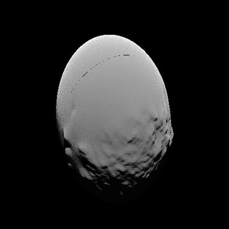 | 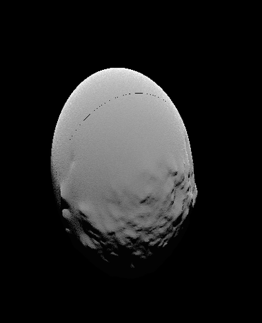 | 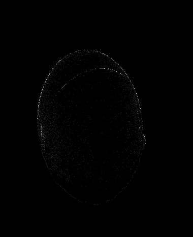 |

(AFC-1 frames are **1020 × 1020** — square, per `hera_afc_v06.ti`. These three
are the same square crop around the body, at the same scale.)

| | |
|---|---|
| body pixels rendered / source non-zero | 54,662 / 54,707 |
| mean \|ΔDN\| | **0.077** |
| median \|ΔDN\| | **0** |
| bit-identical pixels | **94.24%** |
| within ±1 DN | **99.49%** |
| worst | 51 DN |

The residual is the silhouette, not the geometry: of the 75 pixels past 4 DN
(0.137% of the body), **90.7% lie within 3 px of the limb**, where the source's
local gradient is **141 DN/px** against 4.5 DN/px over the body as a whole —
bilinear resampling across a hard edge, which no projection can avoid.

So the projection shader, the sidecar convention and the camera model are
correct together. Anything that misregisters downstream is introduced after
this point.

**What this step cannot show.** Source and reprojection share one camera, so a
wrong *absolute* roll would rotate both together and cancel. Roll is pinned
elsewhere: against the real ASPECT frame it comes out at **−2.03°** (IoU 93.9%),
and for AFC the same code lands within **11.9°** of the COP delivered frame at
the same epoch — different by an amount the delivery's own 34° body-orientation
error covers, and nowhere near the 90° a wrong `specialTrafos` entry would give.
An independent absolute-roll check for AFC would need a real AFC frame with
trustworthy metadata, which we do not have.

## 2. The stack shader agrees with it

The viewer does not render through `stableImageProjection`; it renders the
projection **stack**. `--project-shader stack` sends the same image, the same
projector and the same camera through `stableImageProjectionStack` as a
one-layer stack — the per-patch matrices coming from `projectionUniformMap`
exactly as in the viewer:

```
pro3d-tool simulate-image --opc <TestData>/HERA/Dimorphos     --project HERA_AFC_0005_20270304_140000_SIM.png --project-shader stack ...
```

| | |
|---|---|
| body pixels drawn, single / stack | 54,662 / **54,662** |
| drawn by one shader only | **0** |
| mean \|ΔDN\| between the two | 0.072 |
| identical pixels | 94.75% |

**Coverage is bit-for-bit the same** — not one pixel differs in which fragments
the two shaders accept — so the geometry, the projector composition and the
facing test agree exactly. The two paths are the same projection.

Where they differ in *value*, it is filtering, and the stack is the better of
the two. Against the source image:

| shader | mean \|ΔDN\| | identical | within ±1 DN |
|---|---|---|---|
| single-image | 0.0771 | 94.24% | 99.49% |
| **stack** | **0.0054** | **99.46%** | **100.00%** |

The 75 differing pixels (0.137%) sit exactly where step 1's residual sat: 90.7%
within 3 px of the limb, median source gradient 141 DN/px against 4.5 over the
body. The single-image path samples a mip-mapped `sampler2d`, the stack an
un-mipmapped `sampler2dArray`, so the single path blurs slightly where the
projected texel density falls below 1:1. Nothing here is geometric.

## Supporting evidence: a self-made AFC dataset

`pro3d-tool simulate-image --write-mbi` renders the body from SPICE and writes
an `.mbi.json` describing **the camera it actually used**. Project that image
back onto the same shape model and it must land on itself — there is no
metadata to doubt, because the render and the sidecar are the same camera.

Eight AFC-1 frames of Dimorphos are committed to the test data repository as
`HERA/SimulatedAFC` (see the README there), rendered against the OPC sitting
next to them so the set is self-contained:

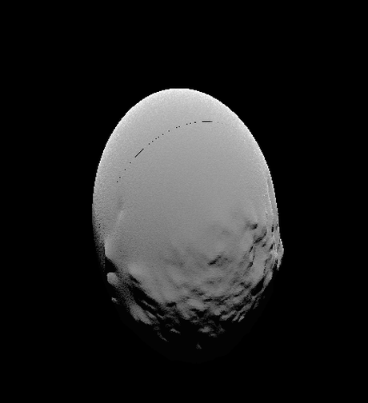

Three independent checks, all on the committed files:

| check | result |
|---|---|
| sidecar read back through `Visualization.projectDirect` vs the render camera | boresight **0.000000°**, worst frustum corner **0.000 px** (all 8) |
| `unproject --method mbi`, 5 pixels per frame | **40 of 40** hit the shape model |
| `TRG_POS` transformed into the spacecraft frame | `(0.00225, 0.00118, 0.999997)` — +Z, as the convention requires |

The residual `(0.00225, 0.00118)` is not error: it is AFC-1's real 0.145°
offset from the direction the spacecraft tracks.

### In the viewer (step 3, partly)

Camera on the image's own axis at 220 m, *Orientation Source* = MBI,
*Transfer Function* off, one image in the stack:

| terrain only | the frame projected onto it |
|---|---|
| 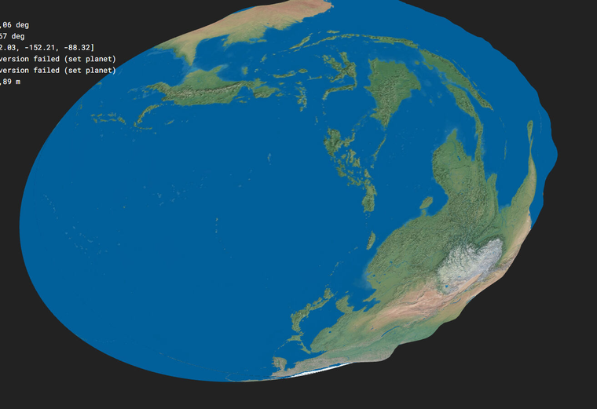 | 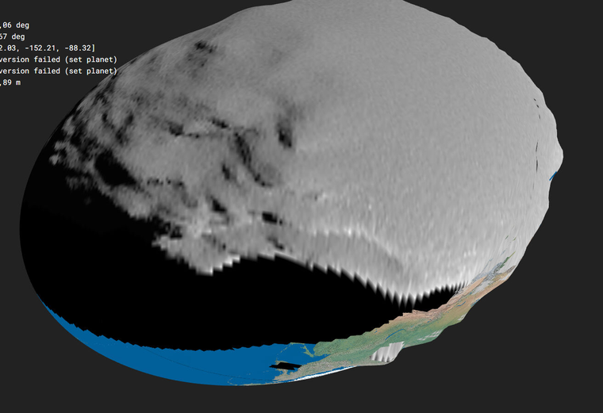 |

(Same camera in both. The terrain's colouring is the OPC's placeholder *Earth*
texture — that dataset ships no DRACO mosaic, which is why the uncovered limb at
the lower right is blue and green.)

The projection registers with the terrain, and it is the image's own greyscale
rather than a colour map. What is left is the limb at the lower right, where the
projector grazes the surface and the OPC's placeholder Earth texture shows
through.

| | body repainted | painted off the body |
|---|---|---|
| before the `NormalFlip` fix, 500 m | 17.1% | 0.01% |
| after, 500 m | 86.2% | 0.08% |
| after, 220 m (above) | **92.1%** | 0.23% |

This is **not yet the pixel comparison step 1 was**: the viewer sits at 220 m
while the image was taken from 5,765 m, so the perspective differs and only the
registration can be judged, not DN for DN. A rigorous step 3 needs the viewer
camera at the image's own pose and field of view.

## Supporting evidence: real data, ASPECT at Didymos

The self-made set proves the chain is self-consistent. A *real* observation
proves the convention is the one real deliveries use.

`simulate-image --mbi` takes the camera from an existing image's own sidecar —
through the viewer's projection code, not a look-at — and renders with it. If
the convention were misread, the render would not line up with the image it
came from:

```
pro3d-tool simulate-image --opc <Didymos_ASPECT> \
    --mbi "ASP_000000_270323T060000_2B_NIR1_0.tif" \
    --body DIDYMOS --frame DIDYMOS_FIXED --observer DIDYMOS --write-mbi
```

| the real ASPECT frame | rendered through *its own* sidecar |
|---|---|
| 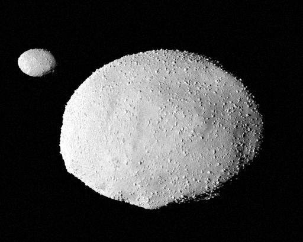 | 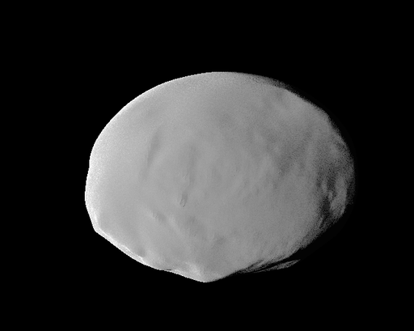 |

Same place, same size, same orientation. (Dimorphos is missing on the right
only because that OPC contains Didymos alone.) Both files are in the test data
repository under `HERA/Instrument Data`; the sidecar is used exactly as it
ships.

## The setting that decides whether any of this is used

*Projection Settings → Orientation Source*:

| mode | where the pointing comes from |
|---|---|
| **SPICE** (default) | Nowhere in the image. The spacecraft position is SPICE's, but the camera is then aimed at the **body centre** with a fixed up-vector — `InstrumentProjection.getLookAt` computes an attitude and discards it. Every image is painted as if shot dead-centre with one roll. |
| **MBI** | The image's measured attitude (`SC_QUAT`) and range (`TRG_POS`). Correct when the sidecar is, and faithfully wrong when it is not. |

So the symptom tells you where to look: *"lands on the body but the features do
not line up"* is the first mode; *"does not land at all"* is the second plus a
sidecar problem.

Measured in the viewer, one image in the stack, same scene and camera
throughout:

| | **SPICE** (default) | **MBI** |
|---|---|---|
| COP frame, as delivered | 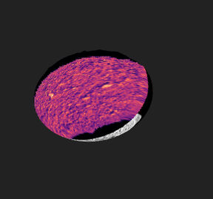<br>87.9% of the body repainted — but offset | 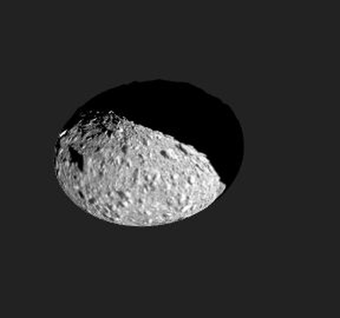<br>**0.0% — misses entirely** |

`pro3d-tool unproject` says the same without a GPU: that frame's centre pixel
finds no surface with `--method mbi`, and hits at 8557 m with `--method spice`.

## The HERA COP delivery

Its sidecars state the pointing three ways wrong at once — each documented with
its evidence and its fix in
[COP-sidecar-issues.md](./COP-sidecar-issues.md#pointing--issues-5-6-and-7):

| | field | delivered | should be |
|---|---|---|---|
| 5 | `SC_QUAT0..3` | J2000 → spacecraft | spacecraft → J2000 (the conjugate) |
| 6 | `TRG_POSX/Y/Z` | the camera's location | target **minus** spacecraft |
| 7 | `TRG_POSX/Y/Z` | measured from Didymos | measured from `TARGET` (Dimorphos) |

Correcting all three by hand makes the centre pixel land on Dimorphos at
8561.9 m, 0.15° from the delivery's own ground-truth boresight. Correcting only
5 and 6 still misses.

### The images themselves do not match our shape model either

Rendering the same epoch with `simulate-image --no-lighting` (a flat disk, so
the image *is* the silhouette) and overlaying the outlines — red = delivered,
green = ours:

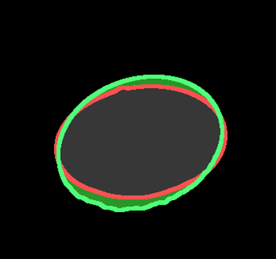

| | |
|---|---|
| centroid offset | **1.80 px** of 1020 — the boresight and ephemeris agree to ~0.01° |
| silhouette area | ours **1.149×** larger |
| principal-axis roll | **+11.9°** |
| best fit allowing rotation **and** scale | IoU 90.4% at −12°, scale 0.94 |

A pure roll does not explain it: rotating our silhouette to best fit only
raises IoU from 84.5% to 85.5%. The outlines are genuinely different shapes, so
the body is presented differently — and indeed, checked against the delivery's
own `PRo3D.json`, its per-image body **orientation** disagrees with SPICE's
body-fixed frames:

| epoch | Didymos vs `DIDYMOS_FIXED` | Dimorphos vs `DIMORPHOS_FIXED` |
|---|---|---|
| 2027-02-05T01:00 | 6.2° | 34.6° |
| 2027-03-01T04:00 | 15.6° | 34.3° |
| 2027-04-30T01:00 | 2.2° | 13.9° |

Body *positions* agree with SPICE to about a metre, so this is orientation
only, and it is not a constant frame offset or a single clock error. Our two
Dimorphos OPCs agree with each other, which puts the disagreement between the
delivery and SPICE rather than between our shape models.

These frames were produced through PRo3D's own sequenced-bookmark rendering
([PR #716](https://github.com/pro3d-space/PRo3D/pull/716)), which is the first
place to look for how the body orientation was set per snapshot. Not chased
further here.

## What was fixed along the way

- **The transfer function was not a property.** `UseFalseColor` was bound in
  `ColorMapping.fs` as `p.colorMapping |> AVal.map Option.isSome`, and
  `getProjectionVisualizationProperties` always supplies a colour map for the
  selected image — so it was effectively always on. Now a real
  `useTransferFunction` flag on `ProjectedImageListModel`, with a checkbox in
  *Projection Settings*; off paints the layer's own RGB, skipping both the
  min/max remap and the colour map. Instrument data still defaults to the
  transfer function; an RGB image does not need it, and a projection cannot be
  *checked* against its source through a colour map.
- **The viewer never bound `NormalFlip`.** The offscreen tools estimate each
  dataset's winding and bind it; the viewer did not, and worked around it for
  *lighting* by orienting the face normal toward the viewer. That cannot work
  for the projection, whose facing test is relative to the **projector**. On an
  inward-wound OPC the test was inverted and the projection survived only near
  the limb. The heuristic now lives in `PRo3D.Core.NormalWinding.estimate` (one
  implementation for the tools and the viewer), `Surface.Sg` binds it per
  hierarchy, and the surface effect composes `applyNormalFlip`. Measured:
  `Dimorphos_0_Meridian` votes 98 outward (flip 0), the test-repo
  `HERA/Dimorphos` 26 inward (flip 1).

  This governed *coverage*, not alignment — it explained a crescent, not a shift.

## Still open

A rigorous **step 3**: the viewer camera pinned to the image's own pose and
field of view, so the comparison is DN for DN as in steps 1 and 2 rather than a
registration check at a different standoff.

## Reproducing this page

```
# 1: the self-made dataset (already committed to the test data repo)
pro3d-tool simulate-image --opc <TestData>/HERA/Dimorphos \
    --time 2027-03-04T14:00:00Z --body DIMORPHOS --frame DIMORPHOS_FIXED \
    --observer HERA --instrument HERA_AFC-1 --gain 3.7 \
    --out HERA_AFC_0005_20270304_140000_SIM.png --write-mbi

pro3d-tool unproject --opc <TestData>/HERA/Dimorphos \
    --images <TestData>/HERA/SimulatedAFC --input pixels.csv \
    --body DIMORPHOS --frame DIMORPHOS_FIXED --observer DIMORPHOS --method mbi

# 2: a real ASPECT observation through its own sidecar
pro3d-tool simulate-image --opc <TestData>/HERA/Didymos_ASPECT --mbi <the .tif> \
    --body DIDYMOS --frame DIDYMOS_FIXED --observer DIDYMOS --write-mbi

# 1 (viewer half): asserts; needs a scene on the same OPC
cd tests-ui && PRO3D_SIM_IMAGE_DIR=<dataset> npx playwright test projection-overlap

# 3: look at one case, including the ones that fail (asserts nothing)
PRO3D_PROBE_IMAGE_DIR=<folder> PRO3D_PROBE_METHOD=MbiBased \
PRO3D_PROBE_LABEL=cop-mbi npx tsx src/probe-projection-landing.ts

# step 2: the same image and camera through the stack shader
pro3d-tool simulate-image --opc <opc> --project <image> --project-shader stack ...

# 4: flat silhouettes for an outline comparison
pro3d-tool simulate-image ... --no-lighting --no-shadows --out flat.png

# step 1: project an image back through PRo3D's single-image projection shader
pro3d-tool simulate-image --opc <opc> --project <image>     --body DIMORPHOS --frame DIMORPHOS_FIXED --observer DIMORPHOS     --out reprojected.png
```

The Playwright harness is machine-local by design (real GPU, local OPC and
image data); `tests-ui/src/pro3d.ts` lists the `PRO3D_*` variables.
