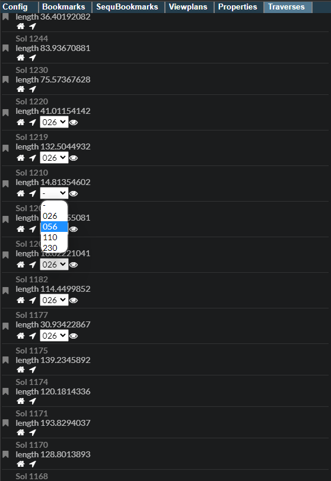

### Loading RIMFAX Traverses

RIMFAX stands for Radar Imager for Mars' Subsurface Experiment. It is a ground-penetrating radar instrument that was carried to Mars on NASA's Perseverance rover. The user can load the RIMFAX traverses indicating that RIMFAX was active. Those traverses align with subsections of the corresponding rover traverse that displays the path of the rover.

The user can load a RIMFAX traverse using the *Extra* panel in the menu.

 

 ### Loading RIMFAX Surfaces

 The user can load and display the RIMFAX images using the *Import Surfaces* button. 
 


The implementation expects a folder structure generated with the traverse exporter developed at JR:

```
Rimfax Data/
├── RIMFAX_traverse.json
├── 0000/
│    ├── 0001/
│    │    ├── 240/
│    │    │    ├── ..._SOL0001_..._noaxis.png
│    │    │    ├── rimfax.mtl
│    │    │    └── rimfax.obj
│    │    ├── 214/
│    │    ├── 078/
│    │    └── 026/
│    ├── 0002/
│    │   ├── ..
│    │   └── ..
│    └── 0003/
│        └── .. 
├── 0100/
│    ├── 0105/
│    ├── 0106/
    ...
├── 0200/
```

On the top levels the sols are divided on two granularity levels, the last folder name encodes the *RIMFAX mode*: For each rimfax traverse usually different wavebands were used to generate the RIMFAX data resulting in multiple images for each RIMFAX traverse. 

After selecting the root folder, the user sees the RIMFAX surface in the render view. The sols of the selected traverse in the attribute window are listed in the *Sol* panel. The user can set the RIMFAX mode in this list for each sol.


