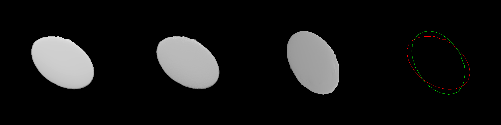
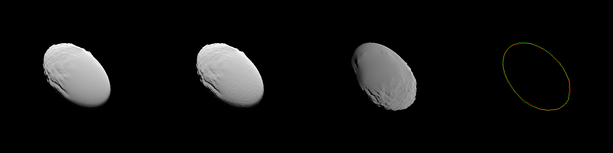
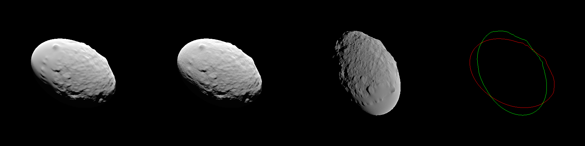
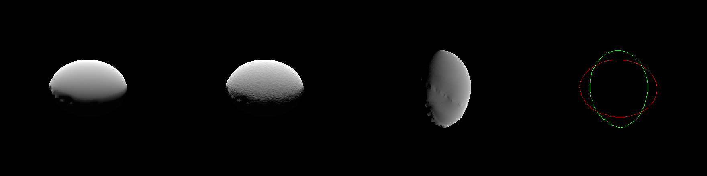
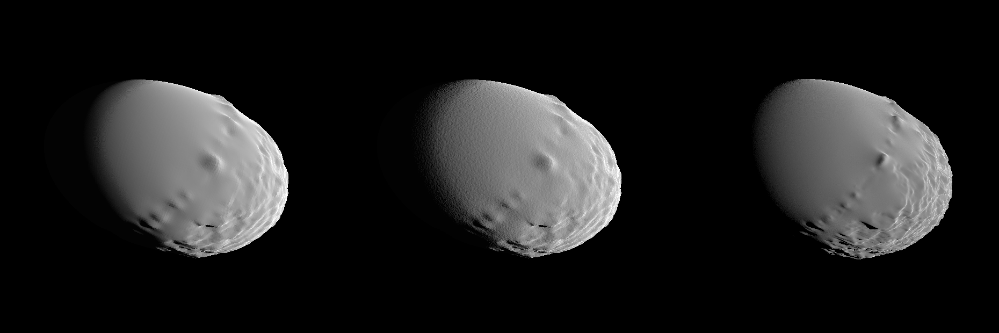
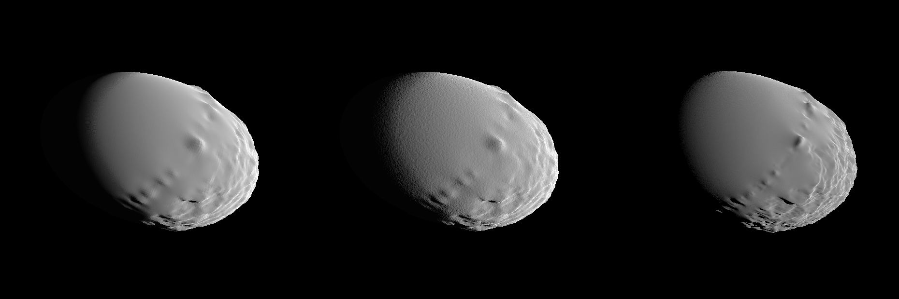
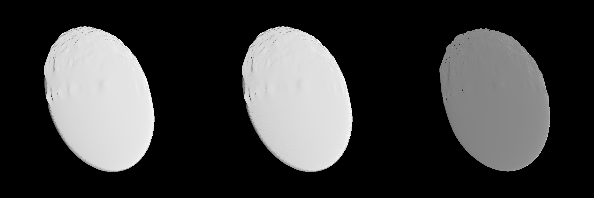
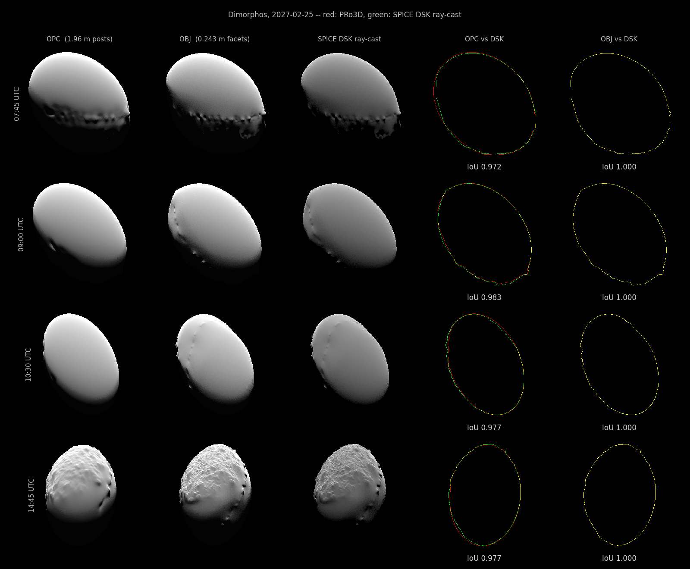
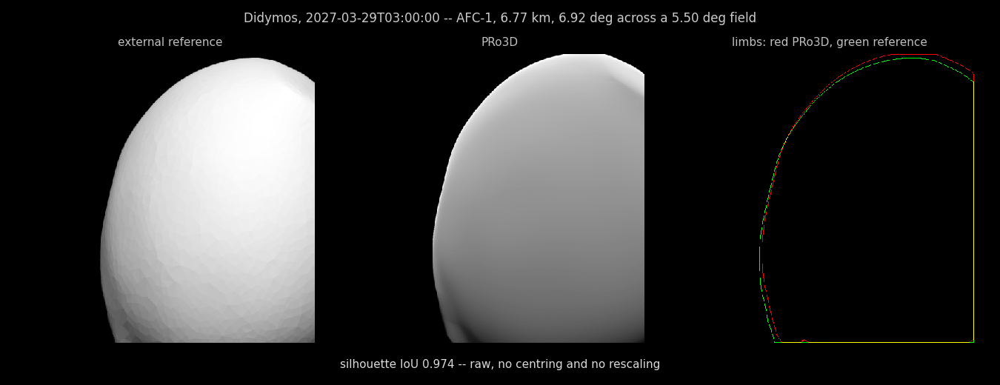
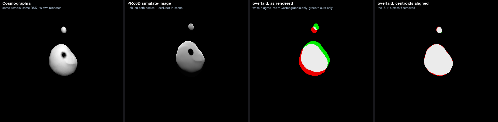

# Cross-checking a simulated image against SPICE

Does [`simulate-image`](./Pro3DTool-SimulateImage.md) put the body where it belongs, at the
right size and the right orientation? This page answers that by rendering the same
observation **twice, through two independent paths**, and comparing them.

|  | ours | the cross-check |
|---|---|---|
| shape model | OPC `g_01960mm_spc_dtm_dimo_0000n00000_v003` | SPICE DSK `g_00243mm_spc_obj_dimo_0000n00000_v004` |
|  | (`--obj` renders the DSK's own mesh instead — see [below](#closing-it-rendering-the-dsks-own-shape)) | |
| resolution | 1.96 m GSD, gridded DTM | 0.243 m, 3 145 728 facets |
| renderer | PRo3D, rasterised, Aardvark scene graph | `spiceypy`, ray-cast, ~40 lines |
| field of view | 5.5307° (`InstrumentProjection.fs`) | 5.5000° (`hera_afc_v06.ti`) |
| shading | Lommel-Seeliger + micro-structure + shadow map | Lommel-Seeliger, `illumf` shadow flag |

Only the **geometry source is shared** — both take the camera from the same SPK and CK.
Everything downstream differs: a different shape model, a different version of it, 65×
the facet density, a different field of view and a completely different renderer. If the
two agree on where the body lands and how big it is, the rasterised path is doing the
geometry correctly.

## The cross-check renderer

The whole thing is three SPICE calls per pixel. `DSK/UNPRIORITIZED` makes SPICE ray-cast
its own shape model, so no PRo3D code is involved in finding the surface:

```python
def render_dsk(et):
    half = np.tan(np.radians(FOV_DSK/2))
    img = np.zeros((N,N), np.float32); hit = np.zeros((N,N), bool)
    for j in range(N):
        y = (1 - 2*(j+0.5)/N) * half
        for i in range(N):
            x = (2*(i+0.5)/N - 1) * half
            try:
                spoint = sp.sincpt('DSK/UNPRIORITIZED','DIMORPHOS',et,'DIMORPHOS_FIXED',
                                   'NONE','HERA','HERA_AFC-1',[x,y,1.0])[0]
            except Exception:
                sp.reset(); continue
            hit[j,i] = True
            try:
                f = sp.illumf('DSK/UNPRIORITIZED','DIMORPHOS','SUN',et,'DIMORPHOS_FIXED',
                              'NONE','HERA',spoint)
            except Exception:
                sp.reset(); continue
            mu0, mu = np.cos(f[3]), np.cos(f[4])
            if mu0 > 0 and mu > 0 and f[6]:
                img[j,i] = 2*mu0/(mu0+mu)
    return img, hit
```

Reading it:

- **`[x, y, 1.0]` is the ray**, expressed in the `HERA_AFC-1` frame, whose `+Z` is the
  boresight (`INS-91110_BORESIGHT = (0,0,1)`). `x` and `y` span `±tan(FOV/2)`, so the
  frame edge is exactly the instrument's declared half-angle.
- **`sincpt` is the ray-cast.** Passing the instrument frame as `dref` means SPICE
  applies the spacecraft attitude itself — the same CK the viewer uses. A ray that
  misses raises, which is why the miss path calls `sp.reset()`; those misses dominate the
  runtime (~1 M per frame).
- **`illumf` returns the illumination angles** at the intercept: `f[3]` incidence,
  `f[4]` emission, and `f[6]` a `lit` flag that accounts for the body shadowing itself,
  which is where the cross-check gets cast shadows for free.
- **`2·μ₀/(μ₀+μ)` is Lommel-Seeliger**, the same photometric function
  `simulate-image` uses, so the two images are comparable in appearance and not only in
  outline.
- **`abcorr = 'NONE'`** matches the tool, which also works with geometric positions (no
  light-time or stellar aberration).

Each panel is normalised to its own maximum, so compare *shape and detail*, not
brightness: the PRo3D frames are tone-mapped with a fixed gain, the cross-check is not.

One thing the code above deliberately does **not** do is apply the detector axis
convention, which is why the two renders come out transposed — see
[below](#the-image-axes-are-transposed-and-that-is-expected).

## Measured

Silhouettes measured as angular semi-axes, which is convention-free, so the two
fields of view need no reconciling. The mask is geometric (the whole disk, lit and
unlit), not the lit part only.

| epoch (UTC) | range | phase | DSK v004 | ratio | OPC v003 | ratio | Δ major |
|---|---|---|---|---|---|---|---|
| 2027-03-21 13:00 | 7.64 km | 2.8° | 0.6561° × 0.4308° | 1.523 | 0.6572° × 0.4333° | 1.517 | **+0.17 %** |
| 2027-03-21 16:00 | 8.05 km | 18.9° | 0.6172° × 0.4080° | 1.513 | 0.6203° × 0.4089° | 1.517 | **+0.50 %** |
| 2027-03-21 19:00 | 6.82 km | 30.4° | 0.7341° × 0.5016° | 1.464 | 0.7362° × 0.5080° | 1.449 | **+0.28 %** |
| 2027-03-22 00:45 | 9.64 km | 40.0° | 0.5145° × 0.3884° | 1.325 | 0.5209° × 0.3900° | 1.336 | **+1.24 %** |

**Apparent size agrees to 1.24 % worst case, axis ratio to 0.014.** Two shape models eight
generations of resolution apart, two renderers, two fields of view — the body lands the
same size and the same shape.

### The image axes: two faults, both now fixed

The IK draws the detector layout, and it is the ground truth here:

```
                        Boresight (+Z axis) is into the page
       +-----------------+
       |      +Zafc1     |
       |        x------------> +Xafc1     <- +X is image RIGHT
       |        |        |
     (0,0)------|--------+
    Pixel       | +Yafc1               <- +Y is image DOWN
                v
```

Measured against that, as (image of +X, image of +Y):

| convention | +X | +Y | det | verdict |
|---|---|---|---|---|
| **IK** `hera_afc_v06.ti` | right | down | +1 | ground truth |
| PRo3D, *before* | up | right | +1 | same handedness, rotated 90° CCW |
| this cross-check, *before* | right | up | −1 | mirrored (its ray grid put +Y up) |
| **both, now** | **right** | **down** | **+1** | conform to the IK |

Two independent measurements agree on the PRo3D row:

1. **Sun direction.** SPICE puts the sun at X +0.6412, Y +0.0004 in the `HERA_AFC-1` frame
   at 2027-03-22T00:45 — essentially pure +X. The brightness offset in our render is
   dcol +0.2 px, drow −26.0 px: almost pure *vertical*. Fitted over 41 frames,
   `sx → (dcol +0.2, drow −46.8)`. **Instrument +X lands on image up.**
2. **Image correlation.** Cross-correlating the two close-up renders over all eight
   dihedral transforms picks the **anti-transpose at +0.911**, with the plain transpose
   worst at −0.843. Rotation (PRo3D vs IK) composed with mirror (cross-check vs IK) is
   exactly a reflection, which is what that measures.

Note what the silhouette tilt alone could *not* tell us: `90° − θ` fits a reflection, and
the two renderers do differ by one — but that reflection is the product of two separate
faults, one in each renderer. Ellipse tilt is blind to which.

`InstrumentProjection.specialTrafos` is where PRo3D's rotation lives:

```fsharp
"HERA_AFC-1", Trafo3d.FromOrthoNormalBasis(-V3d.OIO, -V3d.IOO, V3d.OOI)
```

The IK declares the layout this hardcodes (`INS-91110_FOV_REF_VECTOR = (1,0,0)` plus the
diagram above), so the table could be derived via `getfov` instead of maintained by hand —
see the `MILANI_ASPECT_NIR1` comment for what a wrong hand-written entry costs.

**Both are fixed.** `specialTrafos` now maps `(-X, +Y, +Z)` for AFC-1, AFC-2 and HSH,
which puts instrument +X on image right and +Y on image down as the IK draws them, while
keeping the `det = -1` that cancels `getLookAtQuat`'s improper basis. This page's
ray-tracer had its grid flipped so +Y points down. Verified two ways:

| check | before | after |
|---|---|---|
| sun test — SPICE puts the sun at +X, so the lit limb must be right | dcol +0.2, drow −26.0 (**up**) | dcol **+26.3**, drow +0.2 (**right**) |
| best dihedral transform between the two renderers | anti-transpose +0.911 | **identity +0.915** |

The two renderers now agree with **no transform at all**. The FOV discrepancy
(5.5307° vs the kernel's 5.5000°) is *not* fixed and remains open in
[#801](https://github.com/pro3d-space/PRo3D/issues/801), along with the root cause both
share: `SpiceInterfacing.fs` exposes no kernel-pool access (`getfov`/`gdpool`), so PRo3D
keeps a hand-maintained copy of what the kernels declare.


## What the comparison shows

Each row: **ours (smooth) | ours (micro-structure) | SPICE DSK | silhouette overlay**
(red = ours, green = DSK, centroid-aligned). Each panel is normalised to its own
maximum, so compare shape and detail, not brightness.

Three things are visible across the series:

- **Phase angle governs how much shape you see at all.** At 2.8° the sun is almost behind
  the camera and every panel is a flat disk; by 30.4° the same bodies show craters, a
  terminator and cast shadows. An epoch chosen for low phase will look smooth no matter
  how good the shape model is.
- **The DSK carries real topography ours does not.** At 30.4° the v004 panel is a boulder
  field with a rough limb; the v003 OPC beside it is a smooth body with a few broad
  depressions. That is the 1.96 m sampling — ~19 000 samples over the body against
  1.58 M — and it is why our renders look like an egg.
- **Micro-structure is not a substitute for it.** The `MICRO` panel adds uniform fine
  grain over the whole disk, while the DSK's roughness is localised and alters the
  silhouette. Procedural noise makes a render look busier without adding shape.

### 2027-03-21 13:00 — phase 2.8°, range 7.64 km



### 2027-03-21 16:00 — phase 18.9°, range 8.05 km



### 2027-03-21 19:00 — phase 30.4°, range 6.82 km



### 2027-03-22 00:45 — phase 40.0°, range 9.64 km




## Close-ups: the body filling the frame

At 6.7-9.6 km Dimorphos covers a fifth of the AFC frame, which is too small to compare
features. HERA's closest on-target passes in COP reach **3.9 km**, where the body fills
~47 % of the frame and individual craters resolve. Panels:
**ours (smooth) | ours (micro-structure) | SPICE DSK**.

### Close and strongly lit — 2027-04-15 09:30, 3.91 km, phase 47.5°



### Close and strongly lit, one rotation later — 2027-03-25 13:50, 3.93 km, phase 48.2°



### Close but head-on — the contrast case — 2027-04-22 13:00, 3.88 km, phase 2.7°



What these show that the distant frames could not:

- **The same real features appear in both models.** The crater chain along one limb and
  the broad depressions are present in the v003 OPC and the v004 DSK alike, so the two
  are the same body, not merely the same ellipsoid.
- **The DSK's relief is sharper.** Crater rims are crisper and the limb is visibly
  rougher — 1.58 M facets against ~19 k samples.
- **Both renderers cast shadows.** Ours uses a 4096² sun depth map; the cross-check gets
  them from `illumf`'s `lit` flag, which ray-casts against the DSK per pixel. Measured at
  30.4° phase: 65 px have the sun above the local horizon and are still unlit.
- **The head-on case is the control.** At 2.7° phase the same close range produces almost
  no shadow and the detail collapses — confirming that phase angle, not only model
  resolution, governs how much shape a frame reveals.

> **No re-orientation is applied to any panel.** Both renderers follow the IK layout, and
> the two agree at correlation **+0.915** under the identity transform. The head-on epoch
> scores lower simply because a disk at 2.7° phase has almost no features to match.

## Closing it: rendering the DSK's own shape

Everything above measures PRo3D-on-the-OPC against a ray-cast of the DSK, so a
disagreement has two possible causes — the renderer or the shape model — and the page
cannot separate them. `simulate-image --obj` removes the second one: it renders **the same
mesh the DSK was built from**, the `g_00243mm_spc_obj_dimo_0000n00000_v004.obj` that the
kernel set ships beside `…v004.bds` and that its MKDSK setup names as its own input.

Two renderers, sharing nothing but the kernels, on one shape. Measured over four epochs of
2027-02-25 by [`scripts/check-renderers.py`](../scripts/check-renderers.py):

| pair | footing | worst | mean |
|---|---|---|---|
| OPC vs ray-cast | silhouette | 0.972 | 0.979 |
| **OBJ vs ray-cast** | **silhouette** | **1.000** | **1.000** |
| OPC vs ray-cast | lit region | 0.862 | 0.917 |
| OBJ vs ray-cast | lit region | 0.897 | 0.938 |
| comet-toolbox vs OPC | lit region | 0.856 | 0.905 |
| comet-toolbox vs OBJ | lit region | 0.890 | 0.931 |

**The silhouette is exact.** 79 836 covered pixels against 79 837 at 06:30, and the raw
uncentred, unscaled overlap is 1.000 as well, so it is not an artefact of the centroid
crop. The rasteriser, the camera construction, the instrument frame, the FOV and the units
all agree with SPICE's own ray-cast to within a pixel of a 1020 x 1020 frame. Whatever is
left between us and another implementation is not our geometry.

That is easier to see than to read. Each row is one epoch; every panel of a row shares one
crop box taken from the union of the masks, so what is on screen is the real alignment and
not a re-centring of it. Red is PRo3D, green is the ray-cast:



The two right-hand columns are the whole result. **OPC vs DSK** is a red and green pair of
outlines with a visible fringe between them wherever the 1.96 m posts round off a limb the
ray-cast resolves. **OBJ vs DSK** is one yellow line — red and green on the same pixels,
everywhere, at every epoch. There is nothing to look at, which is the point.

Per-epoch numbers, and the raw uncentred overlaps, are in
[`objMatrix.json`](images/shapeCrosscheck/objMatrix.json) beside the figure; regenerate
both with

```
python scripts/make-shape-crosscheck-figures.py
```

which re-renders every panel from the tool, so the figure cannot drift from what the tool
actually does. The ray-cast is the slow part (~50 s an epoch) and is cached per epoch in
the work directory.

Once the shape is shared, the *shading* becomes measurable too — a per-pixel comparison
that means nothing between different shape models. That is a separate page:
[Checking the shading against SPICE](./Pro3DTool-SimulateImage.md#checking-the-shading-against-spice),
which found and fixed shadow acne in the default `--shadow-bias`.

**The lit region cannot say that, and it is worth knowing why.** Two renderings of the
*identical* mesh agree only to 0.897 there. The difference is the terminator: our lit mask
is everything above DN 25, while the ray-cast writes every pixel with mu0 > 0 and its mask
therefore runs all the way to the terminator — about 5 % more area. That is a property of
the metric, not of either renderer, and it caps any lit-region comparison of ours against
anyone else's at roughly 0.90 whatever the shape model is.

This is why `check-renderers.py` keeps the two footings as separate rows with separate
floors. A lit floor says *the shading is still comparable*; a silhouette floor says *this
is the same body*. Collapsing them to "the strongest footing both can supply" — which the
script used to do — hid the one measurement that isolates the shape, and set the OBJ's
acceptance criterion at a lit-region 0.93 that no PRo3D render could reach for reasons
having nothing to do with the shape. The criterion is now the silhouette, at 0.99.

**What the fine shape buys against a third renderer.** comet-toolbox reaches 0.890 against
our OBJ render and 0.856 against our OPC render — the OPC's 1.96 m posts, against an AFC
pixel of 0.48 m at 5 km, were costing real agreement, and the mesh recovers most of it.
The remainder is the terminator ceiling above.

## Against an external renderer, both bodies at once

A reference frame of **Didymos at 2027-03-29T03:00:00** was supplied for comparison. It is
a demanding epoch to agree on: the primary is 6.77 km away and **6.92° across a 5.50° field**,
so it overflows the frame and the whole test is the position of one limb; and Dimorphos sits
0.15° off the boresight but 1.14 km *further* away, so it is hidden behind the primary and
must not appear.



| | |
|---|---|
| silhouette IoU | **0.974**, raw — no centring, no rescaling |
| body covers | 64.6 % of the reference frame, 65.0 % of ours |
| limb column, per row | within −10 … +7 px of 512, most rows within 2–7 |
| Dimorphos | hidden behind the primary in both |

The alignment is deliberately raw. Both renders come from the same instrument at the same
FOV, so the frames are directly comparable after a resize, and a body that overflows the
frame is clipped — re-centring a clipped silhouette is meaningless and would hide exactly the
disagreement this is looking for.

What is left is mostly shape model: the reference is visibly faceted, ours is the kernels'
1.16 m SPC Didymos, and the residual drifts monotonically from −10 px at the top of the limb
to +7 px at the bottom, which is the signature of a small pose or figure difference rather
than of a camera error. The shading differs more than the geometry does — the reference is
brighter and flatter — but that is photometry, and this comparison is not about photometry.

Rendered with:

```
pro3d-tool simulate-image --obj <didymos-obj> --body DIDYMOS --frame DIDYMOS_FIXED     --time 2027-03-29T03:00:00Z --micro-amplitude 0     --occluder-body DIMORPHOS --occluder-obj <dimorphos-obj> --occluder-in-scene
```

**The provenance of the reference frame is not recorded here** — it was handed over without
one. Before this table is quoted anywhere, the renderer and its kernel set should be named:
a 0.974 against an unidentified image is an encouraging number, not evidence.

<a name="against-cosmographia"></a>
## Against Cosmographia — and a mutual eclipse

The comparison above has a hole in it: the reference frame arrived without provenance, so
0.974 is encouraging rather than evidential. **Cosmographia closes that hole.** It reads the
same kernels and the same DSK, it is maintained by NASA/NAIF rather than by us, and its
renderer shares no code with ours. Where it agrees, the agreement means something.

The epoch is **2027-01-29T17:45:00**, and it was chosen because it is not just a silhouette
test:

| | |
|---|---|
| Didymos | 28.70 km, 1.641° across, 0.146° off the AFC-1 boresight |
| Dimorphos | 27.78 km, 0.363° across, 1.527° off the boresight |
| phase at Didymos | 40.7° |
| Dimorphos relative to Didymos | **1.145 km sunward, 0.119 km off the sun-line** |

That last row is the point. Dimorphos is almost exactly between the Sun and Didymos, so it
**casts its umbra onto the primary** — and Cosmographia draws it, independently, as a dark
ellipse on the lit face. A mutual eclipse is the one thing a SPICE ray-cast cannot check for
us, because `illumf` takes one target body.



| | ours | Cosmographia | |
|---|---|---|---|
| Didymos silhouette, centroid-aligned | | | **IoU 0.967** |
| Dimorphos silhouette, centroid-aligned | | | **IoU 0.904** |
| Didymos area | 11 944 px | 12 336 px | ratio **0.968** |
| Dimorphos area | 509 px | 527 px | ratio **0.966** |
| separation of the two bodies | 130.13 px | 130.76 px | **0.5 %** apart |
| umbra on Didymos | 457 px | 217 px | see below |

**The frames do not share an origin, and that is not a disagreement.** Raw IoU is 0.700 and
0.146, because everything in our frame sits **16 px** from where Cosmographia puts it — in
one direction, for both bodies. Measured against the frame centre, Cosmographia has Didymos
**0.063°** off centre while we have it **0.219°**; the difference is **0.146°**, which is
exactly the offset the CK gives between the AFC-1 boresight and the body. Cosmographia's
camera was aimed at the target; ours takes the spacecraft attitude from the kernels. Once
that shift is removed the silhouettes are the fourth panel: white nearly everywhere, with a
thin red rim where Cosmographia's disk is 3 % larger.

Rendering the same epoch with `--pointing lookat` does **not** fix it: that aims the
boresight at the body but picks its own roll, which swings Dimorphos 207 px around the
primary. The roll is a convention in both tools, and they do not share it.

**The umbra is where the two renderers differ most** — ours covers 457 px against their
217 px, a factor of two. Both put it in the same place on the disk, so this is not geometry;
it is the shadow's edge. Ours is a 4096² depth map with a PCF lookup and a penumbra
approximated by a 5.1 m blur, theirs is whatever Cosmographia does, and their image is
saturated, which by itself moves a threshold-defined boundary. **This is measured, not
explained**, and it is the first independent look at the eclipse pass at all.

Rendered with:

```
pro3d-tool simulate-image --obj <didymos-obj> --body DIDYMOS --frame DIDYMOS_FIXED ^
    --time 2027-01-29T17:45:00Z --micro-amplitude 0 --width 519 --height 519 ^
    --occluder-body DIMORPHOS --occluder-obj <dimorphos-obj> --occluder-in-scene

python scripts/compare-cosmographia.py --ours ours_519.png --theirs cosmographia_519.png ^
    --epoch 2027-01-29T17:45:00Z --out docs/images/simulateImage/cosmographia.png
```

Both bodies are rendered from the DSK meshes, constant albedo, no micro-structure — so what
is being compared is shape, pose and shadow, with nothing of ours in the surface.

## Where PRo3D goes beyond the cross-check

The 17-line ray-tracer is a better *oracle* than PRo3D — it cannot drift, because it never
copies a constant, which is how it found #801. It is not a better renderer, and the gap is
not only speed. These are capabilities SPICE's geometry API structurally does not have.

**1. Mutual shadowing in a binary.** `illumf` takes a *single* target body, so a second
body casting a shadow is not modelled. Measured over COP at 5 min sampling: Dimorphos lies
inside Didymos' shadow cylinder for **11.6 % of the phase — about 235 hours**, beginning
2027-02-05T02:30. Those are real mutual events, they change the observed brightness, and
the cross-check renders them fully lit. Nothing else in this comparison is a *science*
capability gap; this one is.

PRo3D draws a scene, so it needs no new physics for it: `--occluder-body` gives the primary
a sun-side depth map of its own and the shading shader takes a second lookup. Verified
against one full event on 2027-02-25 — first contact just after 10:35, totality 10:55 to
11:45 at the ambient floor, last contact just after 12:05 — with `--occluder-obj` putting
the primary's real shape in it. See
[Eclipse by the other body](./Pro3DTool-SimulateImage.md#eclipse-by-the-other-body).

**This is the one place where the ray-cast on this page cannot be the oracle**, and it is
worth being explicit about that: an eclipsed epoch has no independent reference here, so
what is checked is the light curve's timing and its floor, not a second opinion on the
shadow. Making `dsk_render` cast a ray from each surface point toward the Sun and test it
against the *primary's* DSK would give one; it is not written.

**2. The surface, not just the shape.** A DSK carries geometry and nothing else. PRo3D
carries the DRACO mosaic and nine other layers, projects real instrument imagery onto the
terrain, stacks up to 32 images and maps their coverage. "What will the camera see" is a
question only the textured path can answer.

**3. Planetary scale.** A DSK is one global mesh; ray-casting it does not reach a
terabyte-scale Mars OPC. LOD and out-of-core streaming do.

**4. Speed turns single frames into series.** 7 s versus 136 s for the same 1020² frame —
19×, and that is Python against a GPU, so it is structural. A 48-epoch rotation is 11
minutes for us and ~2 hours for the oracle. Coverage sweeps, animations and interactive
exploration only exist on the fast side.

**5. Forward-model experiments.** SPICE returns one geometric answer and no radiometry.
Photometry variants, de-shading, micro-structure, exposure and (eventually) a detector
chain are hypotheses we can vary and compare — the actual point of simulating an image
before the real one exists.

**6. Geometry that is not in any kernel.** `--distance` overrides, synthetic cameras,
trajectories that have not been flown. Mission design happens before the kernels exist;
the oracle can only answer for epochs someone already planned.

### The reciprocal

Use the oracle where it is strongest. A 128² DSK cross-check in CI, asserting silhouette
size and the sun-side of the terminator, costs seconds and would have failed the day the
FOV constant and the axis mapping diverged from the kernels — instead of both surviving
until someone rendered a picture and looked at it.


## Caveats

- **The overlay panel shows the transpose.** Its red (ours) and green (DSK) outlines are
  reflections about the image diagonal, for the reason given above; compare their *shape*,
  not their orientation.
- **The silhouette overlay is centroid-aligned.** Each panel is cropped around its own
  centroid, so the overlay tests *shape*, not absolute position. Absolute pointing is
  covered by the boresight round-trip in
  [Pro3DTool-SimulateImage.md](./Pro3DTool-SimulateImage.md#writing-an-mbi-sidecar) and by
  [ProjectionValidation.md](./ProjectionValidation.md).
- **The two fields of view differ by 0.558 %** (5.5307° vs the kernel's 5.5000°), so a
  0.5 % size difference is expected and is a property of PRo3D's hardcoded table, not of
  the render.
- **The cross-check has no micro-structure**, so it is the fair counterpart of the
  `SMOOTH` panel; the `MICRO` panel's grain is procedural and exists in neither shape
  model.
- **Both models are SPC products of the same DART data**, so this validates the geometry
  pipeline, not the shape of the real asteroid.
