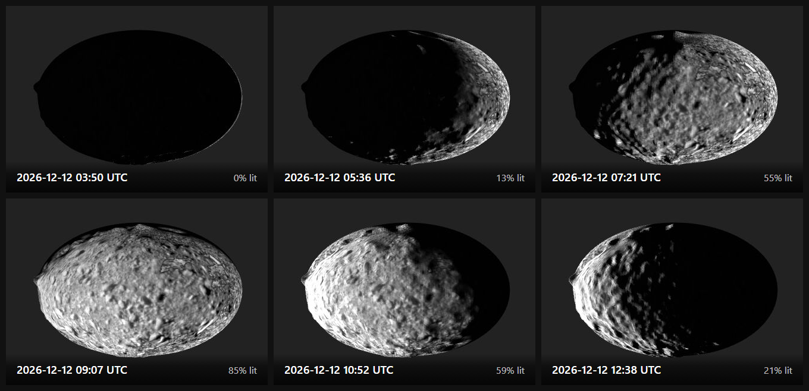
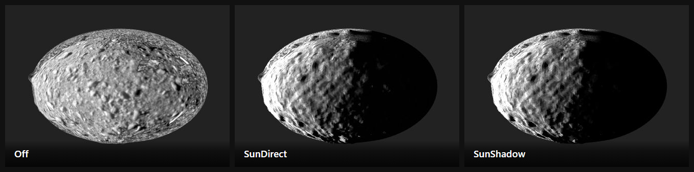

# Time and Sun

Move the scene through time and watch the sun travel around the body: the terminator
sweeps and craters catch the light from one side and then the other. Everything
SPICE-driven — sun direction, body placement, spacecraft positions — follows the scene's
**observation time**.



Six positions of one slider, evenly spaced through a single rotation. Same camera, same
body — only the time changed.

# Walkthrough

## 1. Load Dimorphos

*Surfaces → Import OPCs* and pick the Dimorphos OPC. It ships with
[PRo3D.Resources.TestData](https://github.com/pro3d-space/PRo3D.Resources.TestData):

```
HERA/Dimorphos_opc/Dimorphos_DRACO1_DRACO2_Earth/Dimorphos/
```

Load a SPICE kernel covering the epochs you want — GIS tab → *Settings* → *Path to
Spice Kernel*, or `--defaultSpiceKernel <path>` on the command line. Without one
there is no sun direction and nothing below works.

## 2. Pick the planet

Choose **Dimorphos** under **Reference System** in the top bar. This is not cosmetic: it
puts the scene in the body's own fixed frame (`DIMORPHOS_FIXED`), which is what makes the
body turn with the scene — and therefore whether step 4 shows you anything moving. See
[SceneBody.md](SceneBody.md).

## 3. Turn on sun lighting

GIS tab → *Projected Images* → *Projection Settings* → **Sun / Lighting Mode**:



| Mode | Effect |
|---|---|
| `Off` (default) | no sun shading; the surface renders with its texture only |
| `SunDirect` | shaded by the real sun direction, Lommel-Seeliger photometry over the per-face terrain normal |
| `SunShadow` | `SunDirect` plus cast shadows from a sun-aligned shadow map |

`Off` is not "lit from everywhere" — it simply skips shading, so the whole visible body
reads bright (92% of it, measured). `SunDirect` is what creates a day and a night side:
the same instant drops to 38%.

`SunShadow` differs little from `SunDirect` in this view (36% against 38% lit): the
shadows it adds are cast by relief, and there is little of it along this terminator. Look
for the difference inside craters and beside boulders.

## 4. Slide through mission time

GIS tab → **Mission Time**. Three mission phases are listed:

| Phase | Window |
|---|---|
| Deimos Flyby | 2025-03-12 (12:07 → 12:10, three minutes) |
| Mars Flyby | 2025-03-10 → 2025-03-14 |
| Didymos Orbital Insertion | 2026-12-12 → 2026-12-16 |

The rows show dates only, so the Deimos Flyby reads as a single day; its window is in fact
three minutes wide, and the slider spans just those.

**Click the row first.** A row's slider does nothing until its row is selected — the
cell is `pointer-events: none` otherwise. Clicking also sets the scene time to that row's
current slider position.

If the rows are missing and a **Load Data** button sits there instead, you have loaded a
saved scene: scenes store no mission times, so the list starts empty. Click it once.

Then drag the slider. For Dimorphos use *Didymos Orbital Insertion*, and drag **slowly**:
the row spans four days and the body turns about every 11 h, so the whole slider is some
nine full rotations.

The figure at the top samples one such rotation, measured on the Dimorphos test data by
stepping the slider in hundredths and counting lit pixels:

| Slider | Scene time (UTC) | Body lit |
|---|---|---|
| 0.040 | 2026-12-12 03:50 | 0% |
| 0.058 | 2026-12-12 05:36 | 13% |
| 0.077 | 2026-12-12 07:21 | 55% |
| 0.095 | 2026-12-12 09:07 | 85% |
| 0.113 | 2026-12-12 10:52 | 59% |
| 0.132 | 2026-12-12 12:38 | 21% |

The lit fraction reaches a minimum at 0.040 and again at 0.150, so one full turn is
**0.11 of the row**. The row is 96 h, giving ~10.6 h — but the scan steps in hundredths,
which is ~1 h per sample, so read that as "about 11 hours", not as a measurement of
Dimorphos's period.

## If the sun does not seem to move

**The scene is not in the body's fixed frame.** In an inertial frame such as `J2000` the
body does not turn with the scene, so the sun direction barely changes: measured on the
same data, the lit area creeps from 32.5% to 33.6% across the entire four-day row —
visually nothing. Fix it in step 2. The GIS tab warns about this directly: *"J2000 is not
the body-fixed frame of Dimorphos"*, with a button to switch.

**You are stepping too coarsely.** The body turns about every 11 h and the row spans four
days, so moving the slider in ninths samples almost exactly one rotation per step and the
sun lands in nearly the same place every time. That is aliasing, not a still sun. Drag
continuously, or step by 0.01 or less.

# Notes

- The observation time is also set by other actions — notably **fly-to on a projected
  image**, which jumps the scene to that image's epoch (see
  [MultiImageProjection.md](MultiImageProjection.md)).
- The scene time is **saved with the scene**, and GIS bookmarks store their own. A
  sequenced-bookmark render therefore sweeps the sun across the sequence; see
  [GisView.md](GisView.md) for batch rendering.
- Shadows use one global shadow map for all surfaces, sized for small bodies. On a
  planet-sized scene a single 4096² map has too little resolution to be useful.
- Only OPC surfaces cast shadows — not OBJ surfaces, annotations or scene objects.

The figures and every number on this page come from `tests-ui/src/probe-suntime.ts`;
run it with `PRO3D_SUN_INERTIAL=1` to reproduce the J2000 case.
