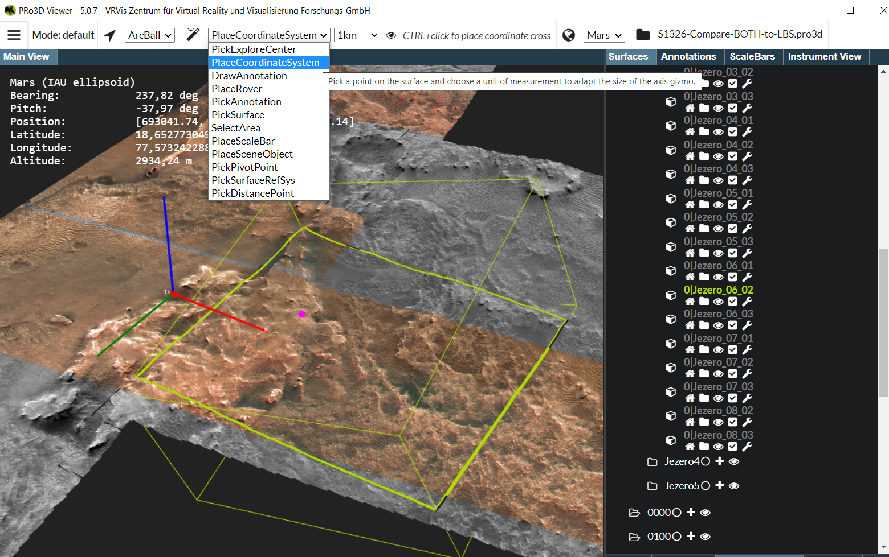
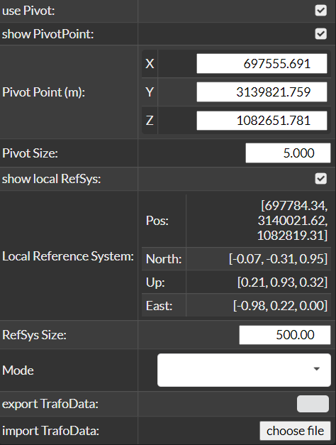

## Transformations

To transform a surface, it must first be selected. The tool supports two types of transformations:

1. **Global Transformation**

2. **Local Transformation**

### Global Transformation
For global transformations, the position and orientation of the global reference system are used. Therefore, it is important that this system is strategically well placed in the scene.

### Local Transformation
For local transformations, a pivot point must be defined for the selected surface. This pivot acts as the origin for all local transformations and remains fixed on the surface—even when the surface is translated.

Additionally, a local reference system can be placed to further guide and calculate local transformations more precisely. 

To use the pivot, both **Use Pivot** and **Show Pivot** must be enabled in the Transformation GUI.
In the main menu, select **PickPivotPoint**, then press **Ctrl + LMB** to place the pivot at a desired point on the surface.
The pivot point's position will be displayed, and its size can also be adjusted.

To place the local reference system, select **PickSurfaceRefSys** in the main menu, then use **Ctrl + LMB** to position the local reference system at an appropriate location on the surface.

### Transformation UI

For **global transformation**, translation occurs along the axes of the global reference system. The origin of the reference system is also used as the center for rotation and scaling.

For **local transformation**, the pivot point serves as the origin for rotation and scaling.
Translation occurs either along the axes of the local reference system (if one is defined), or otherwise along the axes of the global reference system.
