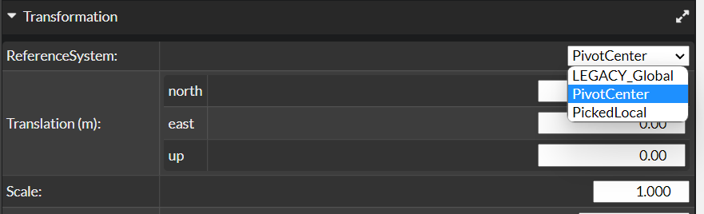
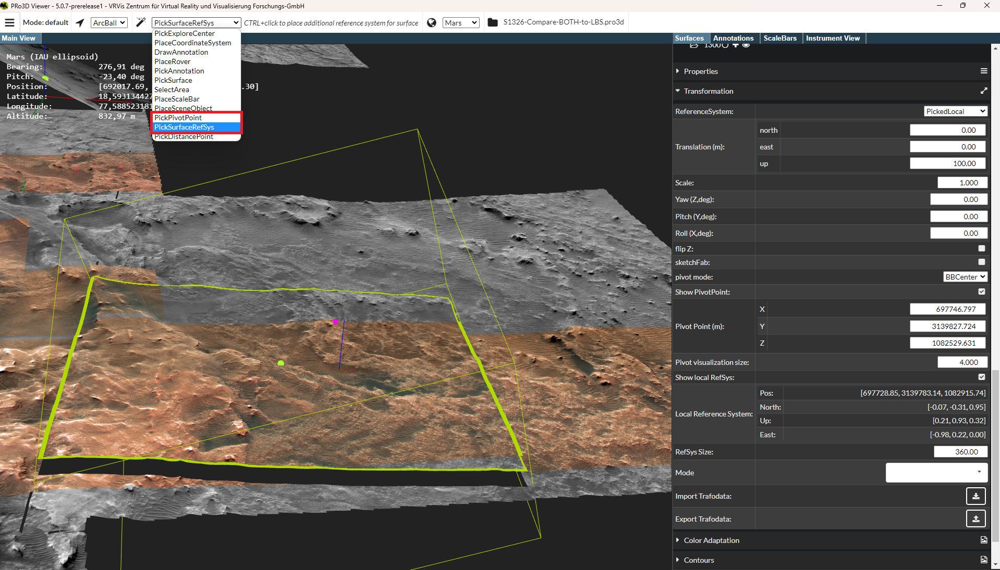
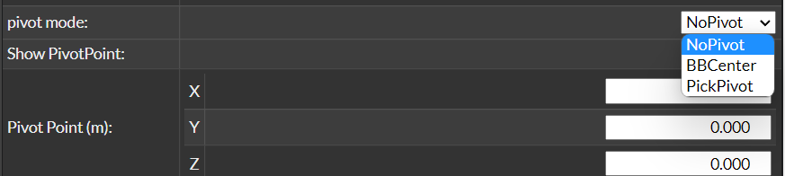
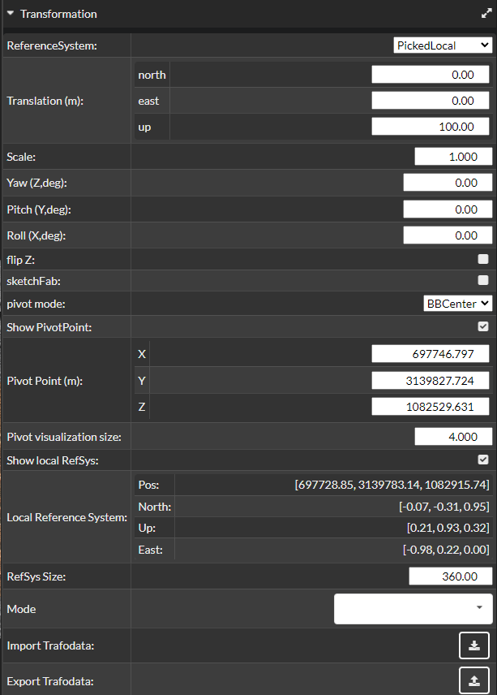

## Transformations

To transform a surface, it must first be selected. Then the user has to select in the surface's Transformations menu:

1. **A reference system.**
    The translation occurs along and the rotations around the axes directions of the selected reference system. 
    There are two recommendet ways to set a reference system.
    The third option is outdated and is not recommended!
    
    - **PivotCenter:** A local reference system is placed at the pivot position (therefore you have to place a pivot first, see below).
    - **PickedLocal:** To place the local reference system, select **PickSurfaceRefSys** in the picking interactions menu, then use **Ctrl + LMB** to position the local reference system at an appropriate location on or near the surface. 
    
    - **LEGACY_Global:** For global transformation the orientations of the global scene reference system are used. That means the translation occurs along the directions of the axes of the global reference system. Therefore, it is important that this system is strategically well placed in the scene. 
    **NOTE:** It is not recommended to select this option!! It ist only used for scenes with older versions.

2. **A pivot.**
    For local transformations, a pivot point must be defined for the selected surface. This pivot acts as the origin for all local transformations and remains fixed on the surface—even when the surface is translated.
    To use the pivot,  **Show Pivot** must be enabled in the Transformation GUI. Here too, option three is not recommended!!

    
    
    - **BBCenter:** The pivot point is placed at the center of the surface's bounding box and serves as the origin for rotation and scaling.
    - **PickPivot:** In the picking interactions dropdown menu, select **PickPivotPoint**, then press **Ctrl + LMB** to   place the pivot at a desired point on the surface. This point serves as the origin for rotation and scaling.
    - **NoPivot:** The origin of the scene's global reference system is also used as the center for rotation and scaling.
    **NOTE:** It is not recommended to select this option!! It ist only used for scenes with older versions.

## Transformation UI

- **ReferenceSystem:** Described above.
- **Translation(m):** The translation occurs along the axes of the selected reference system (as described above). The translation can be entered in the input fields of the respective axes.
- **Scale:** The scaling center ist the pivot position.
- **Yaw(Z,deg):** Rotation around yaw or z-axis. The rotation center is the pivot position. Rotation unit is degrees.
- **Pitch(Y,deg):** Rotation around pitch or y-axis. The rotation center is the pivot position. Rotation unit is degrees.
- **Roll(X,deg):** Rotation around roll or x-axis. The rotation center is the pivot position. Rotation unit is degrees.
- **flip Z:** Flips the z-coordinate upside down.
- **sketchFab:**
- **pivot mode:** Described above.
- **show PivotPoint:** Must be enabled to see and use the pivot.
- **Pivot Point (m):** The position of the pivot can also be adjusted via the UI.
- **Pivot visualization size:** The size of the sphere that visualizes the pivot.
- **Show local RefSys:** Must be enabled to see and use the local reference system (PivotCenter or PickedLocal).
- **Local Reference System:** The position and directions of the local reference system.
- **RefSys Size:** The size of the cross that visualizes the local reference system.
- **Mode:** Change the euler directions to avoid a possible gimbal lock.
- **Import Trafodata:** Import trafo from a json file.
- **Export Trafodata:** Export trafo to a json file.

## Further work
https://github.com/pro3d-space/PRo3D/issues/553