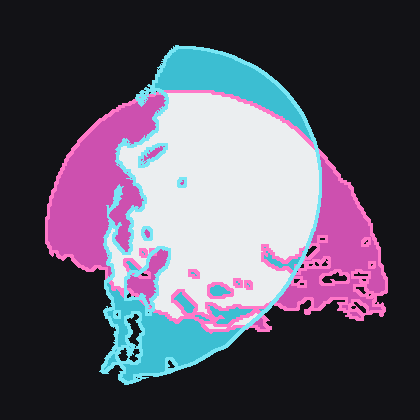
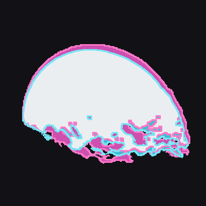

# AFC image orientation: a 90° disagreement with comet-toolbox

**Status: settled by convention, not by evidence.** We ship the orientation the
comet-toolbox HERA dashboard shows. The underlying question — which one the kernels
actually call for — is still open.

Our frames and comet-toolbox rendered the same epoch 90° apart. This note records what
was measured, what was assumed, and what would settle it, because the evidence that drove
`ea3337cb` turns out not to decide the question.

## The observation

comet-toolbox (<https://comet-toolbox.com/dashboard/hera/>), AFC1, 2027-02-25T06:30:00,
against our frame for the same epoch.

| | extent (of frame width) | illumination direction |
|---|---|---|
| ours | 20.9 % × 30.7 % | 347° |
| comet-toolbox | 30.7 % × 21.8 % | 76° |

*0° = right, 90° = up. Measured on the largest connected lit blob: direction from the
blob's shape centroid to its brightness centroid.*

**Difference: 88.6°.** The extents are reciprocal (0.68 vs 1.41), which is what a 90°
rotation does.

Silhouettes overlaid — ours cyan, comet-toolbox magenta, agreement white. Both are
normalised to the same centre and scale, so the picture shows orientation and shape only;
apparent size already agreed to three digits before any of this.

| as `ea3337cb` shipped it | after matching the dashboard |
|---|---|
|  |  |
| silhouette IoU **0.52** | silhouette IoU **0.81** |

The residual fringe on the right-hand panel is not a rotation. The lit-region major axis
agrees to **0.4°** (165.1° against 164.7°) and a fine rotation search peaks at −1.1° with
almost no gain over 0° (IoU 0.8156 vs 0.8127) — there is no angle left to find. The
coloured edge is relief: comet-toolbox uses a finer shape model, so its terminator carries
more structure, which is also why the *brightness* centroid still differs by ~6° while the
outline does not.

## Comparison against two independent renderers

Repeated after the change, against comet-toolbox and against Pilucas' COP set
(`HERA_AFC_*_COP.png`, 1020x1020, same epochs).

**Compare like with like, or the numbers are meaningless.** The two references render
illumination differently, and our four variants exist precisely so a comparison can be
made against the matching one:

| | night side | so compare |
|---|---|---|
| comet-toolbox | has a terminator, dark side unlit | lit region vs our lit region |
| Pilucas | **no dark side** — 7.6 % of her frame is above DN 1 and 7.5 % above DN 60 | full disk vs our full disk (ours at DN > 1, which includes the ambient night side) |

Our full disk covers 7.9 % of the frame against her 7.6 %, so the bodies are the same
size; it is only the shading that differs. Measured on `smooth`, our untextured variant,
so albedo cannot bias the shape:

| reference | epoch | compared | axis difference | IoU at 0° | best rotation |
|---|---|---|---|---|---|
| comet-toolbox | 06:30 | lit region | **+0.4°** | 0.810 | −4.0° (0.824) |
| Pilucas | 14:30 | full disk | **+4.6°** | 0.941 | +4.0° (0.949) |
| Pilucas | 06:30 | full disk | −28.1° | 0.865 | −24.5° (0.924) |

**No 90° anywhere.** The 06:30 row against Pilucas is the weakest: the full disk is
near-circular there (elongation 1.23 and 1.27), so the major axis is poorly constrained,
and unlike every other case a rotation does improve the overlap materially. It is not a
consistent angle — +4° at one epoch, −24° at the other — so it is not a systematic
rotation, but it is not nothing either and is the residual worth chasing if this matters.

Over a longer stretch the two track each other closely. Lit-region major axis every
30 min from 06:30 to 11:00, ten samples: ours −47.3° net, Pilucas −48.0° net, **same
sense, mean agreement 4.0°, worst 10.1°.**

Beyond 11:00 her frames stop being comparable, for a good reason: they contain **both
bodies**. At 11:30 her frame has two lit blobs, and by 12:30 one covers 77 % of it — the
kernels put Didymos at 5.0 km there, 1748 px across a 1020 px frame. We render the target
body only. An earlier version of this note read that as an opposite rotation sense; it was
Didymos entering the frame.

## What this is not

- **Not a different kernel delivery.** Apparent size agrees to three digits — 30.7 % of
  the frame in both. A different spacecraft ephemeris would change the range and with it
  the size.
- **Not a different body.** At this epoch the kernels put Dimorphos at 5.17 km, ~369 px
  across a 1020 px frame; Didymos would be ~1444 px, overflowing the frame.
- **Not a flip or a transpose.** The silhouettes align under a plain 90° rotation, as the
  overlay above shows. Correlating the *grey levels* instead is useless here — all eight
  dihedral transforms come out negative (−0.28 to −0.36) — because the two renders use
  different shape models and so disagree pixel by pixel whatever the orientation. The
  silhouette is what carries the orientation; the shading does not.

## What is established

1. **Our two renderers agree with each other.** The PRo3D render and the independent
   spiceypy DSK ray-cast (`pro3d_sim.dsk_render`) produce the same orientation, and the
   series validates 28/32 and 31/32 pairs under `identity`.

   This is weaker than it looks: both were written to the *same reading* of the IK. The
   ray-cast builds its ray grid with +X right and +Y down because that is how we read the
   kernel. They cannot disagree about a convention they share.

2. **The change in `ea3337cb` is what rotated us.** Frames delivered before it, still in
   the test data (`HERA/Dimorphos_opc/AFC_2027-03-21/`), relate to today's output by
   `rot90`/`rot270` — those two lead the ranking while `identity` is negative. The
   pre-fix orientation is the one comet-toolbox shows.

## The evidence that drove the fix, re-examined

`ea3337cb` changed `specialTrafos` for AFC-1/-2 and HSH, on two grounds:

**The IK diagram.** `hera_afc_v06.ti`, "Apparent FOV Layout":

```
                          1020 pixels/line
       ---              +-----------------+
        |               |      +Zafc1     |
        | 5.5 deg  1020 |        x------------> +Xafc1
        |         lines |        |        |
       ---            (0,0)------|--------+
                      Pixel      |
                                 | +Yafc1
                                 v
```

with "Boresight (+Z axis) is into the page" and "Pixel (0,0) is in the lower left corner
of the image". Read literally: **+X is image right, +Y is image down.** Pixel (0,0) at
lower-left means the line index runs opposite to +Y — an array-order detail, not a
rotation. PRo3D previously mapped +X to image *up*, so this is a documented 90° mismatch.

**The sun-direction test.** SPICE gives the sun direction in the HERA_AFC-1 frame; if +X
is image right, the lit limb must be on the right. Before the fix it was 26 px *up*;
after it, the lit limb sits along +X to within 7° over 12 frames spanning both series.

**Why that test does not settle it.** It establishes that our image places the lit limb
along the axis we *call* +X. If the true convention were +X = image up, the same test run
against the pre-fix renders would have passed just as cleanly. The test ties PRo3D's
camera basis to SPICE's frame chain **given an axis reading**; it cannot choose the
reading. The reading came from the diagram, and the diagram is exactly what a second
implementation might read differently.

The FOV correction in the same commit is unaffected: `getfov` returns symmetric
±0.04792 corners, i.e. 2.75° half-angle = 5.50° full, confirming 5.50 over the previous
5.5307 independently of any orientation question. `getfov`'s corner ordering does **not**
pin pixel (0,0), so it says nothing about rotation.

## The two possibilities

| | if our orientation is right | if comet-toolbox's is right |
|---|---|---|
| the IK diagram | read correctly | read correctly by us, but the detector's readout differs from the apparent-FOV drawing |
| comet-toolbox | has a 90° error, shared with pre-fix PRo3D | is right, and `ea3337cb` introduced the error |
| our delivered series | correct | rotated 90°, and must be re-rendered |

Both of our renderers sit on the same side of this, so the count of implementations that
agree with us is one, not two.

## What would settle it

In rough order of strength:

1. **A real AFC or DRACO frame with documented sky orientation.** The frames in our test
   data are our own output (`ORIGIN: pro3d-tool simulate-image`), so they are not
   evidence. An ESA-delivered image would end the discussion.
2. **The HERA FK plus detector readout documentation** — how the CCD's first line maps to
   the spacecraft frame, rather than how the apparent FOV is drawn.
3. **Asking the comet-toolbox author** which convention they implement and from which
   document. If they derived it from the same IK, one of the two readings is wrong and it
   can be argued from the text.

## What we did

We rotated to match comet-toolbox.

`specialTrafos` for `HERA_AFC-1`, `HERA_AFC-2` and `HERA_HSH` is back to the pre-`ea3337cb`
basis `FromOrthoNormalBasis(-V3d.OIO, -V3d.IOO, V3d.OOI)` — with the one change that all
three now share it, since the IK gives AFC-1 and AFC-2 the same layout and the old code
had them 180° apart. Verified on 2027-02-25T06:30: extent 31.2 % × 20.4 % against
comet-toolbox's 30.7 % × 21.8 %, and the lit-region major axis within 0.4°.

The kernel delivery is not a factor: rendering the same epoch against
`hera_plan_v182_20260817_001` (the workshop-3 tree) instead of `v182_20260820_001` gives
the same size, the same illumination direction and the same major axis.

`pro3d_sim.dsk_render` rotates its output by the same 90°, so the SPICE cross-check keeps
measuring geometry rather than re-measuring the convention.

**The FOV fix from `ea3337cb` stays.** 5.50° is confirmed by `getfov` independently of any
orientation question, and nothing here touches it.

### Why, given that the IK reads the other way

Because the recipients of this data compare it against comet-toolbox, and a dataset that
disagrees with the tool the community uses is not useful, whichever of the two is right.
This is a deliberate choice to match an external convention, not a correction — if the IK
reading is vindicated, this has to be rotated back, and the note above says how to tell.

Both orientations exist in the repository's history, one commit apart, so switching is a
three-line change plus a re-render (~7 min per series).

### What is still owed

The checks that would settle it, from the section above — a real ESA-delivered AFC frame,
the detector readout documentation, or the comet-toolbox author's source. Until then this
note travels with the data.
