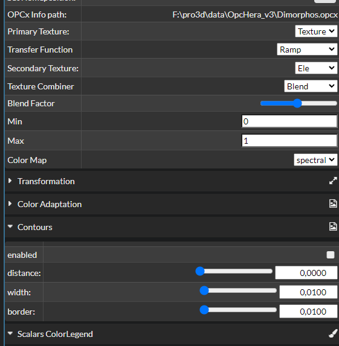
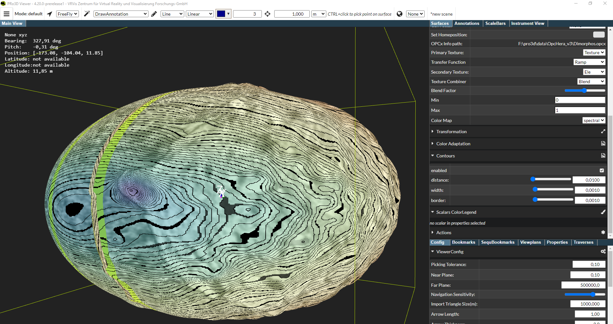

# Layered OPCs

Goal: [Countour lines](../Contour-Lines.md) can be mapped onto secondary textures of [multilayer opcs](../Feature-Multitexture.md). Contour distance can be specified, the lines should appear as anti-aliased lines given a line width.

Dependent tests: [layers](./layers.md)

Approach:
 - import of OPC data
 - changing visualization properties to use secondary texture
 - apply contour line onto secondary texture
 - save/load of scenes and check whether all properties are restored properly

Out-of-scope:
 - Multitextured OBJs

Data needed: OPC with layers, e.g. Dimorphos, HeraV3.

Steps:
 - [ ] run the [layers](./layers.md) test
 - [ ] Check whether counturs tab in the surface window appears
 
 - [ ] For eleveation as layer, choose distance/width/border accordingly:
 
 Note: Lines should be crisp and anti-aliased. In the current screenshot above those are not. When we get higher-resolution layer this image will be updated.