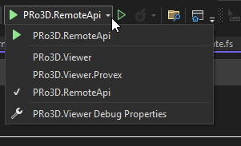
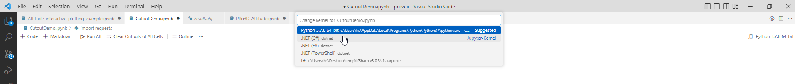
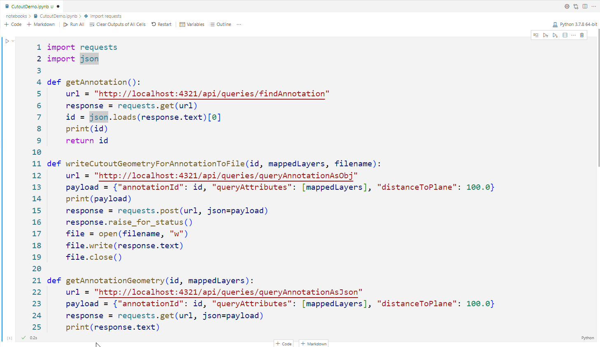
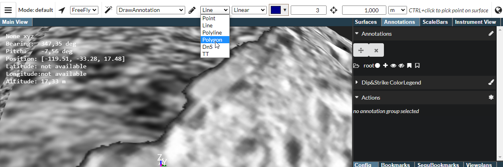
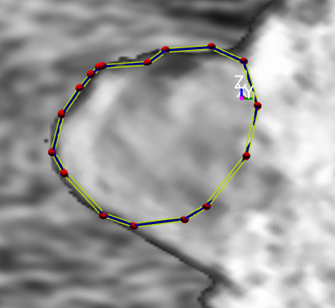
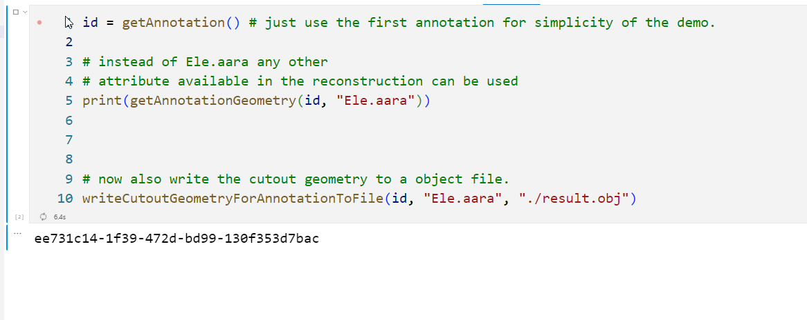
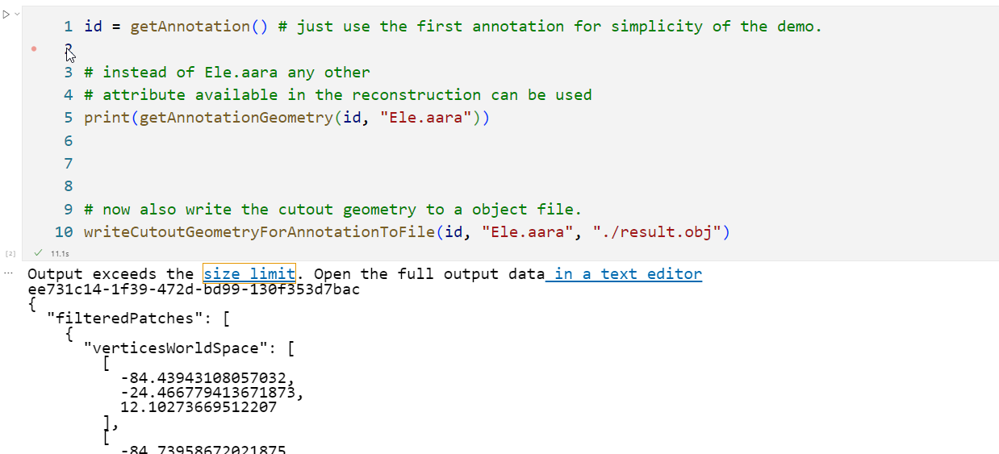
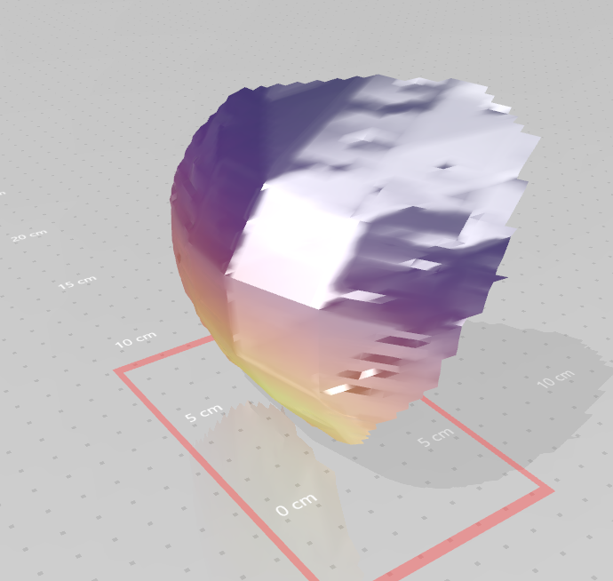

# Cutout geometry

Goal: Perform annotations on a [multilayer](../Feature-Multitexture.md) opc and export cut-out geometry described by the annotation.

Dependent tests: [layers](./layers.md)

Approach:
 - import of OPC data
 - perform an annotation
 - use vscode nodebook to run a demo [notebook](../../notebooks/CutoutDemo.ipynb) to create an obj of the cutout geometry

Prerequisited:
 - vscode with: ionide & polyglot notebook extension

Out-of-scope:
 - Multitextured OBJs

Data needed: OPC with layers, e.g. Dimorphos, HeraV3.

Steps:
 - [ ] start PRo3D with the the pro3d api enabled using the command line flag (`--remoteApi `) or the predefined launch profile
 
 - [ ] run the [layers](./layers.md) test
 - [ ] open vscode in PRo3D root/notebooks and open the [cutout notebook](../../notebooks/CutoutDemo.ipynb).
 
 - [ ] run the first cell and check the result (should be a green tickbox)
 
 - [ ] create a annotation which forms a convex polygon
 
 
 - [ ] run the next cell in the notebook. First it should print the ID of the annotation created:
 
 - [ ] next it should print filtered vertices. Next check the result.obj - does it contain geometry representing the cotout, colored with elevation values:
 
 