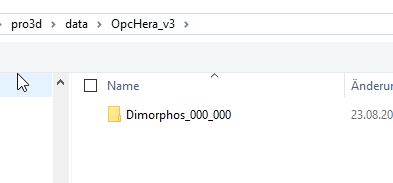
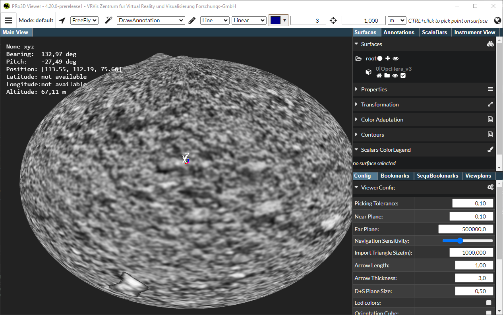
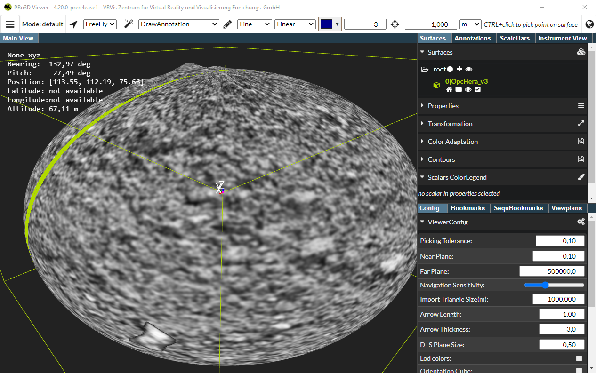
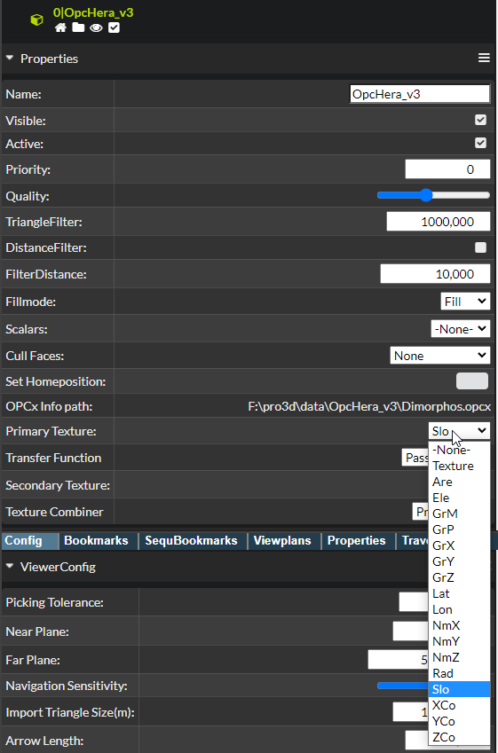
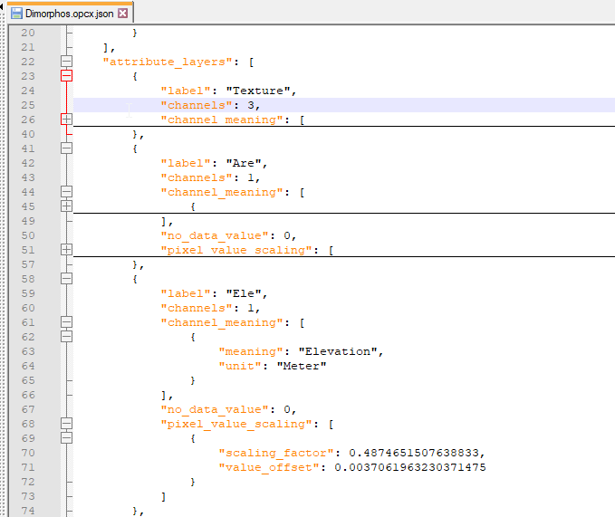
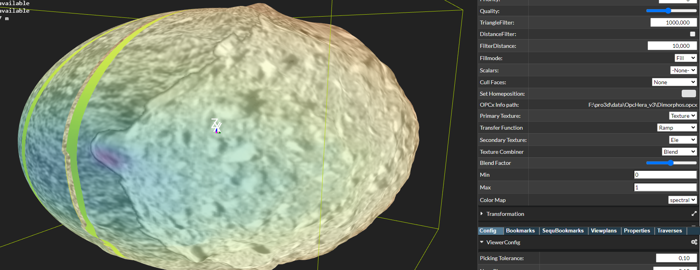

# Layered OPCs

Goal: OPCs with multiple texture layers can be visualized, its pixel information can be blended and mapped using a transfer function. The (surface) properties can be saved and reloaded from scene files.

Approach:
 - import of OPC data
 - changing visualization properties
 - save/load of scenes containing layered opcs

Out-of-scope:
 - Multitextured OBJs

Data needed: OPC with layers, e.g. Dimorphos, HeraV3.

Test needs to be done manually, by importing multilayer opcs:
 - [ ] Import OPC, surface gets visible
    
    
 - [ ] Select Surface, surface properties get visible
    
 - [ ] Change visualization properties, change properties and check result visually
    * check whether *all* layers are available as primary texture

    
    Check whether they match the layers in opcx.json file:

    
    * perform blending, choose a color map and check wether two layers can be visualizated properly

    
 - [ ] Save the scene
 - [ ] Check whether the visualization properties appear as tested befor saving.